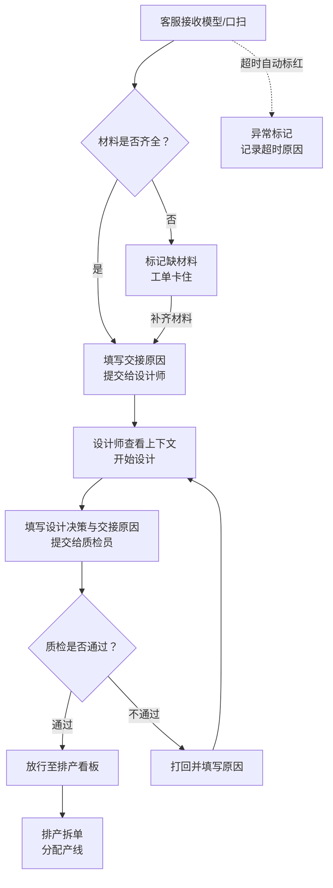

## 1. 产品概述

义齿加工厂的模型接收与排产拆单系统，核心解决三角色接力中"信息断点"问题——接单客服登记了口扫模型，数字设计师不知道为什么色号被改；设计师做完了，质检员不知道哪里容易出问题；返工原因散落在微信群里，没人追溯。系统把每一次交接变成带"原因"的结构化记录，模型接收是流程的起点而非终点，排产拆单是接力的延续而非独立菜单。

- 目标用户：义齿加工厂的接单客服、数字设计师、质检员
- 核心价值：消灭交接中的信息黑洞，异常单从被追问变成主动暴露

## 2. 核心功能

### 2.1 用户角色

| 角色 | 进入方式 | 核心权限 |
|------|----------|----------|
| 接单客服 | 默认角色 | 登记/接收模型、录入异常原因、标记缺材料、发起交付期确认 |
| 数字设计师 | 角色切换 | 查看交接上下文、登记设计决策原因、提交质检交接 |
| 质检员 | 角色切换 | 查看完整交接链、登记质检结果与原因、打回或放行到排产 |

### 2.2 功能模块

1. **交接工作台**：三角色共用的主界面，以"待我交接"为中心，展示流入的工单、异常标记、快捷操作；左侧筛选面板持久化（非临时状态），角色切换后视图自动适配
2. **工单详情**：一条工单的完整接力时间线——从模型接收到排产拆单，每一步都有"为什么"的交接备注；异常节点高亮，点击可追溯原因
3. **排产看板**：从工作台内嵌入的排产视图（非独立菜单），按交付日期和优先级排列工单卡片，支持拖拽分组拆单，异常单锁定在前排

### 2.3 页面详情

| 页面名称 | 模块名称 | 功能描述 |
|----------|----------|----------|
| 交接工作台 | 角色视图切换 | 顶部角色标签页，切换客服/设计师/质检员视角，筛选和列表随之变化 |
| 交接工作台 | 持久筛选面板 | 左侧固定筛选：工单状态、异常类型（缺材料/超时/复核不通过）、日期范围、客户名；筛选条件存入URL参数，刷新不丢失 |
| 交接工作台 | 待交接工单列表 | 中间区域，按流入时间倒序排列；卡片显示工单号、客户、当前阶段、异常标记、停留时长；异常单置顶且带红色边框 |
| 交接工作台 | 交接操作面板 | 右侧滑出面板：接收/提交/打回操作，必须填写"交接原因"才能提交；缺材料单需补充材料信息后才能推进 |
| 交接工作台 | 排产拆单入口 | 列表底部"查看排产"按钮，展开内嵌排产看板，不跳转页面 |
| 工单详情 | 接力时间线 | 纵向时间线，每节点显示：操作人、角色、时间、交接原因；异常节点红色标注，点击展开详细原因 |
| 工单详情 | 模型接收记录 | 时间线首个节点：口扫文件信息、模型类型、材料清单、缺材料标记 |
| 工单详情 | 设计决策记录 | 设计师节点的展开内容：设计软件版本、修改点、色号变更原因、特殊工艺备注 |
| 工单详情 | 质检结果记录 | 质检员节点的展开内容：检验项、通过/不通过、不通过原因、返工指向 |
| 工单详情 | 排产拆单回看 | 时间线末尾节点：拆单方向、分配产线、预计完成时间、实际完成对比 |
| 工单详情 | 异常溯源 | 顶部异常标签组，点击跳转到时间线中对应的异常节点 |
| 排产看板 | 工单卡片墙 | 按交付日期分列，每列一天；卡片显示工单号、产品类型、优先级、异常标记 |
| 排产看板 | 拖拽拆单 | 长按卡片拖到新列实现日期调整；拆单操作自动记录到工单时间线 |
| 排产看板 | 异常单锁定 | 缺材料/超时单无法拖拽，需先在工单详情中解除异常 |

## 3. 核心流程

### 3.1 正常接力流程

接单客服收到口扫文件/实体模型 → 录入工单信息（患者、产品类型、材料清单） → 检查材料是否齐全 → 填写交接原因后提交给设计师 → 设计师查看交接上下文开始设计 → 完成设计后填写设计决策和交接原因提交给质检员 → 质检员按检验项逐项检查 → 通过则放行到排产，不通过则打回并填写原因 → 排产看板中按交付日期排列 → 拆单分配产线

### 3.2 异常处理流程

缺材料：客服登记时标记缺材料 → 工单卡住在"待补材料"状态 → 补齐后才能推进
超时：工单停留时间超过阈值 → 自动标红 → 系统记录超时原因到时间线
复核不通过：质检员打回 → 设计师收到打回工单（带原因）→ 修改后重新提交 → 质检员二次复核

### 3.3 流程图

## 4. 用户界面设计

### 4.1 设计风格

- **主色调**：深灰底 (#0F1117) + 琥珀色强调 (#F59E0B)，模拟工厂控制台的工业感
- **辅助色**：翡翠绿 (#10B981) 表示正常流转，红色 (#EF4444) 表示异常/打回，钢蓝 (#3B82F6) 表示信息提示
- **字体**：标题用 Noto Sans SC Bold，工单号/编码用 JetBrains Mono，正文用 Noto Sans SC Regular
- **布局**：左侧固定筛选 + 中间卡片列表 + 右侧滑出操作面板，三栏式工业控制台布局
- **按钮**：圆角 6px，主操作琥珀色填充，危险操作红色描边，次要操作灰色描边
- **图标**：Lucide Icons，线条风格，与工业简洁感统一
- **异常视觉**：异常卡片左侧 4px 红色竖条 + 闪烁呼吸动画，超时卡片顶部红色进度条

### 4.2 页面设计概览

| 页面名称 | 模块名称 | UI 元素 |
|----------|----------|----------|
| 交接工作台 | 角色视图切换 | 顶部三个等宽标签页，当前角色琥珀色底色+深色文字，其他角色灰色底色；带角色图标（Phone/Pen-Tool/Shield-Check） |
| 交接工作台 | 持久筛选面板 | 左侧 240px 固定栏；下拉选择器（状态/异常类型）、日期范围选择器、搜索框；底部"重置筛选"按钮 |
| 交接工作台 | 工单卡片 | 中间区域卡片列表；每张卡片：工单号（等宽字体）、客户名、产品类型标签、阶段指示条（三段式：接收→设计→质检）、停留时长、异常图标 |
| 交接工作台 | 交接操作面板 | 右侧 360px 滑出面板；顶部工单摘要、中部文本域（交接原因，必填）、底部操作按钮组（提交/打回/补材料） |
| 交接工作台 | 排产入口 | 列表底部"查看排产看板"按钮，点击后列表区域替换为排产看板，带返回按钮 |
| 工单详情 | 接力时间线 | 左侧纵向时间线，节点为圆形图标（颜色按角色区分），右侧展开内容卡片 |
| 工单详情 | 异常溯源 | 详情页顶部横向标签组：缺材料/超时/复核不通过，点击滚动到对应时间线节点 |
| 排产看板 | 日期列 | 按天分列的看板布局，每列顶部日期标题+工单计数 |
| 排产看板 | 拖拽卡片 | 同工作台卡片样式，支持拖拽到不同日期列；异常卡片带锁图标不可拖拽 |

### 4.3 响应式设计

- 桌面优先（1440px+），三栏完整展示
- 1280px 以下筛选面板折叠为图标触发
- 1024px 以下操作面板全屏弹出
- 排产看板在小屏幕下切换为列表模式

### 4.4 3D 场景指导

不适用

## 5. 演示数据设计

演示从异常单开始点，数据中包含以下异常场景：

| 异常类型 | 工单示例 | 场景描述 |
|----------|----------|----------|
| 缺材料 | DN-2024-0087 | 氧化锆瓷块库存不足，等待补货，工单卡在客服阶段 |
| 超时 | DN-2024-0092 | 设计师处停留超过48小时，因客户临时改色号，重新沟通占用时间 |
| 复核不通过 | DN-2024-0095 | 质检发现咬合偏差0.3mm，打回设计师修改，已二次提交待复核 |
| 正常流转 | DN-2024-0089 | 正常全流程完成，已排产 |
| 正常流转 | DN-2024-0091 | 设计师阶段正常流转中 |
