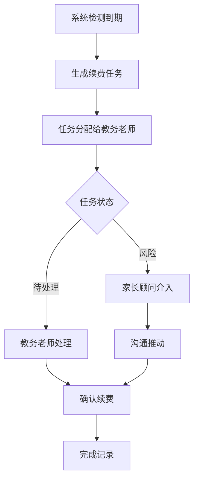
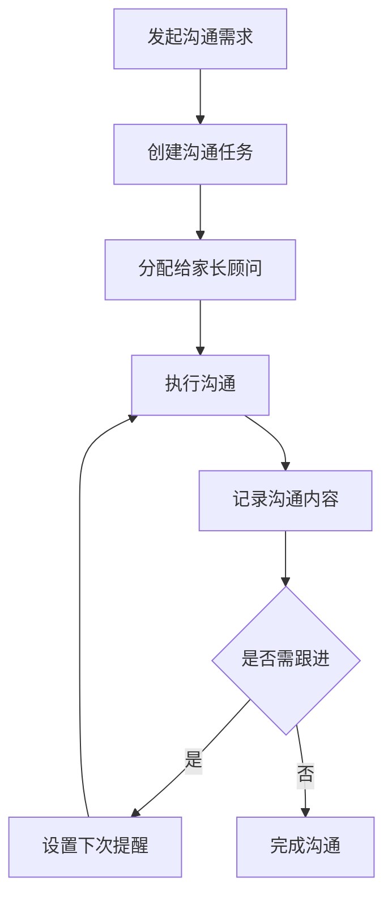

## 1. Product Overview
音乐培训机构课包续费与家长沟通系统，解决当前依赖旧台账、现场记录和沟通截图的低效问题，明确课包续费和家长沟通的责任边界，提供清晰的任务分工和历史追溯能力。

## 2. Core Features

### 2.1 User Roles
| Role | Registration Method | Core Permissions |
|------|---------------------|------------------|
| 教务老师 | 内部账号 | 课包管理、续费处理、班级调度 |
| 任课老师 | 内部账号 | 学员学习记录、教学反馈、沟通发起 |
| 家长顾问 | 内部账号 | 家长沟通、续费推动、客户维护 |

### 2.2 Feature Module
1. **课包续费管理**: 续费任务列表、待处理筛选、续费记录详情、历史追溯
2. **家长沟通管理**: 沟通任务列表、沟通记录、历史回看、跟进提醒
3. **首页仪表盘**: 待处理概览、风险项预警、最近变更记录

### 2.3 Page Details
| Page Name | Module Name | Feature description |
|-----------|-------------|---------------------|
| 首页仪表盘 | 概览卡片 | 待处理续费、待沟通、风险预警统计卡片 |
| 首页仪表盘 | 最近变更 | 展示最近的续费和沟通记录变更 |
| 课包续费列表 | 筛选器 | 按状态、时间、学员筛选续费任务 |
| 课包续费列表 | 操作栏 | 快速执行续费处理动作 |
| 课包续费详情 | 历史记录 | 展示该学员的所有续费历史 |
| 课包续费详情 | 异常处理抽屉 | 处理续费异常情况 |
| 家长沟通列表 | 筛选器 | 按状态、优先级、学员筛选沟通任务 |
| 家长沟通列表 | 操作栏 | 快速发起沟通、记录沟通结果 |
| 家长沟通详情 | 沟通历史 | 展示所有历史沟通记录 |
| 家长沟通详情 | 异常处理抽屉 | 处理沟通异常情况 |

## 3. Core Process

### 3.1 课包续费流程

### 3.2 家长沟通流程

## 4. User Interface Design

### 4.1 Design Style
- **主色调**: 深紫色系(#6B21A8)作为主色，传达专业与艺术感
- **辅助色**: 琥珀色(#F59E0B)用于警告和重点提示
- **按钮样式**: 圆角矩形，hover状态有阴影加深效果
- **字体**: Inter字体，层级分明
- **布局**: 卡片式布局，清晰的信息层级
- **图标**: Lucide图标库

### 4.2 Page Design Overview
| Page Name | Module Name | UI Elements |
|-----------|-------------|-------------|
| 首页仪表盘 | 概览卡片 | 数字统计、状态标签、快捷入口 |
| 首页仪表盘 | 最近变更 | 时间线列表、状态变更标识 |
| 课包续费列表 | 筛选器 | 下拉选择、日期范围、搜索框 |
| 课包续费列表 | 列表项 | 学员信息、到期时间、状态标签、操作按钮 |
| 课包续费详情 | 历史记录 | 时间线展示、操作类型、处理人 |
| 课包续费详情 | 异常处理抽屉 | 表单输入、原因选择、确认按钮 |
| 家长沟通列表 | 列表项 | 学员信息、优先级标识、最后沟通时间 |
| 家长沟通详情 | 沟通历史 | 消息气泡形式、时间戳 |

### 4.3 Responsiveness
- 桌面优先设计，支持响应式布局
- 移动端适配：列表项折叠、筛选器转为底部抽屉

### 4.4 关键交互设计
- 状态切换动画平滑过渡
- 抽屉式异常处理面板，不跳转页面
- 历史记录时间线支持展开/收起
