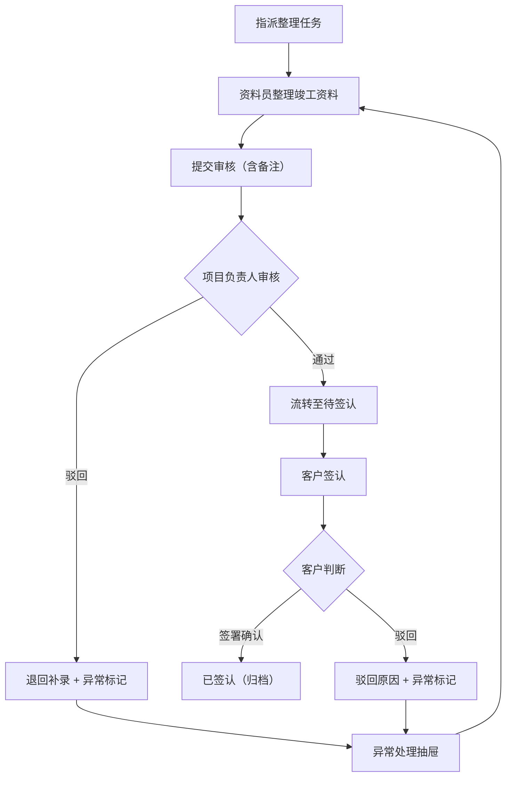

## 1. 产品概述

弱电施工队竣工资料与客户签认管理系统——解决竣工资料从整理、审核到客户签认全流程中责任不清、卡点不明、备注断裂的问题。面向弱电施工行业的项目负责人、施工班组长和资料员，让"谁在处理、卡在哪里、为什么还没签完"一目了然。

- 核心价值：消除竣工资料流到客户签认时的驳回与补录黑洞，让处理备注穿透到签认环节，批量操作与异常处理不再靠口头解释
- 目标用户：弱电施工队项目负责人、施工班组长、资料员、客户代表

## 2. 核心功能

### 2.1 用户角色

| 角色 | 进入方式 | 核心权限 |
|------|----------|----------|
| 项目负责人 | 管理端登录 | 全局总览、审批驳回、指派处理人、查看异常统计 |
| 施工班组长 | 管理端登录 | 提交竣工资料、补充现场照片与布线图、处理异常项 |
| 资料员 | 管理端登录 | 整理归档、批量提交审核、处理备注、跟进签认进度 |
| 客户代表 | 签认端登录 | 查看竣工资料与处理备注、签署确认或驳回 |

### 2.2 功能模块

1. **总览仪表盘**：三问直达（谁在处理、卡在哪里、为什么没签完）、待处理统计、风险项高亮、最近变更时间线
2. **竣工资料处理**：资料卡片列表、单条/批量处理、处理备注（穿透至签认）、状态流转、异常标记
3. **客户签认**：签认列表、回看处理备注与历史、签认/驳回操作、签认状态追踪
4. **异常处理抽屉**：侧滑抽屉、异常分类、处理记录、一键升级

### 2.3 页面详情

| 页面名称 | 模块名称 | 功能描述 |
|----------|----------|----------|
| 总览仪表盘 | 三问卡片 | 项目负责人/施工班组/资料员当前处理数量与超时预警 |
| 总览仪表盘 | 状态分布 | 竣工资料各状态数量分布（待整理/待审核/待签认/已签认/已驳回） |
| 总览仪表盘 | 风险项列表 | 超时未处理、驳回未补录、签认超期等风险项聚合展示 |
| 总览仪表盘 | 最近变更 | 按时间倒序展示最近的状态变更与备注更新 |
| 竣工资料处理 | 资料卡片列表 | 每张卡片展示项目名、资料类型、当前状态、处理人、更新时间 |
| 竣工资料处理 | 批量操作栏 | 勾选多条后可批量提交审核、批量标记异常、批量指派 |
| 竣工资料处理 | 处理备注 | 提交时填写备注，备注自动携带到客户签认页面 |
| 竣工资料处理 | 状态流转 | 待整理→待审核→待签认→已签认，支持驳回回退 |
| 客户签认 | 签认列表 | 展示所有待签认和已签认的资料，含处理备注回看 |
| 客户签认 | 签认回看 | 点击条目可查看完整处理历史与所有备注 |
| 客户签认 | 签认/驳回 | 客户确认签署或驳回并填写驳回原因 |
| 异常处理抽屉 | 抽屉面板 | 右侧滑出，展示当前选中项的异常详情 |
| 异常处理抽屉 | 异常分类 | 资料缺失、照片不符、材料领用差异等分类标签 |
| 异常处理抽屉 | 处理记录 | 每次异常处理的操作记录与结果 |
| 异常处理抽屉 | 一键升级 | 将异常升级至项目负责人处理 |

## 3. 核心流程

### 3.1 竣工资料处理与签认主流程

项目负责人指派资料员整理竣工资料 → 资料员整理布线图、材料领用单、现场照片并提交审核 → 项目负责人审核（通过则流转至待签认，驳回则退回资料员补录）→ 客户签认（可查看全程备注，签署确认或驳回）→ 驳回时异常标记并进入异常处理流程 → 异常处理完成后重新进入签认

### 3.2 流程图

### 3.3 备注穿透规则

- 资料员整理阶段的备注 → 审核阶段可见 → 签认阶段可见
- 审核驳回时的驳回原因 → 资料员补录时可见 → 再次提交后签认阶段可见
- 异常处理记录 → 全流程可见
- 客户签认页可直接回看所有历史备注，无需跳转

## 4. 用户界面设计

### 4.1 设计风格

- 主色调：深灰蓝（#1e293b）+ 琥珀色强调（#f59e0b），工业实用感
- 辅助色：翡翠绿（已签认）、珊瑚红（驳回/风险）、石板灰（待处理）
- 按钮风格：圆角矩形（rounded-lg），主操作实色填充，次操作描边
- 字体：标题用思源黑体/Noto Sans SC Bold，正文用系统默认
- 布局：左侧固定导航栏 + 右侧内容区，卡片式布局
- 图标：线性图标（lucide-vue-next），一致风格

### 4.2 页面设计概览

| 页面名称 | 模块名称 | UI元素 |
|----------|----------|--------|
| 总览仪表盘 | 三问卡片 | 三列等宽卡片，每张卡片顶部图标+数字，底部人员列表，超时红色脉冲动画 |
| 总览仪表盘 | 状态分布 | 水平堆叠条形图，各状态颜色区分 |
| 总览仪表盘 | 风险项列表 | 紧凑行列表，左侧风险等级色条，右侧操作按钮 |
| 总览仪表盘 | 最近变更 | 时间线组件，圆点+连线+内容卡片 |
| 竣工资料处理 | 资料卡片 | 卡片网格布局，顶部状态标签，中部信息区，底部操作按钮 |
| 竣工资料处理 | 批量操作栏 | 顶部悬浮栏，选中计数+操作按钮组 |
| 竣工资料处理 | 备注输入 | 底部固定输入区，支持文本输入 |
| 客户签认 | 签认列表 | 分组列表（待签认/已签认/已驳回），每组可折叠 |
| 客户签认 | 签认回看 | 展开式详情面板，时间线展示处理历史与备注 |
| 异常处理抽屉 | 抽屉 | 右侧滑出，固定宽度400px，遮罩层 |

### 4.3 响应式设计

- 桌面优先（1280px+），平板（768px-1279px）卡片从三列变两列，手机（<768px）单列+底部导航
- 触屏优化：签认按钮放大触摸区域，抽屉滑动手势关闭

### 4.4 数据状态设计

- 样例数据故意包含：3条待整理、2条待审核、1条待签认、2条已驳回（风险项）、1条已签认
- 最近变更时间线展示最近5条操作
- 风险项展示超时和驳回条目
- 打开即看到问题，不是满屏"已完成"
