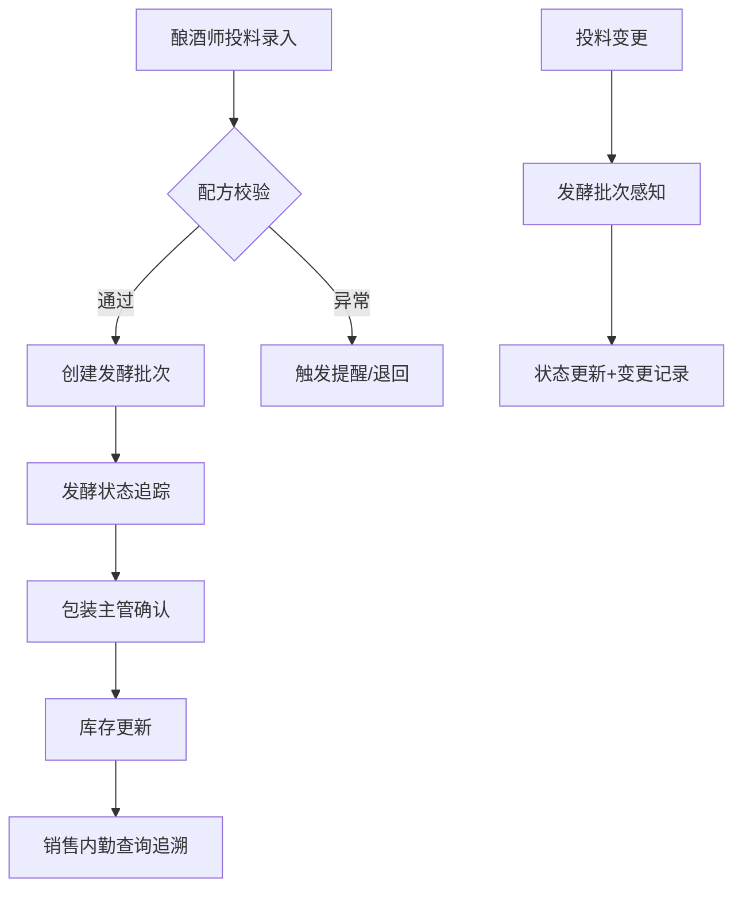

## 1. 产品概述

精酿酒厂-原料投料与发酵批次管理工具，解决酿酒过程中状态变化追踪难题，将分散在发酵罐记录、配方表和经销商订货群的信息整合为一条完整链路。核心目标是保证酿酒师、包装主管、销售内勤的处理节奏协同，实现原料投料改动后发酵批次的即时感知。

- **主要用途**：精酿酒厂生产流程管理，追踪原料投料、发酵批次、包装和销售全链路
- **解决问题**：信息碎片化、状态变化无法追踪、异常情况难以及时发现
- **目标用户**：酿酒师、包装主管、销售内勤、生产管理人员

## 2. 核心功能

### 2.1 用户角色

| 角色 | 注册方式 | 核心权限 |
|------|----------|----------|
| 酿酒师 | 角色切换 | 原料投料录入/修改、发酵批次状态更新、异常上报 |
| 包装主管 | 角色切换 | 发酵批次查看、包装记录录入、质量确认 |
| 销售内勤 | 角色切换 | 库存查询、订单关联、批次追溯 |
| 管理员 | 角色切换 | 备份恢复、系统配置、数据导出 |

### 2.2 功能模块

1. **原料投料管理**：投料录入、配方校验、改动记录追踪、状态联动发酵批次
2. **发酵批次管理**：批次列表、状态流转、时间线回看、异常标记
3. **包装管理**：批次包装记录、质量检查、库存更新
4. **销售查询**：批次追溯、库存查询、订单关联
5. **系统功能**：数据备份与恢复、异常提醒中心、密集表格视图

### 2.3 页面详情

| 页面名称 | 模块名称 | 功能描述 |
|----------|----------|----------|
| 投料工作台 | 投料表单 | 原料投料录入，支持配方选择和实时校验 |
| 投料工作台 | 投料历史 | 投料记录列表，支持筛选和改动查看 |
| 发酵批次 | 批次列表 | 所有发酵批次密集表格，显示完整状态链路 |
| 发酵批次 | 批次详情 | 单批次时间线回看，状态变更全记录 |
| 包装管理 | 包装记录 | 包装录入表单，关联发酵批次 |
| 销售查询 | 批次追溯 | 根据批次号查询全链路信息 |
| 系统中心 | 备份恢复 | 数据导出、导入、一键备份 |
| 系统中心 | 异常提醒 | 异常列表、处理状态、退回操作 |

## 3. 核心流程

### 主链路流程

酿酒师录入原料投料 → 系统自动创建/关联发酵批次 → 发酵状态实时更新 → 包装主管确认包装 → 销售内勤可追溯查询

原料投料任何改动都会触发发酵批次状态变更提醒，形成完整的审计追踪。

## 4. 用户界面设计

### 4.1 设计风格

- **主色调**：深琥珀色 (#8B4513) - 代表麦芽和精酿文化
- **辅助色**：深绿色 (#2E7D32) - 代表啤酒花和新鲜
- **警告色**：砖红色 (#C62828) - 异常提醒
- **中性色**：深灰背景 (#1A1A1A)、浅灰文字 (#E0E0E0)
- **设计风格**：工业实用风，密集表格优先，减少装饰元素，突出数据可读性
- **按钮风格**：扁平直角，高对比度，状态明确
- **字体**：系统等宽字体用于数据表格，确保对齐；无衬线字体用于标题
- **布局**：顶部导航 + 左侧角色切换 + 主内容区密集表格
- **图标风格**：简约线条图标，避免花哨装饰

### 4.2 页面设计概览

| 页面名称 | 模块名称 | UI元素 |
|----------|----------|--------|
| 投料工作台 | 投料表单 | 深色卡片、下拉选择、数字输入、实时校验提示 |
| 发酵批次 | 批次列表 | 斑马纹密集表格、状态色标、悬停高亮、行内操作 |
| 发酵批次 | 批次详情 | 垂直时间线、状态节点、变更记录列表 |
| 系统中心 | 异常提醒 | 红色标记、可展开详情、退回/处理按钮 |
| 系统中心 | 备份恢复 | 文件上传、备份时间线、确认对话框 |

### 4.3 响应式

- 桌面端优先设计 (1280px+)
- 平板端：侧边栏折叠，表格横向滚动
- 移动端：卡片化展示，核心数据优先

### 4.4 交互细节

- 状态变更时表格行闪烁提示
- 异常数据红色背景高亮
- 投料保存时显示联动发酵批次信息
- 时间线支持展开/收起详细记录
