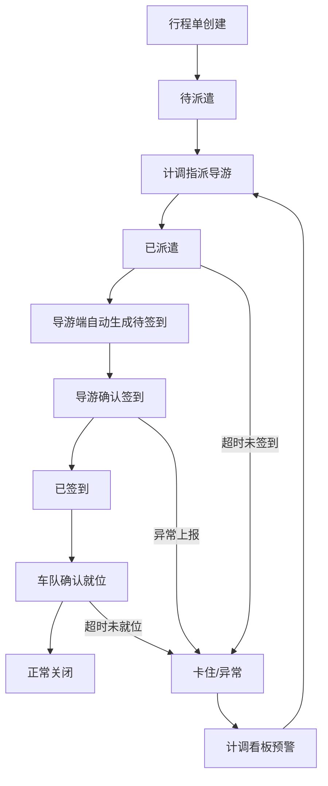

## 1. 产品概述

旅游地接社-导游派遣与接团签到系统，解决行程单、导游群与车队排班之间交接不清、责任模糊的问题。主管追问进度时，导游派遣和接团签到之间的断层不再被拖成后续问题。

- **核心痛点**：行程单下发→导游派遣→车队排班→接团签到四环断裂，靠人工发消息提醒，责任说不清
- **目标用户**：地接社计调、导游、车队调度三类角色，以及需要追问进度的主管

## 2. 核心功能

### 2.1 用户角色

| 角色 | 进入方式 | 核心权限 |
|------|----------|----------|
| 计调 | 顶部角色切换「计调」Tab | 创建/编辑行程单、指派导游、查看派遣与签到全链路状态 |
| 导游 | 顶部角色切换「导游」Tab | 查看自己被派遣的任务、确认接团签到、上报异常 |
| 车队调度 | 顶部角色切换「车队调度」Tab | 查看关联行程的车队排班、确认车辆就位状态 |

### 2.2 功能模块

1. **角色仪表盘**：三个独立角色视图，顶部 Tab 切换，各自聚焦本角色待办与进度
2. **导游派遣管理**：计调视角下的核心操作——筛选未派遣行程、选择导游、一键派遣；派遣后自动生成接团签到待办
3. **接团签到回看**：导游视角确认签到；全角色可回看签到记录，区分「正常关闭」和「卡住」状态
4. **筛选搜索**：按团号、导游名、日期范围、状态（待派遣/已派遣/已签到/异常）多维度筛选

### 2.3 页面详情

| 页面名称 | 模块名称 | 功能描述 |
|----------|----------|----------|
| 角色仪表盘 | 角色切换 Tab | 顶部三个角色入口，切换后展示对应角色看板 |
| 角色仪表盘 | 计调看板 | 待派遣行程列表 + 今日派遣统计 + 异常预警卡片 |
| 角色仪表盘 | 导游看板 | 我的派遣任务列表 + 待签到任务（自然衔接） + 签到操作入口 |
| 角色仪表盘 | 车队调度看板 | 关联行程车辆排班 + 车辆就位状态确认 |
| 导游派遣 | 派遣操作面板 | 选择导游 → 确认派遣 → 自动触发签到待办 |
| 导游派遣 | 筛选搜索栏 | 团号搜索 + 状态筛选 + 日期范围 + 导游名搜索 |
| 接团签到 | 签到确认 | 导游确认到达 + 签到时间记录 + 异常上报 |
| 接团签到 | 签到记录回看 | 全链路状态时间轴，正常关闭 vs 卡住记录视觉区分 |

## 3. 核心流程

1. 计调创建/接收行程单 → 行程进入「待派遣」状态
2. 计调筛选待派遣行程 → 选择导游 → 确认派遣 → 行程进入「已派遣」状态
3. 派遣完成后，系统自动在导游端生成「待签到」任务（无需额外消息通知）
4. 导游查看待签到任务 → 到达接团地点 → 确认签到 → 行程进入「已签到」状态
5. 车队调度确认车辆就位 → 三方状态全部闭环 → 行程「正常关闭」
6. 若任何环节超时未处理 → 行程标记为「卡住/异常」→ 计调看板预警

## 4. 用户界面设计

### 4.1 设计风格

- **主色调**：深青石色（#1e3a5f）为权威底色，琥珀色（#d97706）为预警/待办强调色，翠绿色（#059669）为完成/正常状态色
- **按钮风格**：圆角微立体，主操作用实色填充，次要操作用描边
- **字体**：标题用 Noto Serif SC 增加商务质感，正文用 Noto Sans SC 保持可读性
- **布局风格**：左侧固定侧栏 + 右侧内容区，卡片式模块，顶部角色 Tab 切换
- **图标风格**：Lucide 图标库，线描风格

### 4.2 页面设计概览

| 页面名称 | 模块名称 | UI 元素 |
|----------|----------|---------|
| 角色仪表盘 | 角色切换 Tab | 三个等宽 Tab，当前角色高亮下划线，切换动画 |
| 角色仪表盘 | 计调看板 | 顶部统计卡片（待派遣数/今日派遣/异常数）+ 待派遣行程列表 + 异常预警卡片（琥珀色边框） |
| 角色仪表盘 | 导游看板 | 今日任务卡片列表 + 待签到区域（自动衔接派遣）+ 签到按钮（绿色大按钮） |
| 角色仪表盘 | 车队调度看板 | 车辆排班表格 + 就位状态标签 + 关联行程信息 |
| 导游派遣 | 派遣操作面板 | 右侧抽屉式面板：导游选择下拉 + 派遣确认按钮，派遣成功后面板自动切换到签到预览 |
| 导游派遣 | 筛选搜索栏 | 搜索框 + 状态多选下拉 + 日期选择器，实时过滤 |
| 接团签到 | 签到确认 | 模态弹窗：签到确认 + 时间戳 + 异常上报选项 |
| 接团签到 | 签到记录回看 | 时间轴样式，正常节点绿色圆点，卡住节点琥珀色闪烁圆点，卡片展开详情 |

### 4.3 响应式设计

- 桌面优先设计，最小宽度 1280px
- 内容区最大宽度 1440px 居中
- 列表区域支持内部滚动，固定表头

### 4.4 测试数据要求

- **正常关闭记录**：已完成全流程（派遣→签到→车队就位→关闭）的行程，至少3条
- **卡住记录**：停在某一环节超时的行程，至少2条（如已派遣但未签到、已签到但车队未就位）
- **待处理记录**：刚进入待派遣状态的行程，至少2条
- 数据需包含：团号、行程名称、导游姓名、车队信息、各环节时间戳、状态标签
