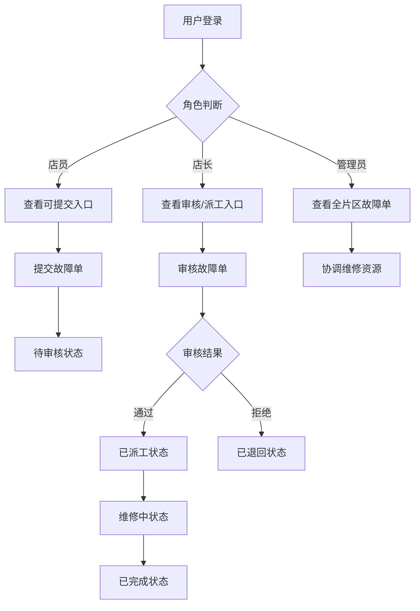

## 1. Product Overview
彩票门店终端故障与维修跟踪系统是一款面向彩票门店店员、店长和片区管理员的业务工作台应用，旨在解决销售班结、兑奖登记和设备故障单之间的交接问题，确保终端故障和维修跟踪之间的责任清晰，避免问题拖延。

## 2. Core Features

### 2.1 User Roles
| Role | Registration Method | Core Permissions |
|------|---------------------|------------------|
| 店员 | 门店账号登录 | 提交终端故障单、查看本人提交的故障单、添加处理备注 |
| 店长 | 门店账号登录 | 审核故障单、分配维修任务、查看门店所有故障单 |
| 片区管理员 | 管理员账号登录 | 查看片区所有故障单、协调维修资源、处理异常情况 |

### 2.2 Feature Module
1. **维修跟踪回看**: 查看所有故障单列表，支持筛选和搜索
2. **侧栏详情**: 显示故障单详细信息和处理历史
3. **终端故障处理**: 创建和编辑故障单，添加处理备注
4. **状态流转**: 故障单状态管理（待审核、已派工、维修中、已完成、已退回）

### 2.3 Page Details
| Page Name | Module Name | Feature description |
|-----------|-------------|---------------------|
| 工作台首页 | 故障单列表 | 显示故障单卡片列表，支持按状态筛选，显示统计概览 |
| 工作台首页 | 侧栏详情 | 点击故障单卡片展开侧栏，显示详细信息和处理历史 |
| 工作台首页 | 故障处理入口 | 根据角色显示不同的操作按钮（提交、审核、派工、完成） |
| 空状态页 | 无数据提示 | 当没有故障单时显示友好的空状态界面 |

## 3. Core Process
用户登录系统 → 根据角色展示不同的处理入口 → 查看故障单列表 → 点击查看详情 → 进行相应操作（提交/审核/派工/完成）→ 状态流转 → 查看处理历史

## 4. User Interface Design

### 4.1 Design Style
- **Primary Color**: #1E40AF (深蓝色，专业可信)
- **Secondary Color**: #F59E0B (琥珀色，警示提醒)
- **Button Style**: 圆角矩形，hover时有阴影效果
- **Font**: Inter，中文使用思源黑体
- **Layout Style**: 卡片式布局，左侧列表，右侧详情面板
- **Icon Style**: Lucide图标库，简洁现代

### 4.2 Page Design Overview
| Page Name | Module Name | UI Elements |
|-----------|-------------|-------------|
| 工作台首页 | 顶部导航 | Logo、用户信息、角色标识 |
| 工作台首页 | 统计概览 | 故障单数统计卡片（待处理、维修中、已完成） |
| 工作台首页 | 筛选区域 | 状态筛选、时间范围、搜索框 |
| 工作台首页 | 故障单列表 | 卡片式展示，包含设备号、状态、创建时间、优先级 |
| 工作台首页 | 侧栏详情 | 设备信息、故障描述、处理历史、操作按钮 |
| 空状态页 | 无数据提示 | 图标、提示文字、引导操作按钮 |

### 4.3 Responsiveness
- Desktop-first 设计
- 支持平板和移动端自适应
- 移动端侧栏改为全屏模态框

### 4.4 Interactions
- 故障单卡片点击展开侧栏详情
- 状态变更触发提醒动画
- 异常样例直接触发退回操作
- 备注信息在状态流转中保持可见
