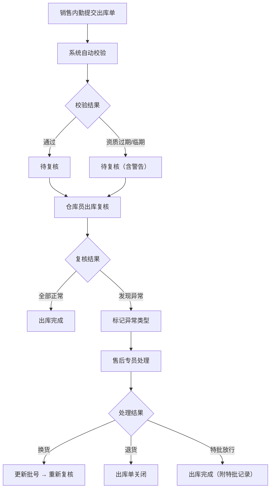

## 1. 产品概述

口腔耗材批号与出库复核管理系统——解决耗材批号发错、临期耗材被退、客户资质过期等问题，让销售内勤、仓库员、售后专员之间的每一次交接都在系统里留痕，杜绝口头解释。

- 目标用户：口腔耗材经销商的销售内勤、仓库员、售后专员
- 核心价值：批号可追溯、出库必复核、资质自动检查、全流程留痕

## 2. 核心功能

### 2.1 用户角色

| 角色 | 进入方式 | 核心权限 |
|------|----------|----------|
| 销售内勤 | 角色切换 | 提交耗材批号、查看出库单、发起售后处理 |
| 仓库员 | 角色切换 | 确认出库复核、标记临期/过期耗材、退回批号异常耗材 |
| 售后专员 | 角色切换 | 处理批号异常、记录售后备注、关闭处理工单 |

### 2.2 功能模块

1. **出库单列表页**：出库单概览、状态筛选、快捷操作
2. **出库单详情页**：批号明细、复核状态流转、历史备注时间线
3. **出库复核页**：仓库员逐项确认复核、标记异常
4. **批号处理页**：售后专员处理异常批号、添加备注、关闭工单

### 2.3 页面详情

| 页面名称 | 模块名称 | 功能描述 |
|----------|----------|----------|
| 出库单列表页 | 状态看板 | 按状态（待提交/待复核/复核中/已完成/已异常）分组展示出库单数量 |
| 出库单列表页 | 列表表格 | 展示出库单号、客户名称、提交人、复核人、状态、创建时间，支持筛选和搜索 |
| 出库单详情页 | 基本信息 | 出库单号、客户信息、客户资质有效期、提交人/时间 |
| 出库单详情页 | 耗材批号列表 | 耗材名称、批号、生产日期、有效期、库存数量、出库数量、复核状态 |
| 出库单详情页 | 状态流转时间线 | 每次状态变更的记录：操作人、操作时间、操作类型、备注 |
| 出库单详情页 | 复核回看 | 展示该出库单全部复核快照，可逐条回看复核操作详情 |
| 出库复核页 | 复核操作面板 | 仓库员逐项确认耗材批号，可标记"正常"或"异常"（批号错误/临期/过期/资质过期） |
| 出库复核页 | 异常标记 | 选择异常类型并填写异常说明，提交后自动流转到售后专员 |
| 批号处理页 | 异常工单列表 | 售后专员查看待处理/已处理的异常批号工单 |
| 批号处理页 | 处理操作 | 添加处理备注、选择处理结果（换货/退货/特批放行）、关闭工单 |

## 3. 核心流程

1. 销售内勤创建出库单，填写客户信息和耗材批号明细，提交出库申请
2. 系统自动校验客户资质有效期和耗材有效期，如有异常自动标记
3. 仓库员收到待复核出库单，逐项核对批号和数量
4. 仓库员确认复核（全部正常→出库单完成）或标记异常（→流转到售后）
5. 售后专员处理异常批号，添加处理备注，选择处理结果
6. 处理完成后，出库单状态更新，全程留痕可回溯

## 4. 用户界面设计

### 4.1 设计风格

- 主色：深靛蓝 (#1e3a5f)，辅色：琥珀色 (#d97706) 用于警告和异常标记
- 按钮：圆角微凸，主操作深靛蓝实心，次要操作灰色描边，危险操作琥珀色
- 字体：标题用思源黑体/Noto Sans SC Bold，正文用 Noto Sans SC Regular
- 布局：左侧固定导航 + 右侧内容区，卡片式模块
- 图标：lucide-react 线性图标

### 4.2 页面设计概览

| 页面名称 | 模块名称 | UI元素 |
|----------|----------|--------|
| 出库单列表页 | 状态看板 | 横向卡片组，每张卡片显示状态名称和数量，当前选中高亮 |
| 出库单列表页 | 列表表格 | 条纹表格，状态标签用不同颜色圆角标签，操作列按钮组 |
| 出库单详情页 | 基本信息区 | 顶部卡片，关键信息双列布局，资质过期红色警示条 |
| 出库单详情页 | 批号列表 | 表格形式，每行末尾有复核状态标签，异常行高亮底色 |
| 出库单详情页 | 时间线 | 左侧竖线+圆点，每条记录显示操作人、时间、动作、备注 |
| 出库复核页 | 复核面板 | 卡片列表，每张卡片一个耗材项，左右两侧"正常"/"异常"按钮 |
| 批号处理页 | 工单列表 | 卡片列表，左侧异常类型标签，右侧处理状态 |
| 批号处理页 | 处理表单 | 弹出式面板，文本域+下拉选择+提交按钮 |

### 4.3 响应式

- 桌面优先设计，最小宽度 1024px
- 侧边栏在窄屏下可折叠
- 表格在窄屏下横向滚动

## 5. 业务约束

- 出库单状态：待提交 → 待复核 → 复核中 → 已完成 / 已异常 → 已关闭
- 幂等提交：同一出库单的批号提交操作幂等，重复提交返回已有记录
- 客户资质有效期自动校验：出库时若客户资质已过期或30天内将过期，系统自动标记警告
- 耗材有效期自动校验：出库时若耗材有效期不足90天，标记临期警告；已过期的禁止出库
- 全流程留痕：每次状态变更、备注添加、复核操作均记录操作人、时间戳、操作类型
