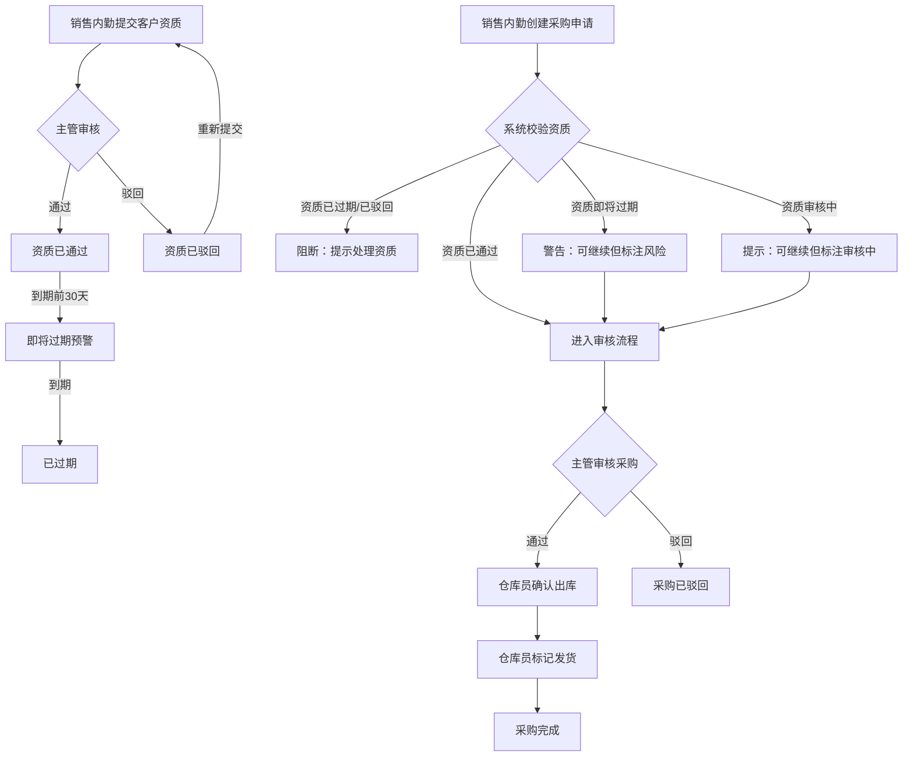

## 1. 产品概述

口腔耗材商客户资质与采购申请管理系统，用于替代旧台账、现场记录和沟通截图中的反复确认流程。核心解决客户资质与采购申请之间责任不清的问题，让主管临时追问进度时能一目了然。

- 目标用户：口腔耗材商的销售内勤、仓库员、售后专员及主管
- 核心价值：消除资质与采购之间的责任灰色地带，让每个状态有明确归属人

## 2. 核心功能

### 2.1 用户角色

| 角色 | 进入方式 | 核心权限 |
|------|----------|----------|
| 销售内勤 | 角色选择页进入 | 提交/编辑客户资质、创建采购申请、查看自己负责的记录 |
| 仓库员 | 角色选择页进入 | 确认出库、标记发货、查看待处理出库单 |
| 售后专员 | 角色选择页进入 | 处理退换申请、关联客户资质异常、查看售后工单 |
| 主管 | 角色选择页进入 | 查看全部数据、筛选/搜索、追问进度、审批/驳回 |

### 2.2 功能模块

1. **角色入口页**：角色选择卡片，不同角色看到不同的功能入口和待办数量
2. **客户资质管理**：资质提交、审核、到期预警、资质状态流转
3. **采购申请管理**：申请创建、审核、出库、发货、完成，与客户资质强关联
4. **主管总览看板**：全局数据统计、异常提醒、进度追问入口

### 2.3 页面详情

| 页面名称 | 模块名称 | 功能描述 |
|----------|----------|----------|
| 角色入口页 | 角色卡片 | 4个角色卡片，显示角色名、待办数、功能入口按钮 |
| 角色入口页 | 快捷操作 | 各角色的Top3待办事项快捷入口 |
| 客户资质列表 | 筛选栏 | 按状态（待审核/已通过/已驳回/已过期）、客户名、到期时间筛选 |
| 客户资质列表 | 资质卡片列表 | 每条资质显示客户名、证照类型、到期日、状态、负责人 |
| 客户资质详情 | 资质信息 | 证照信息、附件、审核记录时间线 |
| 客户资质详情 | 状态操作 | 销售内勤可提交/重新提交，主管可审核/驳回 |
| 采购申请列表 | 筛选栏 | 按状态、客户、申请人、时间范围筛选 |
| 采购申请列表 | 申请卡片列表 | 每条显示申请编号、客户、金额、状态、关联资质状态标记 |
| 采购申请详情 | 申请信息 | 采购明细、关联客户资质状态、流转记录时间线 |
| 采购申请详情 | 状态操作 | 各角色在对应节点操作：创建/审核/出库/发货/完成 |
| 采购申请详情 | 资质关联 | 显示关联资质当前状态，资质异常时阻断采购流程 |
| 主管总览 | 统计卡片 | 待审核资质数、待处理采购数、异常数、近7天趋势 |
| 主管总览 | 异常提醒 | 资质即将过期、采购被阻断、超时未处理等异常条目 |
| 主管总览 | 追问入口 | 点击异常条目直接跳转对应详情页 |

## 3. 核心流程

### 3.1 客户资质流程

销售内勤提交客户资质 → 主管审核 → 通过/驳回 → 到期前30天预警 → 过期自动标记

关键规则：
- 资质到期前30天系统自动预警，状态变为"即将过期"
- 资质过期后自动标记为"已过期"，关联的采购申请将被阻断
- 驳回后销售内勤可重新提交

### 3.2 采购申请流程

销售内勤创建采购申请（自动关联客户资质） → 系统校验资质状态 → 主管审核 → 仓库员确认出库 → 仓库员标记发货 → 完成

关键规则：
- 创建采购申请时，系统自动校验关联客户资质状态
- 资质为"已过期"或"已驳回"时，采购申请创建被阻断，提示"客户资质异常，请先处理资质"
- 资质为"即将过期"时，采购申请可创建但标注"资质即将过期"警告
- 资质为"待审核"时，采购申请可创建但标注"资质审核中"提示
- 每个状态变更记录操作人、操作时间、操作备注

### 3.3 流程图

## 4. 用户界面设计

### 4.1 设计风格

- 主色调：深蓝灰(#1e293b) + 琥珀色(#f59e0b)作为强调色
- 辅助色：翡翠绿(#10b981)表示通过/正常，玫红(#f43f5e)表示驳回/异常
- 按钮风格：圆角(8px)、适度阴影、hover状态有明确反馈
- 字体：思源黑体/Noto Sans SC，标题16-20px，正文14px，辅助12px
- 布局风格：左侧导航 + 右侧内容区，卡片式布局
- 图标风格：线性图标(lucide-react)，2px描边

### 4.2 页面设计概览

| 页面名称 | 模块名称 | UI元素 |
|----------|----------|--------|
| 角色入口页 | 角色卡片 | 2x2网格布局，每张卡片有图标+角色名+待办数+进入按钮 |
| 客户资质列表 | 筛选栏 | 顶部筛选条：状态下拉、搜索框、到期时间范围选择器 |
| 客户资质列表 | 资质卡片 | 左侧状态色条，右侧信息区，底部操作按钮 |
| 客户资质详情 | 信息区 | 上方基本信息卡片，下方审核时间线(垂直) |
| 采购申请列表 | 筛选栏 | 多条件筛选条+排序选项 |
| 采购申请列表 | 申请卡片 | 左侧申请编号+状态色条，右侧信息+关联资质状态标签 |
| 采购申请详情 | 信息区 | 左侧采购明细，右侧关联资质状态+流转时间线 |
| 主管总览 | 统计卡片 | 4个统计卡片横排，下方异常提醒列表 |

### 4.3 响应式设计

- 桌面端优先（1920px/1440px/1280px）
- 平板端适配（768px）：导航收起为汉堡菜单，卡片单列
- 移动端暂不重点适配，保证基本可用即可

### 4.4 交互细节

- 角色切换：顶部右侧角色徽章，点击可切换角色（模拟多角色场景）
- 状态流转：每次状态变更弹出操作面板（含备注输入框）
- 筛选结果：实时更新，无需手动刷新
- 资质预警：即将过期的资质用琥珀色边框标识，已过期用红色边框
- 采购阻断：关联资质异常时，操作按钮禁用并显示原因
