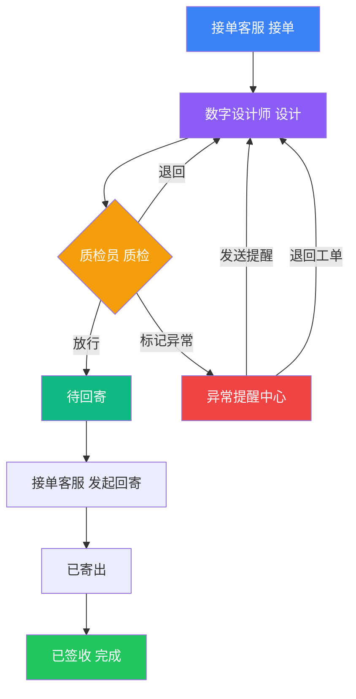

## 1. 产品概述

义齿加工厂质检放行与客户回寄管理系统——解决质检放行与客户回寄之间责任不清、处理人临时补说明的痛点。系统聚焦三个核心问题：谁在处理、卡在哪里、为什么没完成。

- 面向义齿加工厂的接单客服、数字设计师、质检员三类角色，实现从质检放行到客户回寄的全流程可视化追踪
- 目标：消除信息兜底依赖（接单表、口扫文件夹、技师微信群），让流程卡点和异常有系统兜住

## 2. 核心功能

### 2.1 用户角色

| 角色 | 进入方式 | 核心权限 |
|------|----------|----------|
| 接单客服 | 默认登录 | 查看今日待处理、发起回寄、标记异常 |
| 数字设计师 | 角色切换 | 查看设计任务、处理质检退回、确认放行 |
| 质检员 | 角色切换 | 执行质检放行、触发异常提醒、退回工单 |

### 2.2 功能模块

1. **首页仪表盘**：今日待处理概览、责任人追踪、卡点提示、异常样例快触
2. **质检放行处理**：质检工单列表、放行/退回操作、异常标记与提醒触发
3. **异常提醒中心**：异常工单列表、提醒触发、退回操作、处理状态追踪
4. **客户回寄追踪**：回寄工单列表、回寄状态流转、责任人与原因回看

### 2.3 页面详情

| 页面名称 | 模块名称 | 功能描述 |
|----------|----------|----------|
| 首页仪表盘 | 今日待办卡片 | 显示今日待处理工单数、按角色分类（接单客服/数字设计师/质检员），点击可跳转对应处理页 |
| 首页仪表盘 | 责任人追踪 | 实时显示三类角色当前处理人及处理中工单，谁在处理一目了然 |
| 首页仪表盘 | 卡点提示 | 质检放行卡点高亮，显示卡在哪个环节、停留时长，点击可查看详情 |
| 首页仪表盘 | 异常快触 | 异常样例卡片，点击可直接触发提醒或退回，验证流程是否接住 |
| 质检放行处理 | 工单列表 | 按状态筛选（待质检/质检中/已放行/已退回），展示工单号、患者、设计类型、责任角色 |
| 质检放行处理 | 放行操作 | 质检员点击放行，状态流转到待回寄，触发下一环节通知 |
| 质检放行处理 | 退回操作 | 质检员点击退回，选择退回原因，工单回到数字设计师 |
| 质检放行处理 | 异常标记 | 标记异常类型（色差/形态/咬合等），触发异常提醒到相关角色 |
| 异常提醒中心 | 异常列表 | 所有异常工单，按严重程度排序，显示异常类型、触发人、触发时间 |
| 异常提醒中心 | 提醒触发 | 点击"发送提醒"，通知对应处理人（模拟通知弹窗） |
| 异常提醒中心 | 退回触发 | 点击"退回工单"，工单直接回到上一步处理人 |
| 客户回寄追踪 | 回寄列表 | 显示待回寄/已回寄/滞留工单，展示快递信息、责任客服 |
| 客户回寄追踪 | 状态流转 | 点击"发起回寄"→"已寄出"→"已签收"全流程可操作 |
| 客户回寄追踪 | 回看详情 | 点击工单查看完整处理链路：设计→质检→放行→回寄，每个环节的责任人和耗时 |

## 3. 核心流程

用户打开系统，首页仪表盘展示今日待处理任务、三类角色处理人、质检放行卡点和异常样例。质检员处理质检放行（放行/退回），异常可触发提醒或退回。放行后进入客户回寄环节，接单客服发起回寄并追踪状态。全程责任人和卡点透明可见。

## 4. 用户界面设计

### 4.1 设计风格

- **主色调**：工业深灰 (#1a1a2e) + 警示橙 (#ff6b35) + 通过绿 (#00c853)，体现加工厂工业感
- **辅助色**：冷蓝 (#4fc3f7) 表示流程、暖黄 (#ffd54f) 表示等待
- **按钮风格**：圆角矩形，主要操作用实心填充，次要操作用描边，异常操作用红色警示
- **字体**：数字用等宽字体 JetBrains Mono，正文用 Noto Sans SC
- **布局**：左侧固定导航 + 右侧内容区，卡片式信息分组
- **图标**：Lucide Icons，线条风格统一
- **动态效果**：卡点脉冲动画、异常闪烁提醒、状态流转过渡动画

### 4.2 页面设计概览

| 页面名称 | 模块名称 | UI元素 |
|----------|----------|--------|
| 首页仪表盘 | 今日待办卡片 | 深色卡片、大数字、角色图标、悬浮展开详情、点击跳转 |
| 首页仪表盘 | 责任人追踪 | 水平三人卡片组、头像+姓名+处理中数量、脉冲指示灯 |
| 首页仪表盘 | 卡点提示 | 橙色高亮条、停留时长倒计时样式、点击展开详情面板 |
| 首页仪表盘 | 异常快触 | 红色边框卡片、异常类型标签、一键触发按钮（提醒/退回） |
| 质检放行处理 | 工单列表 | 表格布局、状态标签颜色编码、行点击展开操作按钮 |
| 质检放行处理 | 放行/退回 | 绿色放行按钮 + 红色退回按钮、退回弹出原因选择弹窗 |
| 异常提醒中心 | 异常列表 | 左侧严重程度色条、右侧操作按钮、提醒触发后状态变更动画 |
| 客户回寄追踪 | 回寄列表 | 时间线布局、快递状态步骤条、回看展开全链路时间轴 |

### 4.3 响应式

- 桌面优先设计（1440px+），适配1280px最小宽度
- 平板端（768px-1024px）侧边导航收起为图标模式
- 移动端暂不作为主要适配目标

### 4.4 3D场景

不适用
