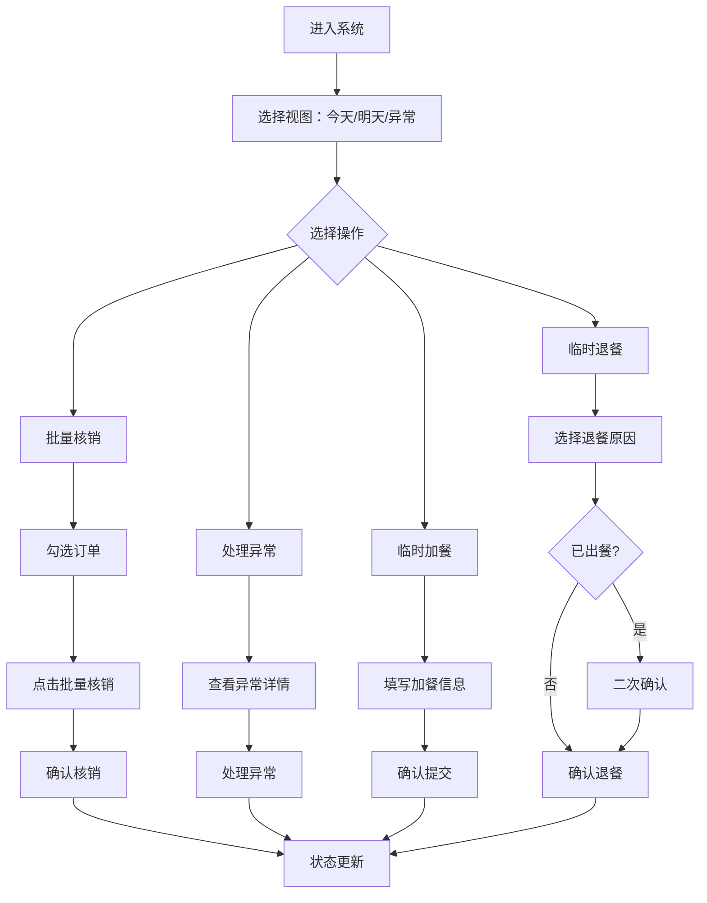

## 1. 产品概述

社区食堂订餐管理前端原型，面向食堂工作人员，解决饭点高峰期纸质名单与小程序后台来回对照导致的漏核销、补贴异常未发现、临时加退餐登记不便等痛点。

- 目标用户：社区食堂工作人员（中老年友好，操作需简洁直观）
- 核心价值：一站式完成订餐查看、批量核销、补贴异常预警、临时加退餐操作，消除纸质流程

## 2. 核心功能

### 2.1 用户角色

| 角色 | 注册方式 | 核心权限 |
|------|----------|----------|
| 食堂工作人员 | 管理员分配账号 | 查看/核销订单、登记加退餐、查看补贴异常 |

### 2.2 功能模块

1. **订餐管理主页**：左侧视图切换（今天/明天/异常订单）+ 右侧订单列表与详情
2. **批量核销面板**：勾选多条订单一键核销，支持扫码快捷操作
3. **补贴异常提示**：资格过期、重复订餐等异常自动高亮标记
4. **临时加餐登记**：快速录入临时加餐信息
5. **临时退餐处理**：支持已出餐退餐的特殊流程

### 2.3 页面详情

| 页面名称 | 模块名称 | 功能描述 |
|----------|----------|----------|
| 订餐管理主页 | 左侧视图切换栏 | 今天/明天/异常订单三个Tab，显示各视图订单数量徽标 |
| 订餐管理主页 | 订单列表区 | 按补贴类型分组显示，支持勾选，显示核销状态、补贴标签、异常标记 |
| 订餐管理主页 | 订单详情面板 | 右侧滑出或内嵌显示：个人订餐信息、补贴类型、送餐地址、核销状态、备注 |
| 订餐管理主页 | 批量核销工具栏 | 底部/顶部悬浮操作栏，显示已选数量，一键核销 |
| 订餐管理主页 | 补贴异常提示 | 异常订单视图中高亮展示：资格过期、重复订餐、已出餐退餐等 |
| 订餐管理主页 | 临时加餐登记 | 弹窗表单：姓名、餐类、补贴类型、送餐地址、备注 |
| 订餐管理主页 | 临时退餐 | 弹窗确认：退餐原因选择、已出餐退餐特殊处理 |

## 3. 核心流程

**核销流程**：工作人员选择日期视图 → 浏览订单列表 → 勾选已出餐订单 → 点击批量核销 → 确认核销 → 状态更新

**异常处理流程**：切换到异常订单视图 → 查看补贴过期/重复订餐/已出餐退餐 → 逐条处理

**临时加餐流程**：点击加餐按钮 → 填写信息 → 确认提交 → 新订单出现在列表中

**临时退餐流程**：选择订单 → 点击退餐 → 选择退餐原因 → 确认（已出餐需额外确认）→ 状态更新

## 4. 用户界面设计

### 4.1 设计风格

- **主色调**：暖橙色（#E8722A）作为主色，传递食堂温馨感；深灰（#1F2937）作为文字色
- **辅助色**：绿色（#10B981）表示已核销、红色（#EF4444）表示异常/过期、蓝色（#3B82F6）表示待处理
- **按钮风格**：圆角按钮（rounded-lg），主操作按钮填充色，次要操作按钮描边
- **字体**：思源黑体风格，正文14px，标题16-20px，确保中老年可读
- **布局风格**：左右分栏布局，左侧窄栏切换视图，右侧主内容区
- **图标风格**：使用 lucide-react 线性图标，24px 尺寸

### 4.2 页面设计概述

| 页面名称 | 模块名称 | UI元素 |
|----------|----------|--------|
| 订餐管理主页 | 左侧切换栏 | 竖向Tab，每个Tab带图标+文字+数量徽标，选中态暖橙色背景 |
| 订餐管理主页 | 订单列表 | 卡片式列表项，左侧勾选框，补贴类型彩色标签，核销状态图标，异常订单红色边框 |
| 订餐管理主页 | 订单详情 | 右侧面板，展示姓名、餐类、补贴类型、送餐地址、核销状态时间线、备注编辑 |
| 订餐管理主页 | 批量核销栏 | 底部悬浮条，显示"已选N项"，核销按钮暖橙色高亮，点击后确认弹窗 |
| 订餐管理主页 | 加餐弹窗 | 居中弹窗，表单字段竖向排列，补贴类型下拉选择，确认按钮突出 |
| 订餐管理主页 | 退餐弹窗 | 居中弹窗，退餐原因单选列表，已出餐退餐黄色警告提示 |

### 4.3 响应式设计

- 桌面优先（1280px+），左右分栏布局
- 平板（768-1279px）自适应缩减左侧栏宽度
- 不需要手机端适配（工作人员使用桌面/平板操作）

### 4.4 3D 场景

不涉及 3D 场景
