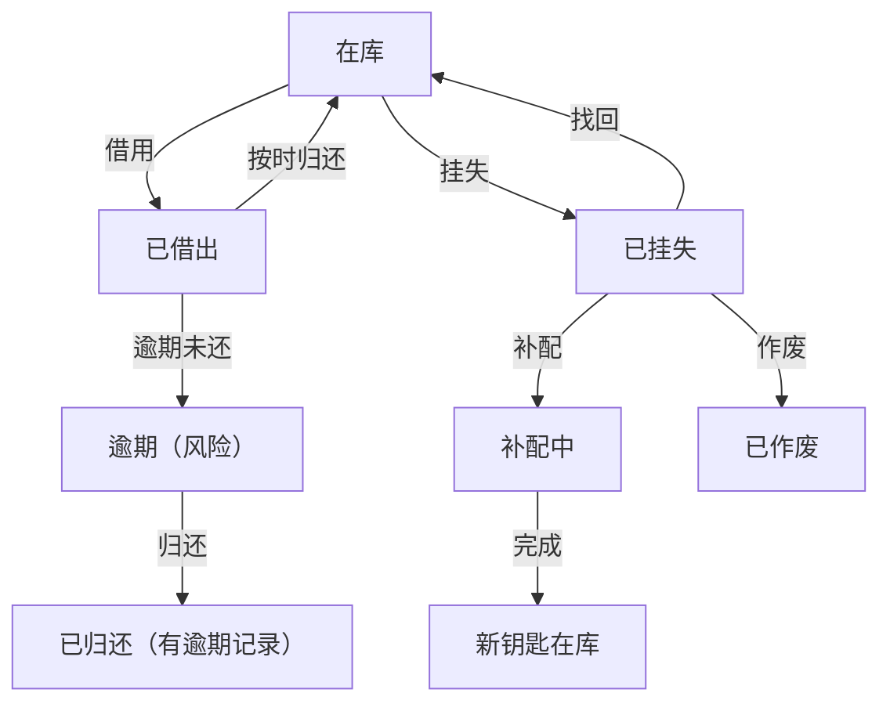

## 1. 产品概述

学生宿舍钥匙借还与挂失补配管理系统，解决当前钥匙管理信息分散、状态追踪困难的问题。面向宿管员、辅导员、维修人员等不同角色，提供统一的钥匙全生命周期管理平台。

- 核心价值：将分散在入住名单、钥匙台账、晚归记录中的信息整合，形成完整的钥匙状态追踪链
- 目标用户：宿管员（日常借还处理）、辅导员（风险查看）、维修人员（钥匙领用）

## 2. 核心功能

### 2.1 用户角色

| 角色 | 登录方式 | 核心权限 |
|------|----------|----------|
| 宿管员 | 简化登录（选择角色即可） | 钥匙借还处理、挂失登记、补配处理、数据重置 |
| 辅导员 | 简化登录 | 查看风险项、查看学生钥匙状态、历史记录回看 |
| 维修人员 | 简化登录 | 公共区域钥匙借还、查看个人借还记录 |

### 2.2 功能模块

1. **仪表盘首页**：待处理事项、风险预警、最近变更记录
2. **钥匙管理列表**：多维度筛选、钥匙状态总览、快速操作入口
3. **钥匙借还处理**：借用登记、归还确认、逾期提醒
4. **挂失补配管理**：挂失登记、补配申请、补配完成、历史回看
5. **系统设置**：数据重置功能

### 2.3 页面详情

| 页面名称 | 模块名称 | 功能描述 |
|----------|----------|----------|
| 仪表盘 | 待处理卡片 | 显示待归还钥匙、待补配钥匙数量，点击跳转详情 |
| 仪表盘 | 风险预警 | 逾期未还、多次挂失、异常借还记录高亮显示 |
| 仪表盘 | 最近变更 | 时间线展示最近20条钥匙状态变更记录 |
| 钥匙列表 | 筛选区域 | 按楼栋、房间、状态、学生姓名、时间范围筛选 |
| 钥匙列表 | 数据表格 | 展示钥匙编号、所属房间、持有人、当前状态、操作按钮 |
| 借还处理 | 借用表单 | 选择学生、钥匙、预计归还时间，记录借用人 |
| 借还处理 | 归还确认 | 核对钥匙信息，记录归还时间，自动计算是否逾期 |
| 挂失补配 | 挂失登记 | 记录挂失原因、挂失时间，自动标记钥匙状态 |
| 挂失补配 | 补配处理 | 记录补配费用、完成时间，生成新钥匙编号 |
| 挂失补配 | 历史回看 | 按钥匙或学生查询完整的挂失补配历史链 |

## 3. 核心流程

### 3.1 钥匙借用流程
宿管员登录 → 搜索学生/房间 → 选择可用钥匙 → 登记借用信息 → 钥匙状态变为"已借出" → 系统记录借还日志

### 3.2 钥匙归还流程
宿管员登录 → 查找借出记录 → 确认归还 → 检查是否逾期 → 钥匙状态变回"在库" → 若逾期标记为风险记录

### 3.3 挂失补配流程
学生报失 → 宿管员登记挂失 → 钥匙状态变为"已挂失" → 提交补配申请 → 补配完成 → 生成新钥匙记录 → 旧钥匙标记为"作废"

## 4. 用户界面设计

### 4.1 设计风格
- **主色调**：深蓝色系 (#1e3a5f) 代表严谨和信任，搭配琥珀橙 (#f59e0b) 作为警告色，红色 (#ef4444) 作为风险色
- **辅助色**：浅灰背景 (#f8fafc)，卡片白色 (#ffffff)，边框浅灰 (#e2e8f0)
- **按钮风格**：圆角 6px，悬停有微妙阴影和颜色加深效果，主按钮深蓝色，危险按钮红色
- **字体**：系统无衬线字体，标题 16-18px semibold，正文 14px regular，辅助文字 12px
- **布局风格**：顶部导航 + 侧边角色入口 + 卡片式内容区，数据表格带斑马纹
- **图标风格**：线性图标，状态使用颜色圆点标识（绿色在库、黄色借出、红色挂失/逾期）

### 4.2 页面设计概述

| 页面名称 | 模块名称 | UI 元素 |
|----------|----------|----------|
| 仪表盘 | 统计卡片 | 渐变背景卡片，大数字 + 趋势箭头，悬停微动效 |
| 仪表盘 | 风险列表 | 红色边框警示，风险等级标签，快速处理按钮 |
| 仪表盘 | 时间线 | 左侧竖线时间轴，状态色点，操作人 + 时间 + 内容 |
| 钥匙列表 | 筛选栏 | 横向排列筛选条件，下拉选择器，日期范围选择 |
| 钥匙列表 | 表格行 | 状态色标、钥匙编号、学生信息、悬停显示操作按钮 |
| 借还弹窗 | 表单 | 分步表单，必填项红星标记，实时校验 |
| 详情页 | 状态流转 | 横向时间轴展示钥匙完整生命周期 |

### 4.3 响应式
- 桌面端优先（1280px 以上），侧边栏固定宽度 240px
- 平板端（768-1279px）：侧边栏可折叠，表格横向滚动
- 移动端（< 768px）：顶部导航，卡片堆叠展示，筛选下拉收起
