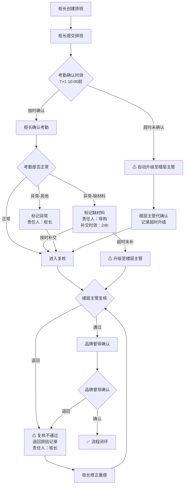

## 1. 产品概述

百货专柜导购排班与考勤确认系统——解决排班提交后到考勤确认之间的责任真空和时效失控问题。正常排班→考勤只是冰山一角，核心是异常场景下的责任追溯和时效约束，让柜长、楼层主管、品牌督导三方在各自视角下看到一致的状态口径，杜绝"没人管"的空档。

- 目标用户：百货商场专柜运营团队（柜长、楼层主管、品牌督导、导购）
- 核心价值：排班到考勤全链路责任到人、异常可追溯、状态口径跨角色一致

## 2. 核心功能

### 2.1 用户角色

| 角色 | 进入方式 | 核心权限 |
|------|----------|----------|
| 柜长 | 演示账号登录 | 创建/提交排班、初确认考勤、处理异常 |
| 楼层主管 | 演示账号登录 | 复核考勤、处理超时未确认、退回异常单 |
| 品牌督导 | 演示账号登录 | 品牌侧确认、查看跨专柜排班汇总 |
| 导购 | 演示账号登录 | 查看本人排班、打卡确认、补交材料 |

### 2.2 功能模块

1. **排班工作台**：排班表创建与提交、排班变更、排班状态追踪
2. **考勤确认台**：班次考勤确认、异常标记、材料补交、超时预警
3. **复核中心**：楼层主管复核、品牌督导确认、复核退回与重提
4. **异常驾驶舱**：缺材料/超时/复核不通过聚合视图、责任到人标记
5. **操作日志**：全链路操作记录、时间戳与操作人、状态变更轨迹
6. **考勤回看**：历史考勤记录查询、按专柜/导购/日期筛选

### 2.3 页面详情

| 页面名称 | 模块名称 | 功能描述 |
|----------|----------|----------|
| 登录页 | 角色选择 | 演示账号切换，4个角色入口 |
| 排班工作台 | 排班表视图 | 按周显示专柜排班，颜色区分班次，异常排班红色标记 |
| 排班工作台 | 排班提交 | 提交排班至待确认状态，触发时效计时 |
| 排班工作台 | 排班变更 | 已提交排班的变更申请与审批 |
| 考勤确认台 | 待确认列表 | 按时效倒序排列，超时项置顶红色闪烁 |
| 考勤确认台 | 考勤确认 | 逐班次确认/标记异常，缺材料可标记待补 |
| 考勤确认台 | 材料补交 | 导购补交缺漏材料，关联原考勤记录 |
| 复核中心 | 待复核列表 | 楼层主管视角的待复核考勤列表 |
| 复核中心 | 复核操作 | 通过/退回，退回需填写原因 |
| 复核中心 | 品牌确认 | 品牌督导最终确认，可附加意见 |
| 异常驾驶舱 | 异常聚合 | 缺材料/超时/复核不通过三类异常聚合面板 |
| 异常驾驶舱 | 责任标记 | 每条异常标注当前责任人，倒计时显示 |
| 操作日志 | 日志列表 | 全操作记录，支持按时间/操作人/状态筛选 |
| 考勤回看 | 历史查询 | 按专柜/导购/日期范围查询历史考勤 |

## 3. 核心流程

排班到考勤确认的核心链路，重点突出异常分支和责任归属：

状态机定义（跨角色口径一致）：

| 状态 | 含义 | 当前责任人 | 时效约束 |
|------|------|-----------|----------|
| 草稿 | 排班未提交 | 柜长 | 无 |
| 已提交 | 等待考勤确认 | 柜长 | T+1 10:00 |
| 待补材料 | 考勤缺材料 | 导购 | 24h |
| 超时升级 | 考勤超时 | 楼层主管 | 4h |
| 待复核 | 等待楼层复核 | 楼层主管 | T+2 18:00 |
| 复核退回 | 复核不通过 | 柜长 | 8h修正 |
| 待品牌确认 | 等待品牌确认 | 品牌督导 | T+3 18:00 |
| 已闭环 | 流程完成 | 无 | 无 |

## 4. 用户界面设计

### 4.1 设计风格

- **风格定位**：工业运营风（Industrial Ops）——深色基调、紧凑布局、醒目异常标记、操作紧迫感
- **主色**：深灰 #1a1a2e 为底，配合冷灰 #16213e 次底色
- **强调色**：琥珀 #f59e0b 用于警告/超时，赤红 #ef4444 用于异常/不通过，翠绿 #10b981 用于正常/闭环
- **辅助色**：钢蓝 #3b82f6 用于信息/链接
- **字体**：Noto Sans SC（中文主字体），JetBrains Mono（数字/时效倒计时）
- **按钮风格**：圆角微矩形，异常操作用填充色强调，常规操作用描边
- **布局风格**：侧边导航 + 内容区，异常驾驶舱用卡片网格，排班表用紧凑表格
- **图标风格**：Lucide 线性图标

### 4.2 页面设计概览

| 页面名称 | 模块名称 | UI 元素 |
|----------|----------|---------|
| 登录页 | 角色选择卡片 | 4张角色卡片，深色背景，角色图标+名称，悬停高亮边框 |
| 排班工作台 | 排班表格 | 紧凑周视图表格，班次色块，异常行红色左边框，顶部统计栏 |
| 排班工作台 | 提交/变更面板 | 右侧滑出面板，表单+时效提示，倒计时组件 |
| 考勤确认台 | 待确认列表 | 卡片列表，超时项置顶+红色脉冲动画，倒计时显示 |
| 考勤确认台 | 确认操作区 | 内联确认按钮组，缺材料标记按钮，异常原因下拉 |
| 复核中心 | 待复核列表 | 表格+侧边状态栏，退回用红色标记，批量操作勾选 |
| 复核中心 | 退回对话框 | 模态框，必填退回原因，关联原考勤快照 |
| 异常驾驶舱 | 异常聚合面板 | 三列卡片（缺材料/超时/复核不通过），数字+趋势，底部列表 |
| 异常驾驶舱 | 责任人标记 | 每条异常右侧显示责任人头像+姓名+倒计时 |
| 操作日志 | 日志表格 | 紧凑表格，操作时间精确到秒，状态变更高亮diff |
| 考勤回看 | 筛选+结果 | 顶部筛选条（专柜/导购/日期），下方结果表格 |

### 4.3 响应式

桌面优先设计，目标分辨率 1440×900 以上。表格在大屏下全部展示，小屏下关键列优先。

### 4.4 交互细节

- 超时项：红色脉冲动画 + 倒计时数字
- 状态变更：Toast 通知 + 列表即时刷新
- 异常标记：操作后即时高亮，不打断流程
- 操作日志：每次操作自动记录，不可手动删除
