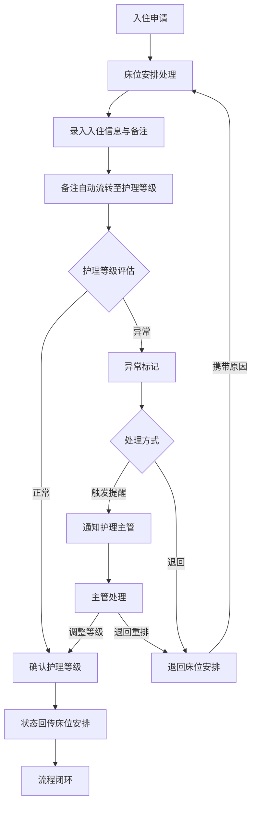
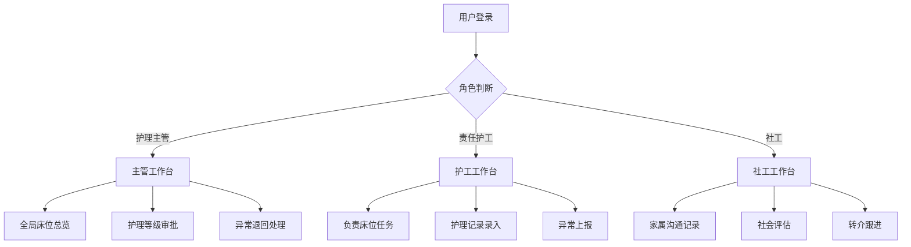

## 1. 产品概述

养老护理院床位安排与护理等级管理系统——解决信息散落在床位表、护理交班本和家属微信群中的追踪断裂问题，实现床位安排到护理等级的全程数据贯通，让备注不再停留在当前页面，而是成为下游流程的可用信息。

- 核心目标：减少翻群记录、消除信息孤岛，让床位安排处理时的备注自动流转到护理等级环节
- 目标用户：护理主管、责任护工、社工三类角色，各自拥有不同的处理入口与视图

## 2. 核心功能

### 2.1 用户角色

| 角色 | 进入方式 | 核心权限与处理入口 |
|------|----------|---------------------|
| 护理主管 | 主管账号登录 | 全局视图：床位总览、护理等级审批、异常退回、等级调整入口 |
| 责任护工 | 护工账号登录 | 执行视图：负责床位任务、护理记录录入、异常上报入口 |
| 社工 | 社工账号登录 | 沟通视图：家属沟通记录、社会评估、转介跟进入口 |

### 2.2 功能模块

1. **床位安排页**：床位状态总览、入住/调床/退床处理、备注流转（备注自动关联护理等级）、密集表格
2. **护理等级页**：等级回看时间线、等级变更记录、异常标记与退回、与床位安排的状态联动
3. **工作台页**：角色差异化入口、待处理事项、异常提醒通知、快捷操作面板

### 2.3 页面详情

| 页面名称 | 模块名称 | 功能描述 |
|----------|----------|----------|
| 床位安排页 | 床位状态总览 | 密集表格展示所有床位，颜色编码标识状态（空闲/已住/待调整/异常），支持筛选与搜索 |
| 床位安排页 | 入住/调床处理 | 表单录入入住信息，备注字段自动携带到护理等级流程；调床时保留历史备注链 |
| 床位安排页 | 备注流转面板 | 侧边面板展示当前床位所有备注，标注哪些已流转至护理等级，哪些待处理 |
| 护理等级页 | 等级回看时间线 | 纵向时间线展示等级变更历史，每个节点显示触发来源（床位安排/定期评估/异常上报） |
| 护理等级页 | 异常标记与退回 | 异常样例可直接触发提醒或退回到床位安排环节，退回时携带原因和修改建议 |
| 护理等级页 | 状态联动指示 | 床位安排与护理等级之间的状态流转清晰可见，用连线或标签标明当前环节 |
| 工作台页 | 角色入口面板 | 根据当前角色展示不同操作入口：主管→审批/退回，护工→录入/上报，社工→沟通/评估 |
| 工作台页 | 待处理事项 | 列出当前角色需要处理的所有待办，按紧急程度排序，异常项置顶 |
| 工作台页 | 异常提醒通知 | 实时弹出异常提醒，支持点击直接跳转处理；未读异常角标提示 |

## 3. 核心流程

**床位安排 → 护理等级贯通流程**：老人入住时在床位安排中录入信息与备注，备注自动流转至护理等级评估环节；护理等级评估完成后，状态回传至床位安排，形成闭环。若评估发现异常，可直接退回床位安排环节并标注原因。

**角色差异化处理流程**：

## 4. 用户界面设计

### 4.1 设计风格

- **主色调**：深蓝灰(#1E293B)作为底色，营造专业沉稳的医疗护理氛围；琥珀色(#F59E0B)作为警示/异常强调色；翠绿(#10B981)作为正常状态色
- **按钮风格**：圆角矩形(8px)，主操作用实心填充，次操作用描边样式；异常操作用琥珀色高亮
- **字体**：中文使用思源黑体(Noto Sans SC)，数据/数字使用 JetBrains Mono 等宽字体便于对齐
- **布局风格**：左侧固定导航 + 右侧内容区，内容区采用密集表格为主，减少留白以提升信息密度；侧边面板用于备注流转和详情展开
- **图标风格**：使用 Lucide 图标库，线性风格，与整体专业感保持一致

### 4.2 页面设计概览

| 页面名称 | 模块名称 | UI 元素 |
|----------|----------|---------|
| 床位安排页 | 床位状态总览 | 密集表格(紧凑行高36px)，每行含：床号、姓名、护理等级标签、状态色块、备注预览、操作按钮；表头固定，支持横向滚动 |
| 床位安排页 | 入住/调床处理 | 右侧滑出抽屉面板，表单含：基本信息、护理初始评估、备注文本域(标注"将流转至护理等级")、提交按钮 |
| 床位安排页 | 备注流转面板 | 侧边面板，备注列表每项含：时间戳、来源标签(床位安排/护理等级/异常退回)、流转状态图标(✓已流转/○待流转) |
| 护理等级页 | 等级回看时间线 | 左侧纵向时间线，节点颜色区分来源：蓝=床位安排触发、绿=定期评估、橙=异常上报；右侧详情面板 |
| 护理等级页 | 异常标记与退回 | 异常条目红色左边框，操作区含"触发提醒"和"退回"两个按钮；退回时弹出原因选择+自由文本框 |
| 护理等级页 | 状态联动指示 | 顶部状态条：床位安排(●) → 护理评估(●) → 已确认(○)，当前环节高亮，异常环节闪烁 |
| 工作台页 | 角色入口面板 | 三列卡片布局(主管/护工/社工各自入口)，每列含2-3个快捷操作按钮，带图标 |
| 工作台页 | 待处理事项 | 紧凑列表，每行含：优先级色条、事项名称、来源标签、操作按钮；异常项置顶并闪烁背景 |
| 工作台页 | 异常提醒通知 | 右上角铃铛图标+角标，点击展开通知列表，每条通知可直接跳转处理页面 |

### 4.3 响应式设计

- 桌面优先(Tauri桌面端为主)，最小支持1280px宽度
- 密集表格在窄屏下支持横向滚动与列固定
- 侧边面板(备注流转/详情)支持折叠收起

### 4.4 无3D场景需求

本系统为数据密集型管理工具，无需3D场景。
