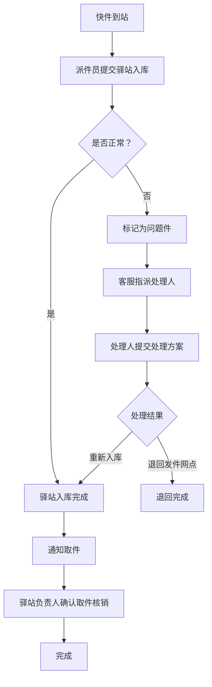

## 1. 产品概述

快递网点驿站入库与取件核销系统——解决驿站入库和取件核销之间责任不清的问题。通过记录每一次状态变化的责任人、时间点和备注，让网点客服、派件员、驿站负责人之间的交接全程留痕可追溯。

- 目标用户：快递网点客服、派件员、驿站负责人
- 核心价值：将派件清单、问题件表、驿站签收图从「只记结果」升级为「全流程留痕」，明确入库与核销之间的责任边界

## 2. 核心功能

### 2.1 用户角色

| 角色 | 进入方式 | 核心权限 |
|------|----------|----------|
| 网点客服 | 选择角色进入 | 查看全部数据、处理问题件、重置数据 |
| 派件员 | 选择角色进入 | 提交驿站入库、查看派件清单 |
| 驿站负责人 | 选择角色进入 | 确认取件核销、查看签收图 |

### 2.2 功能模块

1. **首页仪表盘**：今日优先事项、待处理统计、最近动态
2. **派件清单页**：今日到站快件列表、驿站入库操作、入库留痕
3. **问题件管理页**：问题件列表、处理流转、责任追踪
4. **取件核销页**：待核销列表、核销操作、核销回看
5. **详情时间线页**：单件快件全生命周期时间线、状态变化、责任人、备注

### 2.3 页面详情

| 页面名称 | 模块名称 | 功能描述 |
|----------|----------|----------|
| 首页仪表盘 | 今日优先事项 | 显示今日最需优先处理的事项：超时未入库、超时未核销、待处理问题件 |
| 首页仪表盘 | 统计卡片 | 待入库数、待核销数、问题件数、今日完成数 |
| 首页仪表盘 | 最近动态 | 实时展示最近的入库、核销、问题件处理记录 |
| 派件清单页 | 到站快件列表 | 今日到达网点的快件，含运单号、类型、到达时间 |
| 派件清单页 | 驿站入库操作 | 派件员选择快件提交入库，填写入库备注，系统记录入库时间和操作人 |
| 派件清单页 | 已入库列表 | 已完成入库的快件，显示入库时间、操作人、备注 |
| 问题件管理页 | 问题件列表 | 所有问题件，含问题描述、当前处理人、处理状态 |
| 问题件管理页 | 问题件处理 | 提交处理方案、指派处理人、记录处理结果 |
| 问题件管理页 | 责任追踪 | 每个问题件的责任链路，谁提交、谁处理、何时完成 |
| 取件核销页 | 待核销列表 | 已入库待取件的快件，含入库时间、超时标记 |
| 取件核销页 | 核销操作 | 驿站负责人确认取件，记录取件人、取件时间、备注 |
| 取件核销页 | 核销回看 | 已核销快件的历史记录，含核销时间、操作人、取件人 |
| 详情时间线页 | 全生命周期时间线 | 从到站→入库→通知→核销的完整状态流，每个节点含时间、操作人、备注 |
| 详情时间线页 | 数据重置 | 将快件状态重置到指定节点（仅客服可用） |

## 3. 核心流程

### 3.1 正常流转

快件到达网点后，派件员将其送至驿站并提交「驿站入库」，系统记录入库时间、操作人和备注；驿站负责人在客户取件时进行「取件核销」，记录取件人、核销时间、备注。每一步都在时间线中留痕。

### 3.2 问题件流转

快件出现异常（破损、地址错误、拒收等），客服标记为问题件并指派处理人；处理人提交处理方案后，可重新入库或退回发件网点。

### 3.3 流程图

## 4. 用户界面设计

### 4.1 设计风格

- 主色调：深青色（#0F766E）+ 暖琥珀色（#D97706）作为警示/问题件色
- 辅助色：石板灰（zinc）系列作为中性色
- 按钮风格：圆角（rounded-lg），主操作实色填充，次操作描边
- 字体：使用 Noto Sans SC 作为中文主字体，搭配 JetBrains Mono 显示运单号
- 布局风格：左侧导航栏 + 右侧内容区，卡片式布局
- 图标风格：Lucide 线性图标

### 4.2 页面设计概述

| 页面名称 | 模块名称 | UI 元素 |
|----------|----------|---------|
| 首页仪表盘 | 今日优先事项 | 顶部横幅，红/橙/黄三色优先级卡片，数字高亮，点击跳转 |
| 首页仪表盘 | 统计卡片 | 四宫格卡片，图标+数字+描述，微动效 |
| 首页仪表盘 | 最近动态 | 时间线列表，头像+操作描述+时间，渐入动画 |
| 派件清单页 | 到站快件列表 | 表格，运单号等宽字体，状态徽章，入库按钮 |
| 派件清单页 | 驿站入库操作 | 右侧抽屉/弹窗，表单含备注输入，确认提交 |
| 问题件管理页 | 问题件列表 | 卡片列表，问题类型标签，处理状态色块 |
| 问题件管理页 | 问题件处理 | 弹窗表单，处理方案文本域，指派下拉 |
| 取件核销页 | 待核销列表 | 表格，超时行高亮，核销按钮 |
| 取件核销页 | 核销回看 | 折叠面板，已核销记录，展开查看详情 |
| 详情时间线页 | 全生命周期时间线 | 垂直时间线，节点图标+状态+时间+操作人+备注 |
| 详情时间线页 | 数据重置 | 下拉选择目标状态，重置确认弹窗 |

### 4.3 响应式

桌面优先设计，最小宽度 1024px；平板端（768px-1024px）导航栏折叠为图标模式；移动端暂不适配。

### 4.4 3D 场景

不适用
