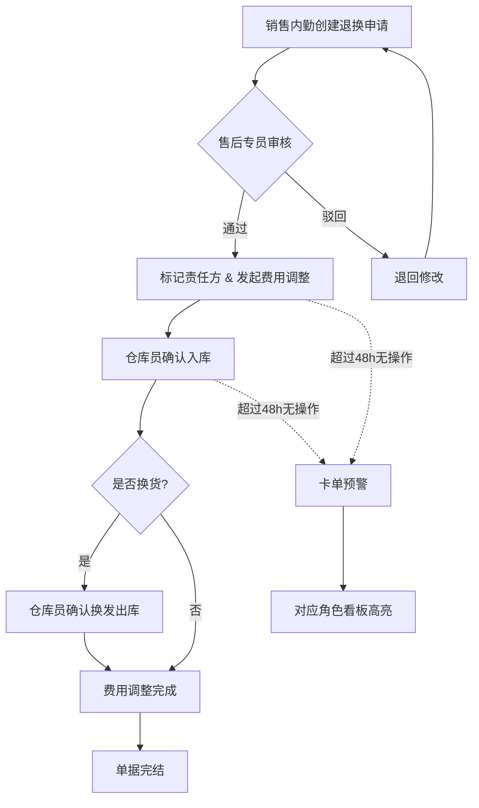

## 1. 产品概述

口腔耗材商售后退换与费用调整管理系统——解决旧台账、现场记录、沟通截图信息分散导致售后退换与费用调整责任不清、卡单后置发现的问题。
- 面向口腔耗材经销商的销售内勤、仓库员、售后专员三类角色，让每个角色直接看到自己的待办，卡住的单子第一时间暴露。
- 将售后退换、费用调整、退回原因、补充备注合并在同一条记录中，处理费用调整时无需跳转多个页面查找依据。

## 2. 核心功能

### 2.1 用户角色

| 角色 | 进入方式 | 核心权限 |
|------|----------|----------|
| 销售内勤 | 角色选择器切换 | 查看全部单据、创建售后退换申请、发起费用调整、补充备注 |
| 仓库员 | 角色选择器切换 | 查看待入库/待出库单据、确认退回入库、确认换发出库、填写仓库备注 |
| 售后专员 | 角色选择器切换 | 查看待处理售后单、审核退换申请、指定费用调整方案、标记责任方 |

### 2.2 功能模块

1. **角色视图首页**：按角色筛选待办单据，高亮卡住（超时/阻塞）的单据，提供全局待办计数
2. **售后退换处理页**：统一展示售后退换与费用调整信息，退回原因、责任方、补充备注在同一记录卡片内
3. **费用调整回看页**：关联原始售后单、退回凭证、沟通截图摘要，无需跳转即可查看全部依据
4. **单据详情面板**：侧滑面板展示单据全生命周期，时间线 + 操作按钮

### 2.3 页面详情

| 页面名称 | 模块名称 | 功能描述 |
|----------|----------|----------|
| 角色视图首页 | 待办看板 | 按角色过滤的待办列表，卡单用红色标签高亮，顶部统计待办数量 |
| 角色视图首页 | 卡单预警栏 | 横幅展示超过48h未推进的单据，点击直达详情 |
| 售后退换处理页 | 退换单列表 | 所有售后退换单卡片，含退回原因、责任方、费用调整状态标签 |
| 售后退换处理页 | 退换操作区 | 侧滑面板内操作：审核通过/驳回、指定换发货、确认入库、补充备注 |
| 售后退换处理页 | 费用调整内联区 | 卡片内直接展示费用调整金额、依据摘要、状态，点击展开完整依据 |
| 费用调整回看页 | 调整记录列表 | 所有费用调整记录，关联原单号、调整金额、责任方 |
| 费用调整回看页 | 依据聚合面板 | 展开单条调整时，下方聚合原始售后信息、退回凭证、沟通截图摘要 |
| 单据详情面板 | 全生命周期时间线 | 侧滑面板：创建→审核→退回→入库→费用调整→完结，每步标注操作人和时间 |

## 3. 核心流程

### 3.1 售后退换主流程

1. 销售内勤创建售后退换申请，填写退回原因、补充备注
2. 售后专员审核退换申请，指定退换类型（退货/换货）、标记责任方
3. 如涉及费用调整，售后专员在同一单据内发起费用调整，填写调整金额和依据
4. 仓库员收到待办，确认退回入库，填写仓库备注
5. 如为换货，仓库员确认换发出库
6. 费用调整完成后自动关联原单，销售内勤可在回看页查看完整依据

### 3.2 卡单暴露机制

1. 单据超过48h无操作自动标记为"卡单"
2. 卡单在看板顶部横幅预警展示
3. 卡单在列表中用红色边框+标签高亮
4. 按角色显示卡单中属于该角色的待处理步骤

## 4. 用户界面设计

### 4.1 设计风格

- **主色调**：深青蓝 #1B4965 + 警示橙 #E8871E + 成功绿 #2D936C
- **辅助色**：浅灰背景 #F7F9FC、白色卡片、边框 #E2E8F0
- **按钮风格**：圆角8px，主操作实心填充，次要操作描边
- **字体**：标题用 Noto Sans SC Bold，正文用 Noto Sans SC Regular
- **布局风格**：左侧固定导航 + 右侧内容区，卡片式列表，侧滑详情面板
- **图标**：使用 Material Icons 线性风格
- **卡单标识**：红色左边框 + 红色"卡单"标签 + 微弱脉冲动画

### 4.2 页面设计概览

| 页面名称 | 模块名称 | UI元素 |
|----------|----------|--------|
| 角色视图首页 | 待办看板 | 三列看板（待处理/进行中/已完成），顶部角色切换Tab，卡单预警横幅 |
| 角色视图首页 | 卡单预警栏 | 橙色渐变横幅，显示卡单数量，点击展开列表 |
| 售后退换处理页 | 退换单列表 | 卡片列表，每卡片含：单号、客户名、退回原因标签、责任方标签、费用调整状态标签、卡单标记 |
| 售后退换处理页 | 退换操作区 | 右侧侧滑面板 500px，时间线 + 操作按钮 + 备注输入 |
| 售后退换处理页 | 费用调整内联区 | 卡片内折叠区域，展开显示调整金额、依据摘要、关联截图缩略图 |
| 费用调整回看页 | 调整记录列表 | 表格 + 展开行，展开时显示依据聚合面板 |
| 费用调整回看页 | 依据聚合面板 | 三栏并排：原始售后信息 | 退回凭证 | 沟通截图摘要 |
| 单据详情面板 | 全生命周期时间线 | 垂直时间线，每节点含操作人、时间、操作结果图标 |

### 4.3 响应式设计

- 桌面优先设计，最小宽度1280px
- 侧滑面板在窄屏下全屏覆盖
- 卡片列表在中等屏幕下双列，宽屏三列

## 5. 模拟数据与集成点说明

### 5.1 Mock 数据位置

- `src/mock/orders.ts` — 售后退换单数据（含退回原因、责任方、卡单标记）
- `src/mock/feeAdjustments.ts` — 费用调整数据（含调整金额、依据、关联单号）
- `src/mock/timeline.ts` — 单据生命周期时间线数据
- `src/mock/users.ts` — 角色与用户数据

### 5.2 角色入口

- 顶部导航栏角色切换器（下拉选择：销售内勤/仓库员/售后专员）
- 切换角色后自动过滤待办列表、刷新看板统计

### 5.3 暂未实现的集成点

| 集成点 | 说明 | 当前替代方案 |
|--------|------|-------------|
| ERP订单系统同步 | 自动拉取原订单信息 | Mock数据模拟 |
| 仓库WMS入库确认 | 实时同步仓库入库状态 | 手动点击"确认入库"按钮 |
| 财务系统费用确认 | 费用调整后自动推送财务 | 页面内展示调整结果，不推送 |
| 通讯截图OCR解析 | 自动提取聊天记录关键信息 | Mock预填摘要文本 |
| 消息通知推送 | 卡单预警推送到角色对应人 | 页面内横幅预警展示 |
