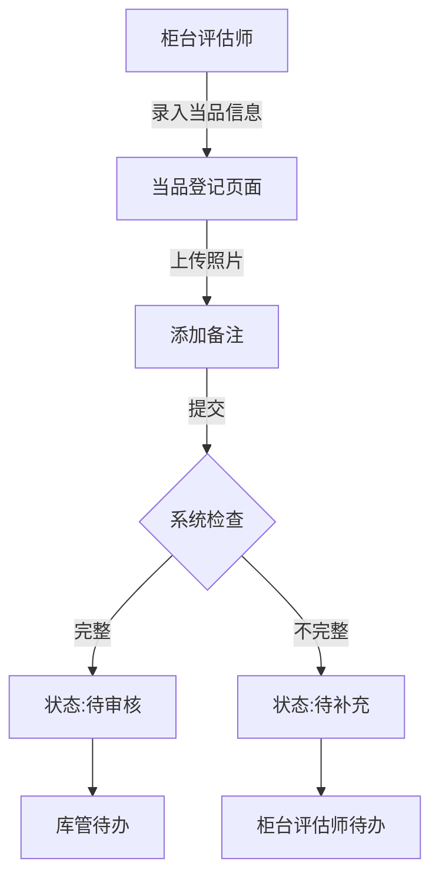
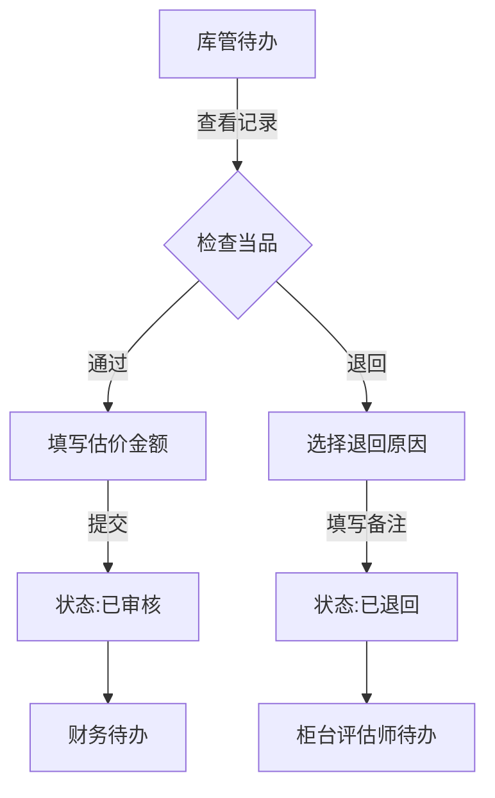
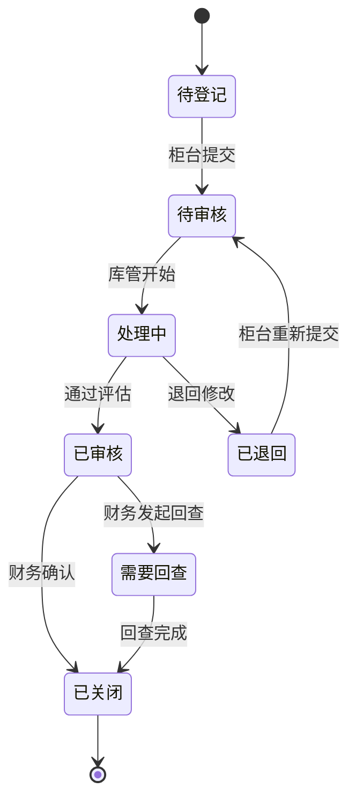

## 1. Product Overview

**典当行当品登记与估价复核系统** - 解决当品登记与估价复核之间责任不清、时效不明的问题，确保各角色（柜台评估师、库管、财务）能清晰看到各自待办，支持离线使用和状态持久化。

- **核心问题**：当品登记与估价复核环节责任边界模糊，备注信息无法流转，导致扯皮纠纷
- **目标用户**：典当行柜台评估师、库管、财务人员
- **核心价值**：明确责任划分、时效追踪、离线可靠、记录完整

## 2. Core Features

### 2.1 User Roles
| Role | Registration Method | Core Permissions |
|------|---------------------|------------------|
| 柜台评估师 | 账号登录 | 当品登记、查看待审核记录、补充信息 |
| 库管 | 账号登录 | 查看入库待办、确认当品状态、退回异常 |
| 财务 | 账号登录 | 查看已完成估价记录、处理赎当相关事务 |

### 2.2 Feature Module
1. **待办首页**：角色专属待办列表、快捷筛选、状态概览
2. **当品登记**：当品信息录入、照片上传、备注添加
3. **估价复核**：查看登记信息、评估价值、退回或通过
4. **记录详情**：完整记录查看、状态流转追踪、备注历史
5. **离线存储**：本地数据持久化、断网可用、自动同步

### 2.3 Page Details
| Page Name | Module Name | Feature description |
|-----------|-------------|---------------------|
| 待办首页 | 待办列表 | 按角色筛选待办、状态筛选、搜索、分页 |
| 待办首页 | 统计概览 | 各状态数量统计、今日待办提醒 |
| 当品登记 | 信息录入 | 当品类目、品牌、成色、重量等信息 |
| 当品登记 | 照片上传 | 支持多张照片、拍照或相册选择 |
| 当品登记 | 备注填写 | 异常情况、特殊说明等备注信息 |
| 估价复核 | 信息查看 | 完整查看登记信息和照片 |
| 估价复核 | 价值评估 | 输入估价金额、添加评估备注 |
| 估价复核 | 退回处理 | 选择退回原因、填写退回备注 |
| 记录详情 | 状态流转 | 查看完整状态变更历史和处理人 |
| 记录详情 | 备注历史 | 查看所有备注的时间线 |

## 3. Core Process

### 3.1 当品登记流程

### 3.2 估价复核流程

### 3.3 状态流转图

## 4. User Interface Design

### 4.1 Design Style
- **主色调**：深蓝色系（#1e3a5f）代表专业、可信
- **辅助色**：金色（#c9a227）体现典当行业特色
- **状态色**：待办(蓝色)、处理中(橙色)、已退回(红色)、已关闭(绿色)、需要回查(紫色)
- **按钮风格**：圆角矩形、hover效果明显
- **字体**：Inter，清晰易读
- **布局**：卡片式布局，信息层次分明
- **图标**：Lucide图标库

### 4.2 Page Design Overview
| Page Name | Module Name | UI Elements |
|-----------|-------------|-------------|
| 待办首页 | 顶部导航 | Logo、角色标识、搜索框 |
| 待办首页 | 统计卡片 | 各状态数量、今日待办数 |
| 待办首页 | 筛选栏 | 状态筛选、日期筛选、关键词搜索 |
| 待办首页 | 待办列表 | 卡片式展示、状态标签、快捷操作 |
| 当品登记 | 表单区域 | 分类选择、输入框、照片上传区 |
| 当品登记 | 备注区域 | 多行文本框、字数提示 |
| 估价复核 | 信息展示区 | 当品信息卡片、照片预览 |
| 估价复核 | 操作区 | 估价输入、通过/退回按钮 |
| 记录详情 | 状态时间线 | 彩色状态节点、处理人信息 |
| 记录详情 | 备注历史 | 时间倒序排列、操作人标识 |

### 4.3 Responsiveness
- **桌面端**：三栏布局，侧边导航、主内容区、详情面板
- **平板端**：两栏布局，折叠侧边栏
- **移动端**：单栏布局，底部导航

### 4.4 离线功能设计
- 本地存储图标标识离线状态
- 断网时自动切换本地数据
- 联网后自动同步变更

## 5. Key Requirements

### 5.1 责任清晰
- 每条记录记录操作人、操作时间、操作内容
- 备注信息在各环节间完整流转
- 退回原因明确记录

### 5.2 时效追踪
- 记录各状态停留时间
- 超时提醒功能
- 处理时效统计

### 5.3 离线可靠
- IndexedDB本地存储
- 状态持久化，重启不丢失
- 自动同步机制

### 5.4 快捷筛选
- 按状态筛选
- 按时间范围筛选
- 关键词搜索
- 按操作人筛选

### 5.5 样例数据覆盖
| 状态 | 说明 | 场景 |
|------|------|------|
| 待办 | 待审核的新登记记录 | 柜台刚提交 |
| 处理中 | 正在复核的记录 | 库管已打开 |
| 已退回 | 被退回修改的记录 | 信息不全或有问题 |
| 已关闭 | 完成全部流程的记录 | 财务已确认 |
| 需要回查 | 需要重新检查的记录 | 财务发现问题 |
