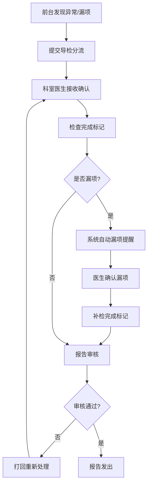

## 1. 产品概述

体检中心导检分流与漏项提醒系统——解决体检中心前台导检、科室医生、报告审核员之间的信息断层问题，将漏检、加项未收费、报告迟发等异常从口头流转变为系统留痕的闭环管理。

- 目标用户：体检中心前台导检员、科室医生、报告审核员
- 核心价值：今日待办一眼可见、异常单优先处理、全流程操作留痕、漏项自动提醒

## 2. 核心功能

### 2.1 用户角色

| 角色 | 进入方式 | 核心权限 |
|------|----------|----------|
| 前台导检员 | 工号登录 | 提交导检分流、查看漏项提醒、上传附件 |
| 科室医生 | 工号登录 | 确认漏项提醒、标记检查完成、发起加项 |
| 报告审核员 | 工号登录 | 审核报告、标记复核不通过、催发报告 |

### 2.2 功能模块

1. **今日待办看板**：第一屏展示当天需优先处理的异常单（缺材料、超时、复核不通过），按紧急程度排序
2. **导检分流处理**：前台提交分流意见，科室确认接收，状态流转全程留痕
3. **漏项提醒中心**：系统自动检测漏检项目，提醒相关人员补检，支持回看历史漏项
4. **详情时间线**：每份体检单的完整操作记录，谁在什么时间做了什么一目了然
5. **附件管理**：关键节点的附件占位与上传，如补检凭证、加项审批单等

### 2.3 页面详情

| 页面名称 | 模块名称 | 功能描述 |
|----------|----------|----------|
| 今日待办看板 | 紧急异常卡片区 | 展示缺材料/超时/复核不通过三类异常单卡片，红色标注，点击直接进入详情 |
| 今日待办看板 | 今日分流待处理列表 | 当天待分流/待确认的体检单列表，按创建时间排序 |
| 今日待办看板 | 漏项提醒摘要 | 今日新增漏项提醒条数及简要列表 |
| 导检分流列表 | 筛选与搜索 | 按状态（待分流/已分流/已确认/已完成）筛选，按姓名/体检编号搜索 |
| 导检分流列表 | 分流操作 | 前台选择科室/医生提交分流，系统记录操作人与时间 |
| 导检分流详情 | 分流信息卡 | 当前分流状态、指派科室、指派医生 |
| 导检分流详情 | 操作时间线 | 从创建到当前所有操作的时序列表，含操作人、时间、动作 |
| 导检分流详情 | 附件区 | 附件占位与上传，标注附件类型（补检凭证/加项审批/其他） |
| 漏项提醒中心 | 漏项列表 | 按体检单维度展示漏检项目，状态（待处理/已提醒/已补检/已关闭） |
| 漏项提醒中心 | 漏项回看 | 历史漏项记录，可按日期范围、科室筛选 |
| 漏项提醒详情 | 漏项信息 | 漏检项目名称、应检科室、提醒时间、当前状态 |
| 漏项提醒详情 | 确认与处理 | 科室医生确认漏项、标记补检完成，全流程留痕 |

## 3. 核心流程

前台导检员发现异常→提交导检分流（记录操作人、时间）→科室医生接收并确认→检查完成后医生标记→漏项自动提醒→医生确认漏项并补检→报告审核员审核→审核不通过则打回重新处理→全流程时间线留痕

## 4. 用户界面设计

### 4.1 设计风格

- 主色调：深靛蓝 (#1E3A5F) 代表专业严谨，辅以琥珀色 (#E8A838) 用于警示与高亮
- 次要色：暖灰 (#F5F3EF) 背景，白色卡片，浅灰边框
- 按钮风格：圆角 8px，主按钮实色填充，次按钮描边
- 字体：思源黑体 / Noto Sans SC，标题 20px 加粗，正文 14px 常规
- 布局：左侧导航 + 右侧内容区，卡片式布局，顶栏含角色切换
- 图标：线性图标，24px，与文字对齐
- 状态色：红色-异常/超时，琥珀色-待处理，绿色-已完成，蓝色-进行中

### 4.2 页面设计概览

| 页面名称 | 模块名称 | UI 元素 |
|----------|----------|---------|
| 今日待办看板 | 紧急异常卡片区 | 红色左边框卡片，含异常类型图标、体检编号、姓名、超时倒计时，3列网格 |
| 今日待办看板 | 分流待处理列表 | 紧凑表格行，状态徽章，快捷操作按钮 |
| 今日待办看板 | 漏项摘要 | 小卡片横向滚动，数字突出 |
| 导检分流列表 | 筛选区 | 顶部状态Tab切换 + 搜索框 |
| 导检分流列表 | 列表区 | 表格，行hover高亮，状态列彩色徽章 |
| 导检分流详情 | 时间线 | 左侧竖线时间轴，圆点+时间+操作人+动作描述 |
| 导检分流详情 | 附件区 | 虚线框占位 + 已上传附件缩略卡片 |
| 漏项提醒中心 | 列表区 | 左侧漏项列表，右侧漏项回看日历 |
| 漏项提醒详情 | 处理区 | 确认按钮、补检完成按钮，操作留痕 |

### 4.3 响应式

桌面优先，最小宽度 1024px，表格列宽固定避免错位。不做移动端适配。

### 4.4 3D 场景

不适用
