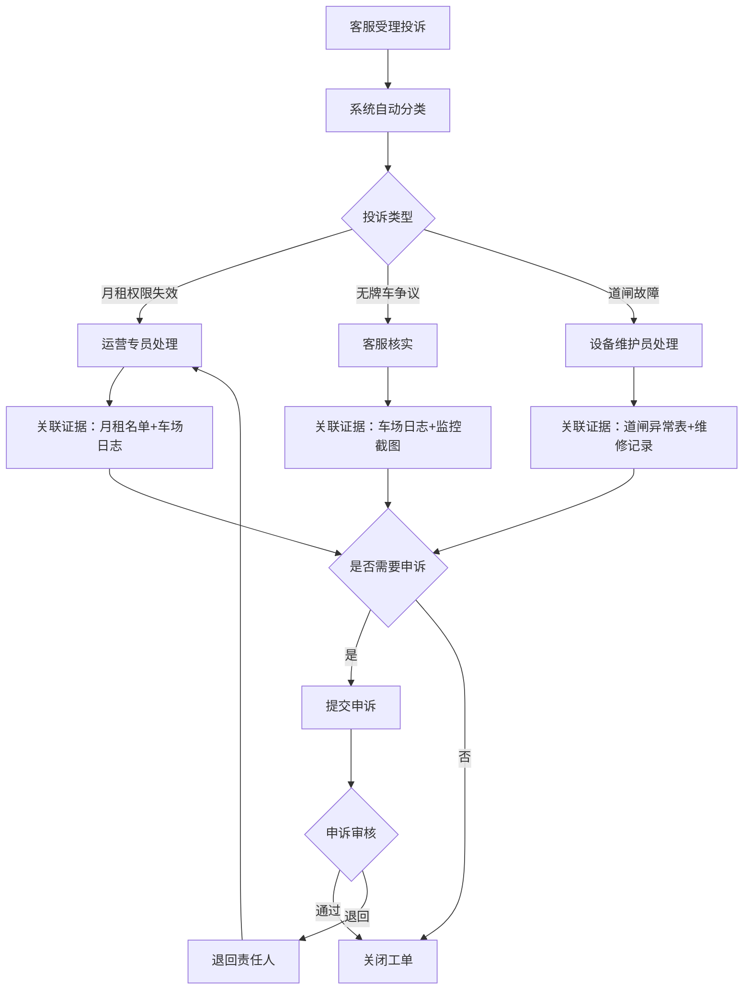

## 1. 产品概述

智慧停车场投诉申诉与证据回查系统，面向停车场运营团队，解决投诉处理责任不清、证据回查耗时过长的问题。系统覆盖车场日志、月租名单、道闸异常三类核心数据源，支持运营专员、客服、设备维护员三类角色协同处理，确保投诉申诉状态可追踪、证据可回查。

- 目标用户：停车场运营管理人员（运营专员、客服、设备维护员）
- 核心价值：将投诉申诉平均处理时长缩短50%，证据回查完成率提升至95%以上

## 2. 核心功能

### 2.1 用户角色

| 角色 | 登录方式 | 核心权限 |
|------|----------|----------|
| 运营专员 | 用户名密码登录 | 查看所有投诉工单、分配责任人、批量处理、导出报表 |
| 客服 | 用户名密码登录 | 受理投诉、提交申诉、查看车场日志与月租名单 |
| 设备维护员 | 用户名密码登录 | 处理道闸异常工单、更新设备状态、提交维修报告 |

### 2.2 功能模块

1. **工作台**：今日待办、已拖延工单、刚被退回工单聚合展示，支持批量操作
2. **投诉申诉处理**：投诉受理、申诉提交、状态流转、责任人分配
3. **证据回查**：关联车场日志、月租名单、道闸异常记录，支持时间线回放
4. **详情时间线**：单条工单的完整生命周期展示，含操作记录与证据链
5. **登录页**：简化登录，角色切换

### 2.3 页面详情

| 页面名称 | 模块名称 | 功能描述 |
|----------|----------|----------|
| 登录页 | 登录表单 | 用户名密码登录，选择角色（运营专员/客服/设备维护员） |
| 工作台 | 今日待办卡片 | 展示今日需处理的投诉工单数量与列表，按紧急程度排序 |
| 工作台 | 已拖延卡片 | 展示超过处理时限仍未完成的工单，红色警示标记 |
| 工作台 | 退回工单卡片 | 展示刚刚被退回需重新处理的工单，橙色警示标记 |
| 工作台 | 批量操作栏 | 勾选多条工单后批量分配责任人、批量标记处理中、批量关闭 |
| 投诉申诉列表 | 筛选与搜索 | 按状态、类型、责任人、时间范围筛选投诉申诉 |
| 投诉申诉列表 | 工单卡片 | 每条工单展示编号、类型标签（月租失效/无牌车争议/道闸故障等）、当前状态、责任人、创建时间 |
| 投诉申诉详情 | 时间线组件 | 工单从创建到当前的全部操作节点，含时间、操作人、操作内容 |
| 投诉申诉详情 | 证据回查面板 | 关联展示车场日志片段、月租权限变更记录、道闸异常截图 |
| 投诉申诉详情 | 处理操作区 | 受理/分配/转派/申诉/退回/关闭操作按钮 |
| 证据回查 | 车场日志查询 | 按车牌号/时间段查询进出记录，支持时间轴可视化 |
| 证据回查 | 月租名单查询 | 查询月租车辆权限状态、到期时间、续费记录 |
| 证据回查 | 道闸异常查询 | 查询道闸故障记录、维修状态、影响时段 |

## 3. 核心流程

投诉从受理到结案的完整流程：客服受理投诉 → 系统自动分类（月租失效/无牌车争议/道闸故障）→ 运营专员分配责任人 → 责任人处理并关联证据 → 若需申诉则进入申诉流程 → 申诉审核通过后关闭或退回重新处理。

## 4. 用户界面设计

### 4.1 设计风格

- 主色调：深蓝灰(#1a2332) + 琥珀橙(#f59e0b)警示 + 翡翠绿(#10b981)完成态
- 按钮风格：圆角矩形(8px)，主按钮实色填充，次按钮描边
- 字体：思源黑体/Noto Sans SC，标题18-20px，正文14px，辅助12px
- 布局风格：左侧固定导航 + 右侧内容区，卡片式布局
- 图标风格：线性图标(Lucide)，2px描边

### 4.2 页面设计概述

| 页面名称 | 模块名称 | UI元素 |
|----------|----------|--------|
| 登录页 | 登录表单 | 居中卡片，深色背景，角色选择下拉，登录按钮琥珀橙 |
| 工作台 | 统计卡片行 | 三列卡片（今日待办/已拖延/退回），数字大号突出，颜色区分 |
| 工作台 | 工单列表 | 表格+卡片混合视图，行内状态标签，批量勾选复选框 |
| 投诉申诉详情 | 时间线 | 左侧竖向时间线，节点圆点颜色区分状态，右侧操作详情 |
| 投诉申诉详情 | 证据面板 | Tab切换（车场日志/月租名单/道闸异常），表格展示关联数据 |
| 证据回查 | 查询面板 | 顶部搜索栏，结果区表格，支持时间范围选择器 |

### 4.3 响应式设计

- 桌面优先，最小宽度1280px
- 内容区最大宽度1440px，居中显示
- 侧边导航可折叠
