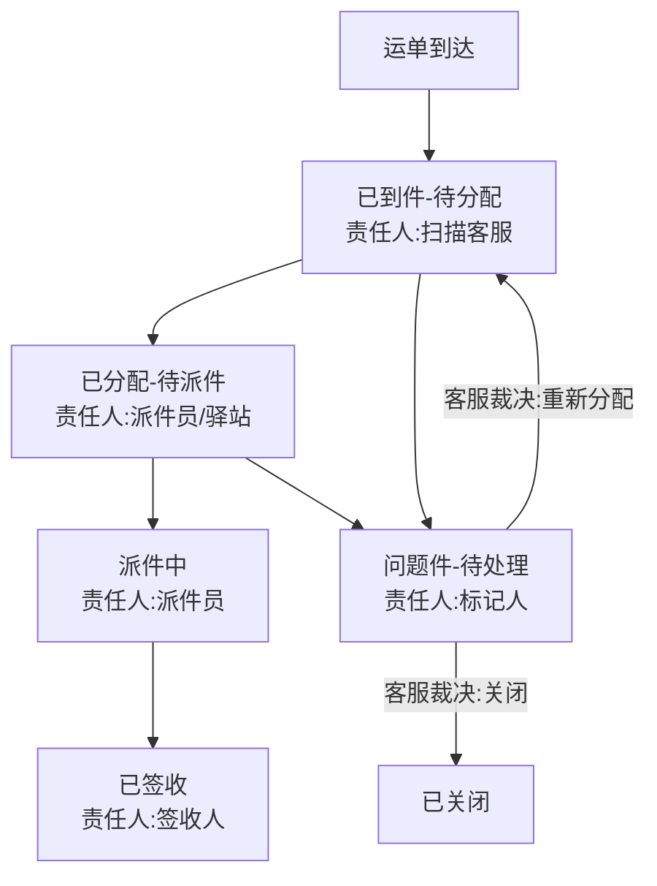

## 1. 产品概述

快递网点到件扫描与派件分配系统，解决到件扫描到派件分配之间责任不清、状态口径不一致、出现无人负责空档的核心问题。目标用户为网点客服、派件员和驿站负责人。

- 消灭"到件已扫但未分配"之间的责任空档，所有状态变化带责任人、时间戳和备注
- 三种角色看到的信息粒度不同，但状态口径严格一致（同一快件在任何角色视图下状态文字相同）
- 忙时到件扫描一键提交、派件分配批量操作，减少交互轮次

## 2. 核心功能

### 2.1 用户角色

| 角色 | 进入方式 | 核心权限 |
|------|----------|----------|
| 网点客服 | 工号登录 | 到件扫描录入、问题件标记、派件分配、全量回看 |
| 派件员 | 工号登录 | 查看本人待派件/已派件、签收确认、上报问题件 |
| 驿站负责人 | 工号登录 | 查看驿站到件明细、签收批量确认、问题件申诉 |

### 2.2 功能模块

1. **到件扫描页**：扫码/手动输入运单号 → 自动识别网点 → 确认到件 → 状态变为"已到件-待分配"
2. **派件分配页**：查看待分配件列表 → 批量选择 → 指派派件员/驿站 → 状态变为"已分配-待派件"
3. **派件回看页**：按运单号/时间/责任人/状态筛选 → 查看完整状态流转链（含责任人、时间点、备注）
4. **问题件处理页**：标记问题件 → 状态变为"问题件-待处理" → 派件员/驿站申诉 → 客服裁决

### 2.3 页面详情

| 页面名称 | 模块名称 | 功能描述 |
|----------|----------|----------|
| 到件扫描页 | 扫码输入区 | 支持扫码枪/手动输入运单号，忙时一键确认不弹二次确认 |
| 到件扫描页 | 到件列表 | 已扫描到件实时列表，显示运单号、到件时间、当前状态、当前责任人 |
| 派件分配页 | 待分配列表 | 筛选"已到件-待分配"件，支持按区域/类型批量选择 |
| 派件分配页 | 分配操作 | 选择派件员或驿站，批量指派，一次操作完成多件分配 |
| 派件分配页 | 分配确认 | 提交后状态立即变为"已分配-待派件"，责任人自动写入 |
| 派件回看页 | 筛选条件 | 运单号、时间范围、状态、责任人组合筛选 |
| 派件回看页 | 流转时间线 | 展示每个状态变化的时间、操作人、备注，数据来自后端而非前端硬编码 |
| 问题件处理页 | 问题件列表 | 状态为"问题件"的快件，显示问题类型、上报人、上报时间 |
| 问题件处理页 | 处理操作 | 客服裁决：退回/重新分配/销毁，每次操作写入审计日志 |

## 3. 核心流程

### 3.1 到件扫描→派件分配主流程

1. 快件到达网点 → 客服扫描运单号 → 系统创建到件记录，状态"已到件-待分配"，责任人=扫描客服
2. 客服在派件分配页查看待分配件 → 批量选择 → 指派派件员或驿站 → 状态变为"已分配-待派件"，责任人=被指派的派件员/驿站负责人
3. 派件员/驿站收到待派件通知 → 派送/签收 → 状态变为"已签收"，责任人不变
4. 全程任何异常可标记问题件 → 状态变为"问题件-待处理"，责任人=标记人，等待客服裁决

### 3.2 状态约束规则

- 快件状态一旦进入下一阶段，不可回退到上一阶段（已签收不可退回已分配）
- 问题件处理后只能进入"已到件-待分配"（重新分配）或"已关闭"
- 每次状态变化必须写入审计日志（parcel_audit_log），含操作人、操作时间、变更前状态、变更后状态、备注
- 任何时刻快件都有明确的责任人，不允许出现"责任人=null"的已到件快件

## 4. 用户界面设计

### 4.1 设计风格

- 主色调：深蓝灰 (#1E293B) + 亮橙强调色 (#F97316)，传达效率与紧迫感
- 辅助色：状态绿 (#22C55E)、警告黄 (#EAB308)、错误红 (#EF4444)
- 按钮：圆角 6px，主操作用实心橙色，次操作用描边按钮
- 字体：标题用 Noto Sans SC Bold，正文用 Noto Sans SC Regular
- 布局：左侧导航 + 右侧内容区，顶部状态栏
- 图标：lucide-react 图标库

### 4.2 页面设计概览

| 页面名称 | 模块名称 | UI 元素 |
|----------|----------|---------|
| 到件扫描页 | 扫码输入区 | 大输入框 + 扫码图标，回车即提交，不弹确认框 |
| 到件扫描页 | 到件列表 | 表格，列：运单号、到件时间、状态徽章、责任人、操作 |
| 派件分配页 | 待分配列表 | 可勾选表格，批量操作栏浮于底部 |
| 派件分配页 | 分配操作 | 下拉选择派件员/驿站，备注输入框（可选），确认按钮 |
| 派件回看页 | 筛选条件 | 折叠式筛选面板，运单号搜索 + 状态/责任人下拉 |
| 派件回看页 | 流转时间线 | 竖向时间线，每个节点显示状态、操作人、时间、备注 |
| 问题件处理页 | 问题件列表 | 表格 + 问题类型标签，行内操作按钮 |
| 问题件处理页 | 处理弹窗 | 选择处理方式 + 填写备注，提交后写入审计日志 |

### 4.3 响应式

桌面优先设计，平板端自适应（侧边栏收起为图标模式），手机端暂不支持（快递网点主要使用桌面端和扫码枪）。
