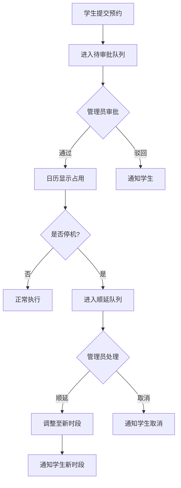

## 1. 产品概述

学院公共仪器预约管理台——为仪器管理员在值班室使用的桌面工具应用。解决现有预约流程中"抢时段、停机无通知、样本无人跟进"的混乱局面，让预约可调度、停机可标记、顺延可追踪、通知有记录。

- 目标用户：仪器管理员（主）、课题组负责人（查看占用）、学生（提交预约与样本登记）
- 核心价值：将"登记表"升级为可操作的调度中心，管理员拖拽即调整，停机自动顺延，变更全部留痕

## 2. 核心功能

### 2.1 用户角色

| 角色 | 进入方式 | 核心权限 |
|------|----------|----------|
| 管理员 | 默认进入（值班室专用） | 全部操作：日历管理、预约审批、停机、顺延、通知、导出 |
| 课题组负责人 | 角色切换 | 查看本组占用情况、预约统计 |
| 学生 | 角色切换 | 提交预约（附申请理由）、登记样本、查看本人预约状态 |

### 2.2 功能模块

1. **仪器日历**：以周/日视图展示所有仪器时段，支持拖拽调整时段位置与长度，直观显示空闲/占用/故障/顺延状态
2. **预约队列**：按时间排序的预约列表，待审批置顶，支持审批（通过/驳回）、查看申请理由、快速调整时段
3. **样本登记**：已送达样本的登记簿，关联预约记录，标注样本状态（待测/检测中/完成/异常）
4. **故障停机**：对仪器标记故障，自动触发该时段内所有预约进入顺延队列
5. **顺延处理**：因停机或调度变更被影响的预约自动归集，管理员逐条确认：顺延至下一可用时段 或 取消并通知
6. **通知记录**：所有状态变更（审批、顺延、取消、停机）自动生成通知条目，按时间线展示，可筛选
7. **数据备份与导出**：一键导出全部数据为 JSON，支持导入恢复；预约记录可导出 CSV

### 2.3 页面详情

| 页面名称 | 模块名称 | 功能描述 |
|----------|----------|----------|
| 仪器日历 | 日历视图 | 周/日切换，拖拽调整时段，颜色区分状态，点击查看详情 |
| 仪器日历 | 仪器筛选 | 左侧仪器列表，支持筛选与折叠 |
| 预约队列 | 队列列表 | 待审批/已通过/已取消分组，搜索与筛选 |
| 预约队列 | 预约详情 | 展开显示申请理由、样本信息、操作按钮 |
| 样本登记 | 样本列表 | 表格展示，筛选与搜索，状态标签 |
| 样本登记 | 样本表单 | 登记新样本，关联预约，填写存储位置/特殊要求 |
| 故障停机 | 停机记录 | 当前故障仪器列表，历史停机记录 |
| 故障停机 | 停机登记 | 选择仪器、故障描述、预计恢复时间，自动触发顺延 |
| 顺延处理 | 顺延队列 | 受影响的预约列表，逐条确认顺延或取消 |
| 顺延处理 | 批量操作 | 批量顺延至下一可用时段 |
| 通知记录 | 通知时间线 | 按时间排列的通知条目，筛选接收人/类型 |
| 设置 | 角色切换 | 切换当前角色（管理员/负责人/学生） |
| 设置 | 备份导出 | 导出 JSON / 导入恢复 / 导出 CSV |

## 3. 核心流程

### 3.1 预约流程
学生提交预约（含申请理由）→ 预约进入队列（待审批）→ 管理员在日历上查看冲突 → 审批通过/驳回 → 通知学生

### 3.2 停机顺延流程
管理员登记故障 → 系统自动找出该时段内所有预约 → 预约进入顺延队列 → 管理员逐条确认：顺延至下一可用时段 或 取消 → 系统自动通知相关人员

### 3.3 拖拽调整流程
管理员在日历上拖拽某预约时段 → 系统检测冲突 → 无冲突直接调整并通知 → 有冲突提示冲突详情，由管理员决定是否强制调整

## 4. 用户界面设计

### 4.1 设计风格

- **风格定位**：工业工具型——功能优先，信息密度高，操作路径短，无多余装饰
- **主色调**：深灰底（#1a1a2e）+ 蓝灰面板（#16213e），功能色：绿（正常）#00b894、红（故障）#e17055、黄（顺延）#fdcb6e、蓝（预约）#0984e3
- **按钮风格**：小圆角（4px）、扁平、hover 微亮，关键操作用功能色填充
- **字体**：系统等宽字体用于数据（Menlo/Consolas），正文用 -apple-system/Segoe UI，标题 14px 加粗，正文 13px，辅助 12px
- **布局**：左侧窄边栏导航 + 右侧主内容区，顶栏显示当前角色与全局操作，无 hero 区域
- **图标**：Lucide 图标集，16px，与文字同行

### 4.2 页面设计概览

| 页面名称 | 模块名称 | UI 元素 |
|----------|----------|---------|
| 仪器日历 | 日历视图 | 周视图为默认，7列×时段行网格，预约色块可拖拽，右键菜单（调整/取消/停机） |
| 仪器日历 | 仪器列表 | 左侧 200px 窄面板，仪器名+状态圆点，故障红色闪烁 |
| 预约队列 | 队列列表 | 表格布局，待审批行黄色左边框，操作列放审批按钮 |
| 样本登记 | 样本列表 | 数据表格，状态列用色块标签，行点击展开详情 |
| 故障停机 | 停机面板 | 当前故障置顶红色面板，历史列表灰色折叠 |
| 顺延处理 | 顺延卡片 | 卡片式，每条顺延预约一张卡，右侧操作按钮 |
| 通知记录 | 时间线 | 左侧时间轴线 + 右侧通知卡片，筛选条固定顶部 |
| 设置 | 设置面板 | 表单布局，角色选择下拉，导入导出按钮 |

### 4.3 响应式

桌面优先，最小宽度 1280px，不做移动端适配（值班室桌面应用定位）

### 4.4 演示数据

| 仪器名称 | 状态 | 特点 |
|----------|------|------|
| 透射电子显微镜 (TEM-JEOL2100) | 🔴 故障停机 | 当前故障，有3条预约受影响需顺延 |
| X射线衍射仪 (XRD-BrukerD8) | 🟢 正常 | 开放夜间时段（18:00-次日06:00），夜间预约满 |
| 核磁共振波谱仪 (NMR-Bruker400) | 🟡 紧张 | 预约冲突严重，多时段被重叠预约，需审批调度 |
