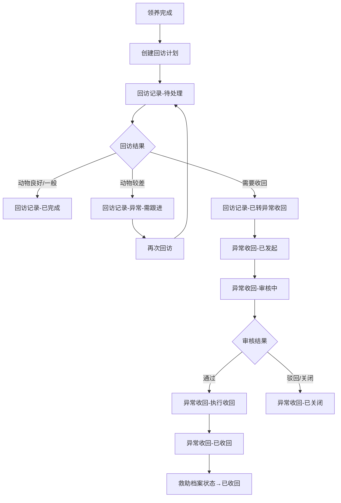
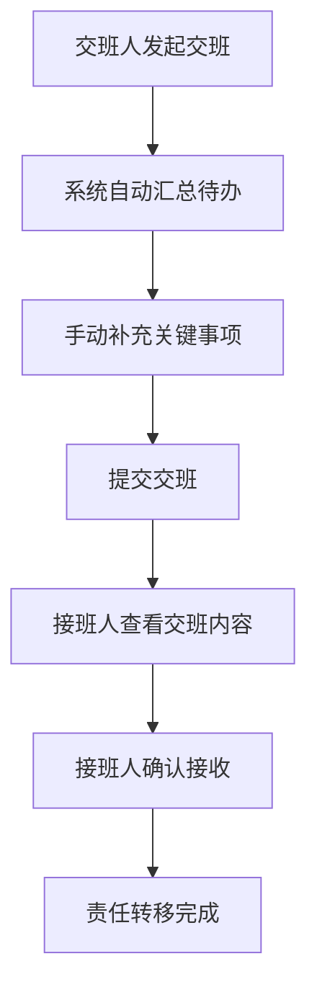

## 1. 产品概述

动物救助站回访记录与异常收回管理系统——将救助登记、寄养、领养回访、异常收回、交班五大流程打通，让不同角色（救助志愿者、兽医、领养审核员、管理员）在同一平台完成各自工作，消除"翻三张表才能说清责任"的问题。

- 解决核心痛点：回访记录与异常收回之间的状态断层和责任模糊
- 目标价值：交班时一站式看清待处理回访、进行中异常收回、关键交接事项

## 2. 核心功能

### 2.1 用户角色

| 角色 | 登录方式 | 核心权限 |
|------|----------|----------|
| 救助志愿者 | 姓名+角色选择 | 救助登记、寄养管理、查看回访 |
| 兽医 | 姓名+角色选择 | 健康状态更新、治疗记录、查看异常收回 |
| 领养审核员 | 姓名+角色选择 | 领养审批、回访记录管理、发起异常收回 |
| 管理员 | 姓名+角色选择 | 全部权限、交班管理、数据统计 |

### 2.2 功能模块

1. **登录与角色入口页**：角色选择登录，进入角色专属仪表盘
2. **仪表盘**：角色感知的工作台，展示待办、统计、快捷入口
3. **救助档案**：动物救助记录 CRUD，关联寄养与领养信息
4. **回访记录管理**：领养后回访记录的创建、处理、状态流转
5. **异常收回管理**：从回访异常触发或独立发起，完整收回流程
6. **交班中心**：创建交班、确认交班、查看历史交班

### 2.3 页面详情

| 页面名称 | 模块名称 | 功能说明 |
|----------|----------|----------|
| 登录页 | 角色选择 | 选择角色后从用户列表中选择姓名登录 |
| 仪表盘 | 待办提醒 | 按角色展示待处理回访、待审核异常收回等 |
| 仪表盘 | 统计卡片 | 救助总数、待回访、异常进行中、已收回等 |
| 仪表盘 | 快捷入口 | 根据角色显示不同操作入口 |
| 救助档案 | 档案列表 | 分页浏览、搜索、筛选救助记录 |
| 救助档案 | 档案详情 | 查看动物完整生命周期（救助→寄养→领养→回访/收回） |
| 回访记录 | 回访列表 | 筛选待处理/已完成/异常回访，支持批量标记 |
| 回访记录 | 新建回访 | 关联领养记录，填写回访内容与动物状况 |
| 回访记录 | 处理回访 | 完成回访或转异常收回（状态机关键节点） |
| 异常收回 | 收回列表 | 按状态筛选，查看触发原因与当前进度 |
| 异常收回 | 发起收回 | 从回访异常转入或独立发起，填写触发原因 |
| 异常收回 | 收回处理 | 审核通过→执行收回→确认收回，完整状态链 |
| 异常收回 | 收回回看 | 查看历史收回记录的完整链路（回访→触发→执行→结果） |
| 交班中心 | 创建交班 | 自动汇总待办事项，手动补充关键事项 |
| 交班中心 | 确认交班 | 接班人确认接收，明确责任转移点 |
| 交班中心 | 交班历史 | 查看历史交班记录 |

## 3. 核心流程

### 3.1 回访→异常收回状态机

回访记录状态：待处理 → 已完成 / 异常-需跟进 / 已转异常收回
异常收回状态：已发起 → 审核中 → 执行收回 → 已收回 / 已关闭

关键约束：回访标记为"已转异常收回"时，自动创建异常收回记录并关联，确保两个实体之间责任不模糊。

### 3.2 流程图

### 3.3 交班流程

## 4. 用户界面设计

### 4.1 设计风格

- 主色调：暖橙 #E8722A（救助温度感）+ 深灰 #1F2937（专业感）
- 辅助色：状态绿 #10B981、警告黄 #F59E0B、危险红 #EF4444
- 按钮风格：圆角 8px，主按钮实心，次按钮描边
- 字体：系统字体栈，标题 20px/16px，正文 14px，辅助 12px
- 布局：左侧导航栏 + 右侧内容区，桌面优先
- 图标：lucide-react 图标库

### 4.2 页面设计概览

| 页面名称 | 模块名称 | UI 元素 |
|----------|----------|---------|
| 登录页 | 角色选择 | 四个角色卡片，选中后展开用户下拉，登录按钮 |
| 仪表盘 | 待办面板 | 卡片式布局，待处理/进行中/已完成分栏，数字高亮 |
| 仪表盘 | 统计区 | 四宫格统计卡，颜色区分类型 |
| 回访记录 | 列表区 | 表格+筛选栏，状态标签色块，批量操作勾选 |
| 异常收回 | 时间线 | 垂直时间线展示收回流程节点，每个节点可展开详情 |
| 交班中心 | 表单+预览 | 左侧表单编辑，右侧实时预览交班单 |

### 4.3 响应式

桌面优先设计，最小宽度 1024px。平板与移动端暂不单独适配，但布局不溢出。

## 5. 关键业务规则

1. 回访标记"已转异常收回"时，系统自动创建异常收回记录，原回访不可再修改状态
2. 异常收回关闭时，关联回访状态回到"异常-需跟进"
3. 交班自动汇总：统计发起人名下所有"待处理"回访和"进行中"异常收回
4. 附件为占位设计：前端显示上传按钮和已上传列表，后端 multer 处理存储到 uploads/ 目录
5. 通知为站内通知：关键状态变更时自动创建通知记录，前端轮询获取
