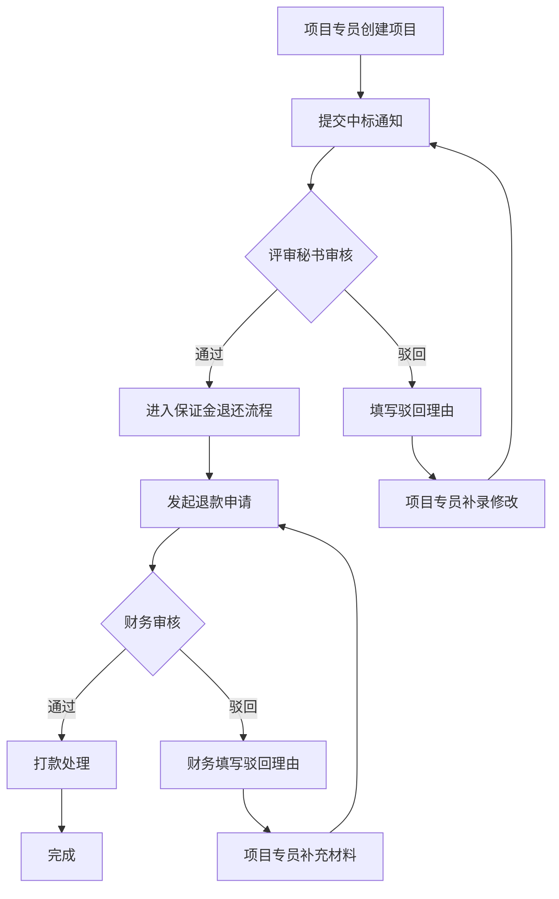

## 1. Product Overview
招标代理公司中标通知与保证金退还管理系统，旨在替代传统台账、现场记录和反复沟通确认流程，实现中标通知审批到保证金退还的全流程数字化管理，减少沟通成本，提高工作效率。

## 2. Core Features

### 2.1 User Roles
| Role | Registration Method | Core Permissions |
|------|---------------------|------------------|
| 项目专员 | 账号分配 | 创建项目、提交中标通知、查看进度 |
| 评审秘书 | 账号分配 | 审核中标通知、处理驳回与补录 |
| 财务 | 账号分配 | 处理保证金退还、查看财务数据 |
| 管理员 | 账号分配 | 系统管理、权限配置 |

### 2.2 Feature Module
1. **项目管理**: 项目创建、状态追踪、批量操作
2. **中标通知处理**: 提交、审核、驳回、补录流程
3. **保证金退还**: 申请、审批、打款、凭证管理
4. **仪表盘**: 实时状态监控、待办提醒、进度可视化
5. **演示数据**: 预置样例数据便于功能演示

### 2.3 Page Details
| Page Name | Module Name | Feature description |
|-----------|-------------|---------------------|
| Dashboard | 仪表盘 | 待办事项、进度概览、状态统计 |
| ProjectList | 项目列表 | 项目筛选、批量处理、状态查看 |
| ProjectDetail | 项目详情 | 完整流程追踪、审批记录、附件管理 |
| NoticeProcess | 中标通知处理 | 提交表单、审核操作、驳回理由记录 |
| DepositRefund | 保证金退还 | 退款申请、凭证上传、打款记录 |
| Settings | 系统设置 | 用户管理、权限配置 |

## 3. Core Process

## 4. User Interface Design
### 4.1 Design Style
- Primary color: #1E40AF (深蓝色)
- Secondary color: #F59E0B (琥珀色)
- Button style: Rounded corners (8px), solid background
- Font: Inter, sans-serif
- Layout: Card-based with clear visual hierarchy
- Icon style: Lucide icons, consistent size

### 4.2 Page Design Overview
| Page Name | Module Name | UI Elements |
|-----------|-------------|-------------|
| Dashboard | 待办卡片 | Status badges, priority indicators, action buttons |
| ProjectList | 项目表格 | Filter dropdowns, batch checkbox, quick actions |
| ProjectDetail | 流程时间线 | Timeline visualization, approval records, attachment preview |
| NoticeProcess | 表单组件 | Form validation, file upload, comment input |
| DepositRefund | 退款面板 | Amount display, receipt upload, status tracking |

### 4.3 Responsiveness
- Desktop-first design
- Mobile-adaptive layout with collapsible side menu
- Touch-friendly button sizes

### 4.4 Key Requirements
1. **减少确认环节**: 系统自动记录操作日志，无需反复确认
2. **驳回与补录**: 必须记录驳回理由，支持补录修改流程
3. **职责清晰**: 明确显示当前处理人、卡壳位置、延迟原因
4. **一站式查看**: 所有相关信息在同一页面展示，无需跳转
