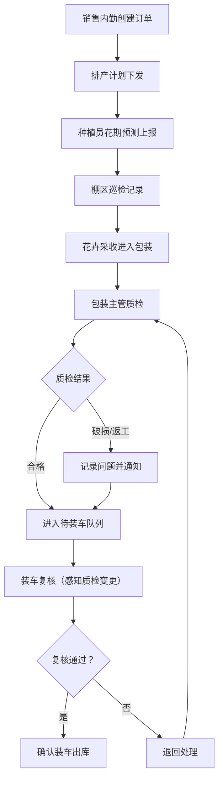

## 1. 产品概述

花卉基地包装质检与装车复核系统，解决棚区巡检、订单排产、物流单三段信息脱节的问题。核心覆盖种植员、销售内勤、包装主管三类角色的处理节奏，重点强化包装质检改动后的装车复核感知能力，避免花期预测不准、包装破损、客户改规格等信息遗漏。

- **核心价值**：打通种植-包装-装车全链路信息，让每个角色的操作都被记录并同步到下游
- **目标用户**：种植员（棚区巡检/花期上报）、销售内勤（订单排产/规格变更）、包装主管（质检/装车复核）

## 2. 核心功能

### 2.1 用户角色

| 角色 | 登录方式 | 核心权限 |
|------|----------|----------|
| 种植员 | 角色切换 | 花期预测上报、棚区巡检记录、查看本人任务 |
| 销售内勤 | 角色切换 | 订单管理、规格变更、排产计划、查看全量订单 |
| 包装主管 | 角色切换 | 包装质检、装车复核、操作日志查看、数据重置 |

### 2.2 功能模块

1. **工作台（首页）**：待处理任务、风险项预警、最近变更记录、关键指标概览
2. **订单排产**：订单列表、订单详情、规格变更、排产状态跟踪
3. **包装质检**：待质检任务、质检操作（合格/破损/返工）、质检记录
4. **装车复核**：待复核任务、复核操作、质检变更感知、复核记录
5. **操作日志**：全链路操作审计、按角色/时间筛选、变更对比
6. **数据重置**：一键恢复初始演示数据

### 2.3 页面详情

| 页面名称 | 模块名称 | 功能描述 |
|-----------|-------------|---------------------|
| 工作台 | 待处理任务 | 按角色展示待办事项（种植员待巡检、内勤待排产、主管待质检/待复核） |
| 工作台 | 风险项卡片 | 花期预测偏差、包装破损、客户改规格等高风险事项高亮展示 |
| 工作台 | 最近变更 | 最新操作记录时间线，显示操作人、操作类型、变更内容 |
| 工作台 | 数据概览 | 今日订单数、待质检数、待复核数、破损率等关键指标 |
| 订单排产 | 订单列表 | 展示所有订单，支持按状态/客户筛选，点击查看详情 |
| 订单排产 | 订单详情 | 订单基本信息、花卉品种、规格要求、排产状态、变更历史 |
| 订单排产 | 规格变更 | 销售内勤修改订单规格，自动记录变更并通知下游环节 |
| 包装质检 | 待质检列表 | 展示待包装质检的批次，关联订单和花期信息 |
| 包装质检 | 质检操作 | 录入质检结果：合格数量、破损数量、破损原因、处理意见 |
| 包装质检 | 质检记录 | 历史质检记录查询，支持按批次/时间筛选 |
| 装车复核 | 待复核列表 | 展示待装车复核的批次，带有质检变更提醒标识 |
| 装车复核 | 复核操作 | 核对数量、规格、质检状态，确认装车或退回 |
| 装车复核 | 质检变更感知 | 质检结果有变动时高亮提示，显示变更前后对比 |
| 操作日志 | 日志列表 | 全链路操作记录，支持按角色、操作类型、时间范围筛选 |
| 操作日志 | 变更详情 | 展示具体变更的前后对比（如规格变更、质检结果修改） |
| 数据重置 | 重置功能 | 一键恢复所有数据到初始演示状态 |

## 3. 核心流程

### 主流程描述

销售内勤创建订单并排产 → 种植员上报花期预测和棚区巡检 → 包装主管进行包装质检（如发现破损或规格问题记录）→ 装车复核时感知质检变更并确认 → 全流程操作留痕

### 信息流转规则

- 订单规格变更：自动同步到包装和装车环节，并标记"规格已变更"
- 质检结果修改：装车复核页面自动感知并高亮提示变更内容
- 花期预测调整：影响排产计划，通知销售内勤和包装主管

## 4. 用户界面设计

### 4.1 设计风格

- **主色调**：深森林绿（#2D5A27）代表自然与种植，搭配暖橙色（#E87722）作为警示/风险强调色
- **辅助色**：米白色背景（#FAF8F3），营造自然温馨的农业氛围
- **按钮风格**：圆角矩形（8px），主按钮实色填充，次要按钮描边
- **字体**：标题使用 Noto Serif SC（衬线体，稳重专业），正文使用 Noto Sans SC（无衬线，清晰易读）
- **布局风格**：左侧导航 + 右侧内容区，卡片式模块布局
- **图标风格**：线性图标（lucide-react），搭配农业相关视觉元素

### 4.2 页面设计概览

| 页面名称 | 模块名称 | UI 元素 |
|-----------|-------------|----------|
| 工作台 | 顶部导航 | 角色切换器、当前时间、数据重置按钮 |
| 工作台 | 侧边栏 | 导航菜单（工作台、订单排产、包装质检、装车复核、操作日志） |
| 工作台 | 数据概览 | 4个统计卡片，数值+趋势指示 |
| 工作台 | 待处理任务 | 列表卡片，带状态标签和优先级标记 |
| 工作台 | 风险项 | 橙色/红色警示卡片，带风险等级标识 |
| 工作台 | 最近变更 | 时间线样式，操作人头像+操作描述+时间 |
| 包装质检 | 列表区 | 表格布局，批次号、订单号、品种、数量、质检状态 |
| 包装质检 | 质检弹窗 | 表单：合格数、破损数、破损原因、备注、提交按钮 |
| 装车复核 | 列表区 | 表格+变更提示角标，质检有变动的行高亮 |
| 装车复核 | 复核详情 | 左右对比布局：左侧订单原始信息，右侧质检后实际信息 |
| 操作日志 | 筛选区 | 角色筛选、操作类型筛选、日期范围选择 |
| 操作日志 | 日志列表 | 时间线布局，带变更详情展开/收起 |

### 4.3 响应式

- 桌面端优先设计（1440px 基准）
- 平板端（768px-1200px）：侧边栏收起为图标导航
- 移动端（<768px）：顶部导航 + 底部标签栏切换

### 4.4 动效与交互

- 页面加载：卡片依次淡入（stagger animation）
- 风险项：呼吸灯效果提示
- 状态变更：数字滚动动画
- 操作反馈：toast 轻提示 + 操作成功动效
- 变更对比：差异处高亮闪烁（新增绿色、删除红色、修改橙色）
