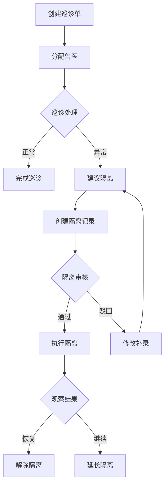
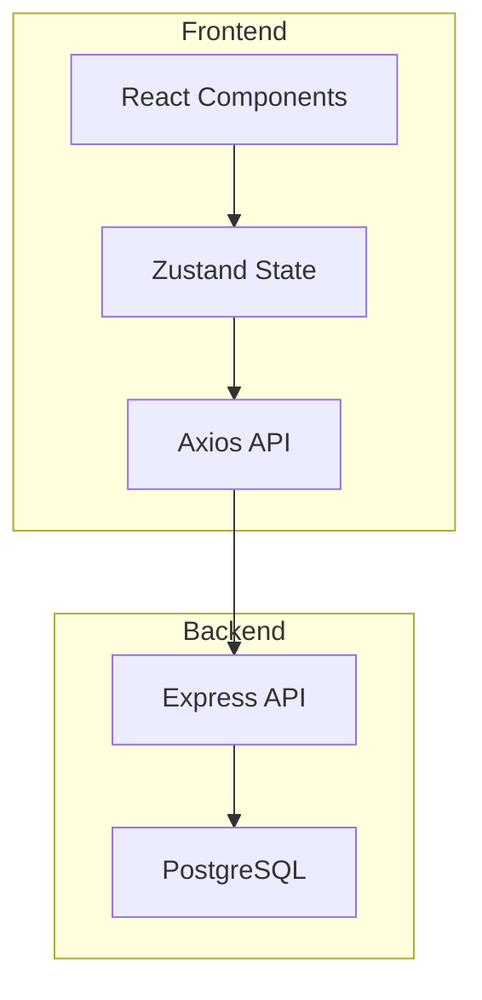
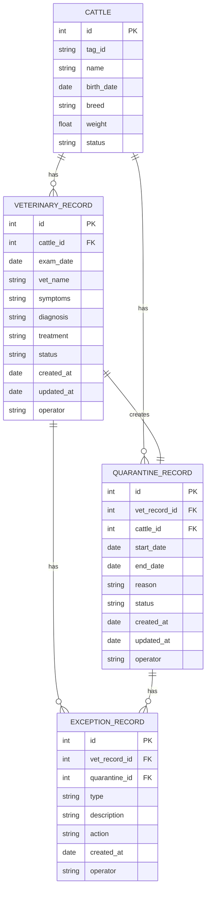

## 1. Product Overview

牧场运营-兽医巡诊与隔离管理系统，旨在帮助牧场管理人员实时追踪兽医巡诊流程、隔离管理状态，及时发现并处理卡住的工单，提升牧场运营效率。系统将挤奶记录、饲喂计划和兽医巡诊单整合在同一平台，实现数据追溯和连续处理。

**目标用户**：牧场一线工作人员、兽医、管理人员

**核心价值**：实时暴露待处理任务和风险项，支持兽医巡诊到隔离管理的完整流程追溯，提升工作效率和决策质量。

## 2. Core Features

### 2.1 User Roles
| Role | Registration Method | Core Permissions |
|------|---------------------|------------------|
| 一线操作员 | 内部账号 | 处理兽医巡诊单、更新隔离状态、记录异常 |
| 兽医 | 内部账号 | 创建巡诊记录、诊断处理、建议隔离 |
| 管理人员 | 内部账号 | 查看统计报表、审批、追溯历史记录 |

### 2.2 Feature Module
1. **工作台首页**：待处理任务汇总、风险项提醒、最近变更动态
2. **兽医巡诊管理**：巡诊单创建、处理、驳回、补录
3. **隔离管理**：隔离记录、状态变更、解除隔离
4. **异常说明**：异常记录、原因分析、处理措施
5. **数据追溯**：完整的操作历史和状态变更记录
6. **筛选搜索**：多维度筛选、关键词搜索

### 2.3 Page Details
| Page Name | Module Name | Feature description |
|-----------|-------------|---------------------|
| 工作台首页 | 待处理看板 | 显示待处理的巡诊单、隔离任务、风险项 |
| 工作台首页 | 风险预警 | 高亮显示超时未处理、高风险的工单 |
| 工作台首页 | 最近变更 | 展示最近更新的记录动态 |
| 兽医巡诊 | 巡诊列表 | 巡诊单列表，支持筛选和搜索 |
| 兽医巡诊 | 巡诊详情 | 巡诊单详情、处理操作、状态变更 |
| 隔离管理 | 隔离列表 | 隔离记录列表，支持状态筛选 |
| 隔离管理 | 隔离详情 | 隔离详情、状态变更、解除隔离 |
| 数据追溯 | 追溯查询 | 按时间、单号、牛只ID查询历史记录 |

## 3. Core Process

### 3.1 兽医巡诊流程


### 3.2 数据追溯流程


## 4. User Interface Design

### 4.1 Design Style
- **主色调**：草原绿色系（#228B22）配合温暖的橙色（#FFA500）作为强调色
- **按钮风格**：圆角矩形，hover时有阴影和缩放效果
- **字体**：思源黑体，清晰易读
- **布局**：卡片式布局，左侧导航，右侧内容区
- **图标**：使用 lucide-react 图标库，简洁现代

### 4.2 Page Design Overview
| Page Name | Module Name | UI Elements |
|-----------|-------------|-------------|
| 工作台首页 | 统计卡片 | 待处理数量、风险项数量、今日完成数 |
| 工作台首页 | 待处理列表 | 任务卡片，显示优先级、状态标签 |
| 工作台首页 | 风险预警 | 红色高亮警示条，超时提醒 |
| 兽医巡诊 | 巡诊列表 | 表格形式，支持分页和筛选 |
| 兽医巡诊 | 操作按钮 | 处理、驳回、补录、转隔离 |
| 隔离管理 | 状态标签 | 待审核、隔离中、已解除、驳回 |
| 数据追溯 | 时间线 | 按时间顺序展示操作历史 |

### 4.3 Responsiveness
- 桌面端优先，支持1200px以上分辨率
- 平板端自适应，调整布局为两列
- 移动端单列布局，隐藏侧边栏

### 4.4 交互设计
- 支持键盘快捷键快速操作
- 拖拽排序待处理任务
- 实时状态更新，无需刷新页面
- 批量操作支持

## 5. 关键需求点

### 5.1 卡住单子暴露
- 超时工单自动标记为红色警示
- 待处理任务按优先级排序
- 首页直接展示待处理数量和风险项

### 5.2 驳回与补录
- 驳回原因必须填写
- 补录记录保留修改历史
- 驳回和补录状态在列表中明确标识

### 5.3 数据追溯
- 所有操作记录时间戳和操作人
- 支持关联查看巡诊→隔离→异常的完整链条
- 导出功能支持PDF和Excel格式

### 5.4 连续处理
- 任务卡片支持快速操作
- 批量处理功能
- 快捷搜索和筛选

---

## 技术架构文档

## 1. Architecture Design



## 2. Technology Description
- Frontend: React@18 + TypeScript + TailwindCSS@3 + Vite
- State Management: Zustand
- Icons: lucide-react
- Backend: Express@4 + TypeScript
- Database: PostgreSQL

## 3. Route Definitions
| Route | Purpose |
|-------|---------|
| / | 工作台首页 |
| /veterinary | 兽医巡诊管理 |
| /quarantine | 隔离管理 |
| /traceability | 数据追溯 |
| /milking | 挤奶记录 |
| /feeding | 饲喂计划 |

## 4. API Definitions

### 4.1 兽医巡诊 API
| Method | Endpoint | Description |
|--------|----------|-------------|
| GET | /api/veterinary | 获取巡诊列表 |
| POST | /api/veterinary | 创建巡诊单 |
| PUT | /api/veterinary/:id | 更新巡诊单 |
| GET | /api/veterinary/:id | 获取巡诊详情 |
| DELETE | /api/veterinary/:id | 删除巡诊单 |

### 4.2 隔离管理 API
| Method | Endpoint | Description |
|--------|----------|-------------|
| GET | /api/quarantine | 获取隔离列表 |
| POST | /api/quarantine | 创建隔离记录 |
| PUT | /api/quarantine/:id | 更新隔离状态 |
| GET | /api/quarantine/:id | 获取隔离详情 |

### 4.3 数据追溯 API
| Method | Endpoint | Description |
|--------|----------|-------------|
| GET | /api/traceability | 查询追溯记录 |

## 5. Data Model

### 5.1 ER Diagram


### 5.2 DDL Statements

```sql
CREATE TABLE cattle (
    id SERIAL PRIMARY KEY,
    tag_id VARCHAR(50) UNIQUE NOT NULL,
    name VARCHAR(100),
    birth_date DATE,
    breed VARCHAR(50),
    weight FLOAT,
    status VARCHAR(20) DEFAULT 'healthy',
    created_at TIMESTAMP DEFAULT CURRENT_TIMESTAMP
);

CREATE TABLE veterinary_record (
    id SERIAL PRIMARY KEY,
    cattle_id INTEGER REFERENCES cattle(id),
    exam_date DATE NOT NULL,
    vet_name VARCHAR(100),
    symptoms TEXT,
    diagnosis TEXT,
    treatment TEXT,
    status VARCHAR(20) DEFAULT 'pending',
    reject_reason TEXT,
    created_at TIMESTAMP DEFAULT CURRENT_TIMESTAMP,
    updated_at TIMESTAMP DEFAULT CURRENT_TIMESTAMP,
    operator VARCHAR(100)
);

CREATE TABLE quarantine_record (
    id SERIAL PRIMARY KEY,
    vet_record_id INTEGER REFERENCES veterinary_record(id),
    cattle_id INTEGER REFERENCES cattle(id),
    start_date DATE NOT NULL,
    end_date DATE,
    reason TEXT,
    status VARCHAR(20) DEFAULT 'pending',
    reject_reason TEXT,
    created_at TIMESTAMP DEFAULT CURRENT_TIMESTAMP,
    updated_at TIMESTAMP DEFAULT CURRENT_TIMESTAMP,
    operator VARCHAR(100)
);

CREATE TABLE exception_record (
    id SERIAL PRIMARY KEY,
    vet_record_id INTEGER REFERENCES veterinary_record(id),
    quarantine_id INTEGER REFERENCES quarantine_record(id),
    type VARCHAR(50),
    description TEXT,
    action TEXT,
    created_at TIMESTAMP DEFAULT CURRENT_TIMESTAMP,
    operator VARCHAR(100)
);

INSERT INTO cattle (tag_id, name, birth_date, breed, weight, status) VALUES
('C001', '花花', '2020-03-15', '荷斯坦', 650, 'healthy'),
('C002', '大黑', '2019-11-20', '西门塔尔', 720, 'quarantine'),
('C003', '小白', '2021-05-08', '荷斯坦', 580, 'healthy'),
('C004', '壮壮', '2018-09-10', '夏洛莱', 800, 'treatment'),
('C005', '美美', '2022-01-12', '荷斯坦', 520, 'healthy');

INSERT INTO veterinary_record (cattle_id, exam_date, vet_name, symptoms, diagnosis, treatment, status, operator) VALUES
(1, '2024-01-15', '李兽医', '食欲不振，精神萎靡', '轻微消化不良', '口服益生菌', 'completed', '张三'),
(2, '2024-01-16', '王兽医', '发烧40.5度，咳嗽', '疑似牛流感', '隔离观察+抗病毒治疗', 'pending', '李四'),
(3, '2024-01-17', '李兽医', '乳房肿胀，乳汁异常', '乳腺炎', '抗生素治疗', 'rejected', '王五'),
(4, '2024-01-18', '王兽医', '跛行，腿部肿胀', '关节炎症', '消炎止痛', 'completed', '张三'),
(5, '2024-01-19', '李兽医', '腹泻，脱水', '肠道感染', '补液+抗生素', 'pending', '李四');

INSERT INTO quarantine_record (vet_record_id, cattle_id, start_date, reason, status, operator) VALUES
(2, 2, '2024-01-16', '疑似牛流感，需隔离观察', 'quarantining', '李四'),
(3, 3, '2024-01-17', '乳腺炎，防止传染', 'pending', '王五');

INSERT INTO exception_record (vet_record_id, quarantine_id, type, description, action, operator) VALUES
(3, NULL, 'reject', '诊断不明确，需重新检查', '退回补录', '王五'),
(2, 1, 'warning', '隔离时间超过72小时', '提醒兽医复查', '李四');
```