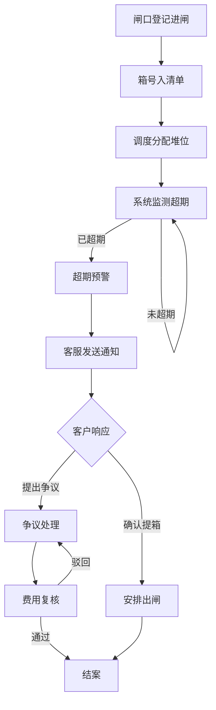
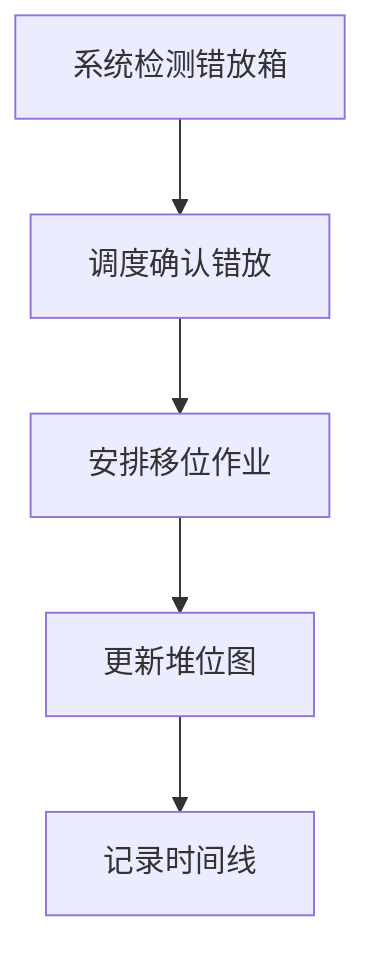
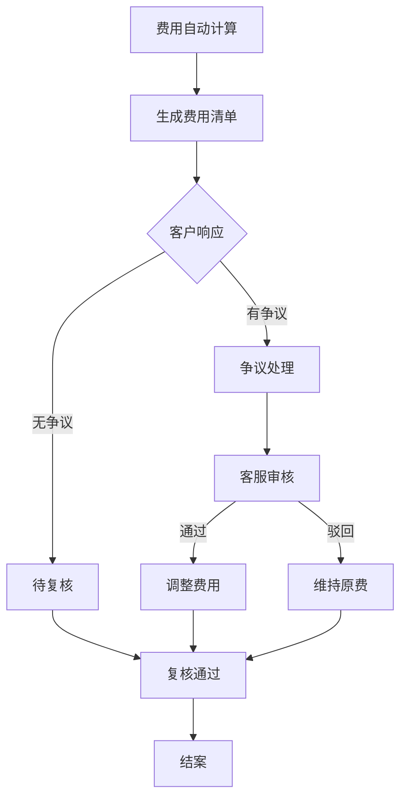

## 1. 产品概述

港口堆场超期堆存与费用复核系统，面向闸口员、堆场调度、客户服务三种角色，解决集装箱超期堆存费争议、错放箱识别、查验计划漏通知三大痛点。通过统一箱号清单、闸口记录、堆位图三方信息源，建立从超期堆存发现到费用复核完成的闭环状态流。

- 核心目标：消除信息孤岛，让每只集装箱的堆存状态、费用计算、查验安排一目了然
- 目标用户：港口堆场运营团队（闸口员、调度员、客服人员）

## 2. 核心功能

### 2.1 用户角色

| 角色 | 进入方式 | 核心权限 | 专属处理入口 |
|------|----------|----------|-------------|
| 闸口员 | 角色切换选择 | 查看闸口记录、登记进出闸、标记异常箱 | 闸口登记、异常箱标记 |
| 堆场调度 | 角色切换选择 | 查看堆位图、管理堆位分配、识别错放箱、安排查验 | 堆位调度、错放箱处理、查验计划 |
| 客户服务 | 角色切换选择 | 查看费用清单、处理费用争议、发送通知 | 费用复核、争议处理、通知管理 |

### 2.2 功能模块

1. **工作台首页**：角色感知仪表盘、待办事项、关键指标卡片、快捷处理入口
2. **箱号清单**：全量集装箱列表、状态筛选、批量操作、超期标记
3. **闸口记录**：进出闸流水、异常标记、关联箱号
4. **堆位图**：可视化堆场布局、箱位占用、错放箱高亮
5. **超期堆存**：超期箱列表、天数计算、状态流转（发现→通知→处理→结案）
6. **费用复核**：费用明细、复核回看、争议处理、审核状态
7. **集装箱详情**：全生命周期时间线、状态变更记录、附件
8. **查验计划**：查验安排、通知状态、关联箱号

### 2.3 页面详情

| 页面名称 | 模块名称 | 功能描述 |
|----------|----------|----------|
| 工作台首页 | 角色仪表盘 | 根据当前角色展示专属KPI卡片和待办列表 |
| 工作台首页 | 快捷入口 | 角色专属处理入口（闸口员→闸口登记，调度→堆位调度，客服→费用复核） |
| 工作台首页 | 超期预警 | 即将超期和已超期箱数统计，点击直达超期堆存页 |
| 箱号清单 | 箱号列表 | 表格展示箱号、类型、进闸时间、堆位、状态、超期天数 |
| 箱号清单 | 状态筛选 | 按状态（正常/超期/查验中/已出闸/争议中）筛选 |
| 箱号清单 | 批量操作 | 选中多箱后可批量标记超期、导出 |
| 闸口记录 | 进出闸流水 | 时间倒序展示所有进出闸事件，含箱号、类型、方向、时间 |
| 闸口记录 | 异常标记 | 闸口员可标记异常（单证不符、箱体损坏、超时未提） |
| 闸口记录 | 关联查询 | 点击箱号跳转集装箱详情 |
| 堆位图 | 可视化布局 | 网格化展示堆场，颜色区分空位/占用/超期/查验/错放 |
| 堆位图 | 错放箱高亮 | 系统识别的错放箱以醒目颜色标注，点击可发起移位 |
| 堆位图 | 快捷调度 | 调度员可拖拽或点击操作重新分配堆位 |
| 超期堆存 | 超期箱列表 | 展示所有超期箱及超期天数，按紧急程度排序 |
| 超期堆存 | 状态流转 | 处理状态：待通知→已通知→处理中→已结案 |
| 超期堆存 | 通知操作 | 一键发送超期通知（模拟第三方通知） |
| 超期堆存 | 关联费用 | 超期箱自动关联费用计算，点击进入费用复核 |
| 费用复核 | 费用清单 | 按箱号/客户/时间段展示费用明细 |
| 费用复核 | 复核回看 | 查看历史复核记录，包含操作人、时间、审核意见 |
| 费用复核 | 争议处理 | 客户发起争议后，客服可录入争议原因并提交审核 |
| 费用复核 | 审核状态 | 费用审核流：待复核→复核中→已通过/已驳回/争议中 |
| 集装箱详情 | 生命周期时间线 | 从进闸到出闸全流程节点可视化时间线 |
| 集装箱详情 | 状态变更记录 | 每次状态变更的操作人、时间、原因 |
| 集装箱详情 | 附件区 | 上传和查看相关附件（轻量实现，仅支持本地存储） |
| 查验计划 | 查验安排 | 新建查验计划，关联箱号，设置查验时间 |
| 查验计划 | 通知状态 | 已通知/未通知状态标记，支持补发通知 |
| 查验计划 | 漏通知预警 | 系统自动检测已到查验时间但未通知的记录并告警 |

## 3. 核心流程

### 3.1 超期堆存主流程

闸口员登记进闸 → 箱号入清单 → 调度分配堆位 → 系统按规则监测超期 → 超期预警推送 → 客服发送通知 → 客户确认/争议 → 费用计算 → 费用复核 → 结案

### 3.2 错放箱处理流程

系统检测错放 → 调度确认 → 安排移位 → 更新堆位图 → 记录时间线

### 3.3 费用复核流程

## 4. 用户界面设计

### 4.1 设计风格

- **主色调**：深海蓝 (#0F2B46) + 港口橙 (#E8722A)，体现港口工业感
- **辅助色**：状态色 — 超期红 (#DC2626)、查验黄 (#F59E0B)、正常绿 (#10B981)、争议紫 (#8B5CF6)
- **按钮风格**：圆角微凸，主操作用港口橙实心，次操作用描边
- **字体**：标题用 Noto Sans SC Medium，正文用 Noto Sans SC Regular
- **布局风格**：左侧固定导航 + 顶部角色栏 + 内容区，卡片式模块
- **图标风格**：线性图标（lucide-react），统一线宽

### 4.2 页面设计概览

| 页面名称 | 模块名称 | UI 元素 |
|----------|----------|----------|
| 工作台首页 | 角色仪表盘 | 深色顶栏显示当前角色，3列KPI卡片带图标，底部待办列表 |
| 工作台首页 | 快捷入口 | 橙色大按钮组，每个入口配图标和数字角标 |
| 箱号清单 | 箱号列表 | 数据表格，超期行红色左边框，状态列彩色标签 |
| 闸口记录 | 进出闸流水 | 时间线式列表，进闸绿标/出闸蓝标 |
| 堆位图 | 可视化布局 | 网格卡片，颜色编码，错放箱脉冲动画 |
| 超期堆存 | 超期箱列表 | 紧急度排序列表，超期天数渐变色条 |
| 超期堆存 | 状态流转 | 横向步骤条，当前步骤高亮 |
| 费用复核 | 费用清单 | 表格+右侧详情面板，复核状态标签 |
| 费用复核 | 复核回看 | 时间线样式，每条记录含操作人和审核意见 |
| 集装箱详情 | 生命周期时间线 | 竖向时间线，每个节点含时间戳和描述 |
| 查验计划 | 漏通知预警 | 顶部警告条，列表中未通知项闪烁提示 |

### 4.3 响应式

- 桌面优先设计，最小宽度 1280px
- 堆位图在大屏下展示完整布局，中屏隐藏次要信息
- 表格在窄屏下可横向滚动

### 4.4 轻量化实现说明

| 功能模块 | 实现方式 | 说明 |
|----------|----------|------|
| 第三方通知 | 模拟发送 | 前端展示通知记录，不接入真实短信/邮件网关，仅记录日志 |
| 附件上传 | 本地文件选择 + Base64 存储 | 不接入 OSS，文件以 Base64 存于本地 SQLite |
| 账号体系 | 角色切换按钮 | 无真实登录注册，通过顶部角色选择器切换身份 |
