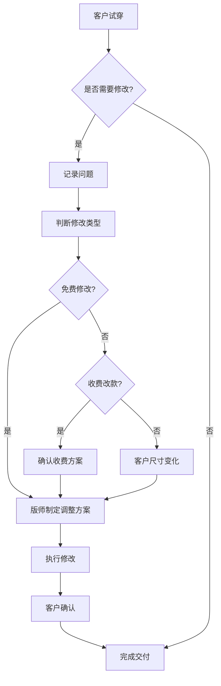

## 1. Product Overview

服装定制店交付验收与售后调整工作台，旨在解决定制服装交付时客户反馈修改需求的管理问题。替代传统便签记录方式，提供系统化的试穿记录和修改依据管理，支持量体师、版师、客服等角色协同工作。

## 2. Core Features

### 2.1 User Roles
| Role | Registration Method | Core Permissions |
|------|---------------------|------------------|
| 量体师 | 内部账号 | 查看原尺寸、量体单管理 |
| 版师 | 内部账号 | 记录调整方案、版型修改 |
| 客服 | 内部账号 | 跟进取件时间、客户沟通 |

### 2.2 Feature Module
1. **工作台首页**: 订单列表、状态筛选、快速搜索
2. **订单详情页**: 量体单、试衣记录、调整状态、修改方案
3. **售后调整管理**: 修改类型区分（免费/收费/尺寸变化）

### 2.3 Page Details
| Page Name | Module Name | Feature description |
|-----------|-------------|---------------------|
| 工作台首页 | 订单列表 | 展示所有订单，支持状态筛选（待验收、待修改、已完成） |
| 工作台首页 | 快速搜索 | 按客户姓名、订单号搜索订单 |
| 订单详情页 | 量体单 | 展示客户原始量体数据 |
| 订单详情页 | 试衣记录 | 记录试穿时间、问题描述、图片备注 |
| 订单详情页 | 调整状态 | 显示修改进度、责任人、预计完成时间 |
| 售后调整管理 | 修改类型 | 区分免费修改、收费改款、客户自身尺寸变化 |

## 3. Core Process

## 4. User Interface Design

### 4.1 Design Style
- **主色调**: 深海军蓝 (#1a365d) 搭配金色点缀 (#d4a574)
- **辅助色**: 清新薄荷绿 (#48bb78) 用于成功状态，珊瑚橙 (#ed8936) 用于警告状态
- **按钮风格**: 圆角矩形，hover效果带有阴影变化
- **字体**: 思源黑体，标题字号18-24px，正文14px，辅助文字12px
- **布局风格**: 卡片式布局，清晰的信息层级
- **图标风格**: 简洁线条图标，使用lucide-react

### 4.2 Page Design Overview
| Page Name | Module Name | UI Elements |
|-----------|-------------|-------------|
| 工作台首页 | 订单卡片 | 卡片布局，显示订单号、客户名、状态标签、优先级标识 |
| 工作台首页 | 筛选栏 | 状态下拉框、搜索输入框、排序选项 |
| 订单详情页 | 量体单 | 表格形式展示各项尺寸数据 |
| 订单详情页 | 试衣记录 | 时间线样式，展示每次试穿记录 |
| 订单详情页 | 调整状态 | 进度条、责任人头像、预计时间 |

### 4.3 Responsiveness
- 桌面端优先设计
- 平板端自适应布局调整
- 移动端单列展示

## 5. Mock Data Requirements
- 西装肩宽修改案例
- 婚纱腰围调整案例
- 客户延期取件案例
