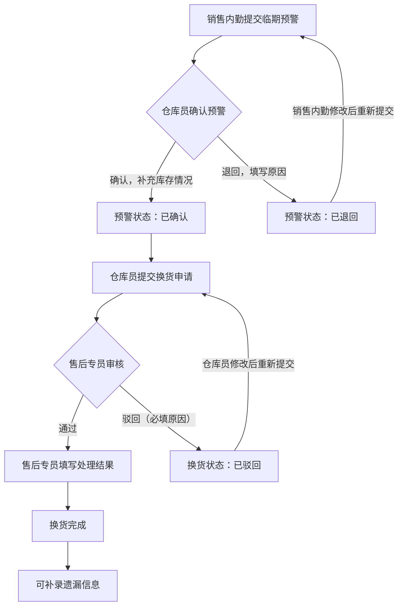
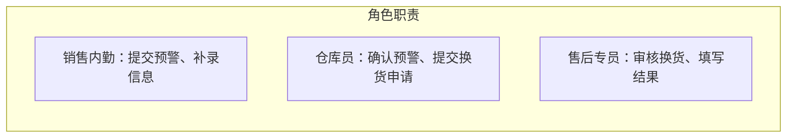

## 1. 产品概述

口腔耗材商临期预警与换货处理系统，面向口腔耗材经销商的一线业务场景，解决旧台账、现场记录和沟通截图无法支撑「临期预警→换货处理」完整流转的痛点。系统强制角色交接留痕，驳回与补录均为真实操作记录而非提示文案，确保销售内勤、仓库员、售后专员之间的工作闭环。

- 目标用户：口腔耗材经销商的销售内勤、仓库员、售后专员
- 核心价值：将散落在微信群、纸质台账中的临期/换货信息收口到可追溯、可回看的系统流程中

## 2. 核心功能

### 2.1 用户角色

| 角色 | 进入方式 | 核心权限 |
|------|----------|----------|
| 销售内勤 | 角色选择登录（轻账号，无真实认证） | 提交临期预警、查看预警列表、补录信息 |
| 仓库员 | 角色选择登录 | 确认临期预警、标记库存状态、提交换货申请 |
| 售后专员 | 角色选择登录 | 处理换货申请（通过/驳回）、填写处理结果、回看历史 |

### 2.2 功能模块

1. **工作台页面**：今日临期概览、待处理任务计数、最近打开记录、快捷入口
2. **临期预警页面**：预警提交表单、预警列表（按紧急程度排序）、预警详情与状态流转
3. **换货处理页面**：待处理换货列表、换货审批（通过/驳回）、处理结果填写、换货记录回看
4. **操作历史页面**：全量操作日志、按角色/时间/类型筛选、操作详情展开

### 2.3 页面详情

| 页面名称 | 模块名称 | 功能描述 |
|----------|----------|----------|
| 工作台 | 临期概览卡片 | 显示即将到期（7/30/90天）的耗材数量统计，按紧急程度分色 |
| 工作台 | 待办任务区 | 按角色显示待处理的预警/换货任务，点击直接跳转 |
| 工作台 | 最近打开 | 显示用户最近操作的预警/换货记录，支持快速回看 |
| 工作台 | 快捷操作 | 提交预警、查看换货等常用操作的快捷按钮 |
| 临期预警 | 预警提交表单 | 填写耗材名称、批号、有效期、数量、仓库位置，选择紧急程度 |
| 临期预警 | 预警列表 | 展示所有预警记录，支持按状态/紧急程度/时间筛选，状态标签可视化 |
| 临期预警 | 预警详情 | 查看预警完整信息、操作流转记录、当前处理人、历史操作时间线 |
| 临期预警 | 仓库确认 | 仓库员核实库存后确认预警，可补充库存实际情况 |
| 换货处理 | 换货申请 | 仓库员基于已确认预警提交换货申请，填写换货原因和期望处理方式 |
| 换货处理 | 换货审批 | 售后专员审核换货申请，可通过或驳回（驳回必须填写原因） |
| 换货处理 | 处理结果 | 审批通过后填写实际处理结果（退回供应商/换新入库/报废等） |
| 换货处理 | 补录入口 | 对已处理的换货记录补充遗漏信息，补录操作单独标记 |
| 换货处理 | 换货回看 | 按时间/状态查看历史换货记录，展开完整处理时间线 |
| 操作历史 | 操作日志列表 | 全量操作记录，包含操作人、操作类型、时间、关联单号 |
| 操作历史 | 筛选与搜索 | 按角色、操作类型、时间范围筛选，支持关键词搜索 |

## 3. 核心流程

### 3.1 临期预警流转

销售内勤在日常盘点或接到通知后发现耗材临期，在系统中提交临期预警。仓库员收到预警后核实库存实际情况，确认或退回预警（附原因）。确认后的预警进入「待换货」状态，仓库员可基于此提交换货申请。

### 3.2 换货处理流转

仓库员基于已确认的临期预警提交换货申请，填写换货原因与期望处理方式。售后专员审核申请，可通过或驳回（驳回必须填写原因）。通过后售后专员填写实际处理结果。整个流程中每一步操作都生成操作记录，包含操作人、时间、操作内容。

### 3.3 补录机制

对于已完成的换货记录，如果发现遗漏信息，可通过补录功能补充。补录操作在操作历史中单独标记为「补录」，不会覆盖原始记录。

## 4. 用户界面设计

### 4.1 设计风格

- **主色调**：深石板灰（#1e293b）为底，琥珀色（#f59e0b）为临期警告强调色，翠绿（#10b981）为已完成状态色，玫红（#ef4444）为驳回/紧急状态色
- **辅色调**：冷灰蓝（#64748b）用于次级文字与边框，暖白（#f8fafc）用于内容卡片
- **按钮风格**：圆角微凸（rounded-lg），主按钮填充色，次级按钮描边
- **字体**：标题使用 Noto Sans SC Bold，正文使用 Noto Sans SC Regular
- **布局风格**：左侧固定导航 + 右侧内容区，卡片式内容组织
- **图标风格**：线性图标（Lucide），与文字等宽对齐

### 4.2 页面设计概览

| 页面名称 | 模块名称 | UI要素 |
|----------|----------|--------|
| 工作台 | 临期概览卡片 | 3列统计卡片，琥珀/玫红/翠绿分色，数字大号加粗 |
| 工作台 | 待办任务区 | 紧凑列表，左侧状态色条，右侧操作按钮 |
| 工作台 | 最近打开 | 横向滚动卡片，显示记录名和最后操作时间 |
| 临期预警 | 预警提交表单 | 侧边抽屉弹出，表单分组，紧急程度用颜色选择器 |
| 临期预警 | 预警列表 | 表格布局，行左侧状态色条，状态标签徽章 |
| 临期预警 | 预警详情 | 右侧抽屉，上部信息区+下部时间线 |
| 换货处理 | 换货审批 | 卡片式审批，通过/驳回按钮显著，驳回弹出原因输入框 |
| 换货处理 | 换货回看 | 筛选栏+表格，行可展开查看完整时间线 |
| 操作历史 | 操作日志 | 虚拟滚动长列表，操作类型彩色标签，时间轴分组 |

### 4.3 响应式设计

桌面优先设计，最小适配 1280px 宽度。导航栏在窄屏下折叠为汉堡菜单，表格在窄屏下切换为卡片列表。

### 4.4 状态持久化说明

所有数据通过 localStorage 持久化，页面刷新、关闭重开、断网场景下数据不丢失。操作历史与业务数据统一存储，自动同步。

## 5. 轻量化实现说明

| 功能 | 实现方式 | 说明 |
|------|----------|------|
| 账号体系 | 角色选择登录（无真实认证） | 启动时选择角色身份，不做密码/注册，明示：非真实账号体系 |
| 第三方通知 | 不接入 | 不对接短信/邮件/企业微信等第三方推送，仅页面内提醒 |
| 附件上传 | 本地文件名记录 | 仅记录文件名和备注，不实际存储文件内容，明示：非真实文件存储 |
| 打印导出 | 浏览器打印 | 支持浏览器原生打印，不做独立导出模块 |
