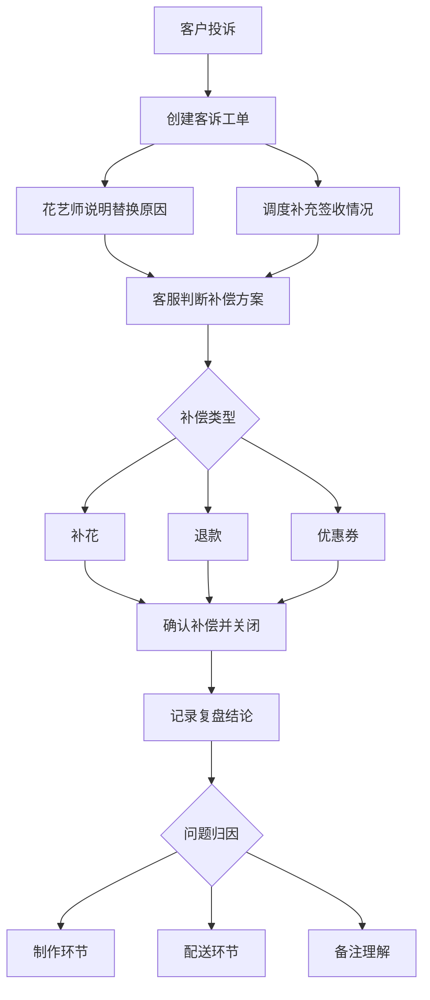

## 1. 产品概述

鲜花配送站客诉补偿与花材复盘系统，面向花艺师、配送调度和售后客服三角色协同，解决鲜花订单中花材替换、配送迟到、卡片写错、客户拒收等高频问题的快速定责与补偿处理。

- 核心目标：让客服在接到投诉后快速判断补偿方案（补花、退款、优惠券），同时让花艺师与调度围绕同一笔订单协作说明原因
- 核心价值：复盘环节能清晰定位问题出在制作、配送还是备注理解，避免同类问题反复发生

## 2. 核心功能

### 2.1 用户角色

| 角色 | 进入方式 | 核心权限 |
|------|----------|----------|
| 售后客服 | 默认角色 | 创建/处理客诉、确认补偿方案、关闭售后、追加备注、记录复盘结论 |
| 花艺师 | 切换角色 | 说明花材替换原因、补充制作环节信息 |
| 配送调度 | 切换角色 | 补充签收情况、配送异常说明 |

### 2.2 功能模块

1. **客诉工单列表页**：状态筛选、问题类型标签、紧急度标识、快速预览
2. **客诉详情与协作页**：多角色时间线、补偿决策面板、花材替换记录、配送追踪
3. **复盘分析视图**：问题归因统计、趋势图表、高频问题洞察

### 2.3 页面详情

| 页面名称 | 模块名称 | 功能描述 |
|----------|----------|----------|
| 客诉工单列表 | 状态筛选栏 | 按待处理/处理中/已关闭/已复盘筛选，支持问题类型过滤 |
| 客诉工单列表 | 工单卡片列表 | 展示订单号、客户名、问题类型标签、紧急度、创建时间、当前处理人 |
| 客诉工单列表 | 快速操作栏 | 一键补偿确认、快速关闭、标记紧急 |
| 客诉详情页 | 订单基础信息 | 订单号、收件人、花束内容、配送地址、期望/实际送达时间 |
| 客诉详情页 | 多角色协作时间线 | 花艺师说明替换原因、客服记录客户诉求、调度补充签收情况，按时间排序展示 |
| 客诉详情页 | 补偿决策面板 | 根据问题类型推荐补偿方案：补花/退款/优惠券，可手动调整金额 |
| 客诉详情页 | 追加备注 | 任意角色可追加备注，支持内部备注（客户不可见） |
| 客诉详情页 | 关闭售后 | 确认补偿方案后关闭，需填写关闭原因 |
| 客诉详情页 | 复盘结论记录 | 选择问题归因（制作/配送/备注理解/其他），填写改进措施 |
| 复盘分析 | 问题归因统计 | 饼图展示制作/配送/备注理解占比 |
| 复盘分析 | 趋势图 | 近期客诉量趋势折线图 |
| 复盘分析 | 高频问题Top列表 | 按问题类型排名，展示发生次数与平均处理时长 |

## 3. 核心流程

客服接到客户投诉 → 创建客诉工单（选择问题类型、紧急度）→ 花艺师补充花材替换原因 / 调度补充配送异常 → 客服判断补偿方案（补花/退款/优惠券）→ 确认补偿 → 关闭售后 → 填写复盘结论（问题归因+改进措施）

## 4. 用户界面设计

### 4.1 设计风格

- **主色调**：暖橘色（#E8734A）作为品牌色，搭配深墨绿（#1A3A2A）作为强调色，奶白底色（#FAF7F2）
- **辅助色**：柔和的粉色用于紧急标识，浅绿用于完成状态，暖黄用于处理中
- **按钮风格**：圆角柔和（8px），主操作按钮用实色填充，次操作用描边样式
- **字体**：标题用 Noto Serif SC（衬线体，体现花艺质感），正文用 Noto Sans SC
- **布局风格**：左侧导航 + 右侧内容区，卡片式布局带微妙阴影
- **图标风格**：线性图标（lucide-react），线条粗细 1.5px
- **装饰元素**：微妙的花卉线条水印作为背景纹理，卡片带有柔和的渐变边框

### 4.2 页面设计概览

| 页面名称 | 模块名称 | UI元素 |
|----------|----------|--------|
| 客诉工单列表 | 筛选栏 | 水平标签组，带计数徽标，选中态用暖橘底色 |
| 客诉工单列表 | 工单卡片 | 左侧问题类型色条，右侧操作按钮组，悬停微浮起效果 |
| 客诉详情页 | 协作时间线 | 左侧角色头像+角色色条，右侧气泡内容，按时间竖排 |
| 客诉详情页 | 补偿面板 | 推荐方案高亮卡片，金额输入框，确认/取消按钮组 |
| 客诉详情页 | 复盘表单 | 归因单选组（图标+文字），改进措施文本域，提交按钮 |
| 复盘分析 | 统计图表 | 简洁饼图+图例，折线图带数据点，Top列表带进度条 |

### 4.3 响应式

- 桌面优先设计，主要内容区最小宽度 1024px
- 客诉详情页在窄屏下时间线与补偿面板上下堆叠
- 列表页在小屏下卡片全宽展示

## 5. Mock数据场景

| 场景 | 问题描述 | 问题类型 | 紧急度 |
|------|----------|----------|--------|
| 生日花束迟到 | 客户订生日花束，配送迟到2小时，错过生日派对 | 配送迟到 | 紧急 |
| 花材临时替换 | 红玫瑰缺货替换为粉玫瑰，客户不满意颜色 | 花材替换 | 一般 |
| 贺卡错字 | 贺卡"生日快乐"写成"生曰快乐"，客户要求重做 | 卡片错误 | 一般 |
| 客户拒收 | 配送时客户不在，花放在门口后枯萎，客户拒收并要求退款 | 客户拒收 | 紧急 |
