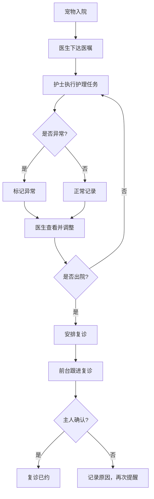

## 1. 产品概述

宠物医院住院护理管理系统——解决住院宠物护理记录分散在笼卡、病历、前台表格三处的问题，将住院护理、医嘱执行、复诊安排统一到一个平台。医生、住院护士、前台客服各自看到与职责匹配的重点信息，夜班交接和主人询问时无需翻三处。

- 目标用户：宠物医院医生、住院护士、前台客服
- 核心价值：信息统一、角色分视图、异常可追溯、复诊不遗漏

## 2. 核心功能

### 2.1 用户角色

| 角色 | 登录方式 | 核心权限 |
|------|----------|----------|
| 医生 | 角色选择（演示用） | 查看病历变化、下达/修改医嘱、查看护理时间线 |
| 住院护士 | 角色选择（演示用） | 查看今日护理任务、执行喂药/换药记录、标记异常 |
| 前台客服 | 角色选择（演示用） | 查看待约复诊列表、记录客户沟通、确认复诊预约 |

### 2.2 功能模块

1. **住院总览页**：当前住院宠物列表，按角色显示不同摘要（医生看病情、护士看任务、前台看复诊状态）
2. **住院详情页**：单个宠物的完整住院档案，含护理时间线、医嘱列表、异常标记
3. **护理时间线**：按时间排列的所有护理记录、医嘱执行记录、异常事件，支持筛选
4. **今日任务面板**（护士视图）：今日需执行的喂药、换药、输液等任务清单，可一键标记完成
5. **复诊提醒面板**（前台视图）：即将到期/已逾期的复诊列表，客户沟通记录
6. **客户沟通记录**：每次与宠物主人的沟通时间、方式、内容摘要

### 2.3 页面详情

| 页面名称 | 模块名称 | 功能描述 |
|----------|----------|----------|
| 住院总览 | 角色切换栏 | 顶部切换医生/护士/前台角色 |
| 住院总览 | 住院列表 | 医生视图：宠物名+诊断+病情趋势标签；护士视图：宠物名+今日待办数+异常标记；前台视图：宠物名+主人+复诊状态 |
| 住院详情 | 基本信息卡 | 宠物名、品种、年龄、主人、入院日期、诊断 |
| 住院详情 | 护理时间线 | 按时间倒序展示护理记录、医嘱执行、异常事件，支持按类型筛选 |
| 住院详情 | 异常标记面板 | 红色/黄色标记异常护理事件（漏喂药、体温异常等） |
| 住院详情 | 医嘱列表 | 医生下达的用药/护理指令及执行状态 |
| 住院详情 | 客户沟通记录 | 与主人的电话/微信沟通记录 |
| 今日任务 | 任务清单 | 护士今日待执行任务，显示时间和类型，可标记完成 |
| 复诊提醒 | 复诊列表 | 前台视图，显示到期/逾期未约复诊，可标记已预约 |
| 复诊提醒 | 沟通记录 | 每次联系主人的记录，含时间、方式、结果 |

## 3. 核心流程

### 3.1 住院护理流程

宠物入院 → 医生下达医嘱（用药/护理频次）→ 护士按时间线执行并记录 → 异常情况标记（漏喂药/体温异常）→ 医生查看病情变化 → 出院时安排复诊

### 3.2 复诊提醒流程

出院安排复诊日期 → 前台查看待约列表 → 联系主人确认 → 记录沟通结果 → 确认预约/改期

## 4. 用户界面设计

### 4.1 设计风格

- **主题色**：温暖系——主色 teal (#0D9488)，辅色 amber (#F59E0B) 做异常/警告，neutral zinc 做底色
- **按钮风格**：圆角 (rounded-lg)，轻微阴影，hover 时加深
- **字体**：Noto Sans SC 做正文，JetBrains Mono 做时间戳/数据
- **布局风格**：左侧导航 + 右侧内容区，卡片式布局
- **图标**：lucide-react 图标库

### 4.2 页面设计概览

| 页面名称 | 模块名称 | UI 元素 |
|----------|----------|---------|
| 住院总览 | 角色切换栏 | 顶部 tab 切换，不同角色用不同色系标识 |
| 住院总览 | 住院列表 | 卡片列表，每张卡片含标签、状态色块、关键指标 |
| 住院详情 | 护理时间线 | 左侧时间轴竖线 + 右侧事件卡片，异常事件红色边框 |
| 住院详情 | 医嘱列表 | 表格形式，状态列用 badge 显示 |
| 今日任务 | 任务清单 | 勾选式列表，完成项灰化，紧急项红色标记 |
| 复诊提醒 | 复诊列表 | 状态分组（逾期/即将到期/已预约），每组卡片 |

### 4.3 响应式设计

- 桌面优先（1440px 基准），平板 (768px) 适配侧边栏折叠，手机暂不做深度适配
- 护理时间线在窄屏下改为单列

### 4.4 角色视觉区分

- **医生视图**：teal 主色调，强调病情趋势与医嘱管理
- **护士视图**：sky 主色调，强调任务执行与时间节点
- **前台视图**：violet 主色调，强调客户沟通与预约管理
