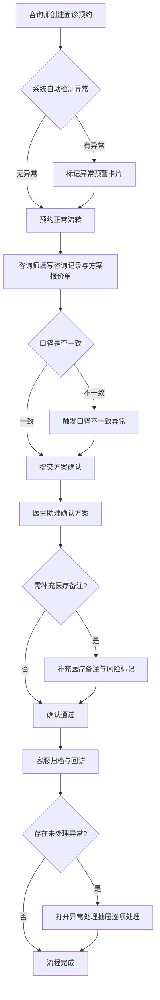
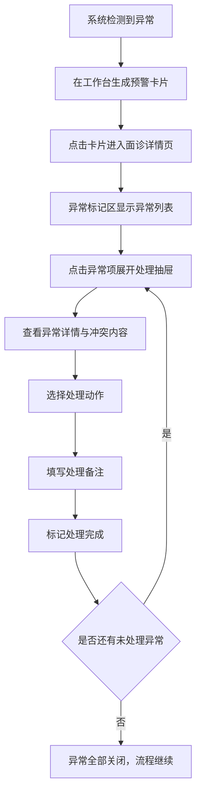

## 1. 产品概述

医美机构面诊预约与方案确认系统——面向咨询师、医生助理、客服的接力式工作台，核心目标是减少翻群记录的时间损耗。系统在面诊预约流转过程中自动标记口径不一致、术后投诉、分期款项对不上等异常，让问题在碰到之前就被看见，而不是事后占半天。

- 解决医美机构微信群记录混乱、项目承诺口径冲突、术后纠纷和分期对账靠人工翻聊天记录的问题
- 目标用户：医美机构咨询师、医生助理、客服人员，机构管理者

## 2. 核心功能

### 2.1 用户角色

| 角色 | 登录方式 | 核心权限 |
|------|----------|----------|
| 咨询师 | 演示账号登录 | 创建/编辑面诊预约、填写咨询记录、提交方案报价单、确认口径一致性 |
| 医生助理 | 演示账号登录 | 确认面诊方案、补充医疗备注、标记医疗风险 |
| 客服 | 演示账号登录 | 处理术后回访、受理投诉、核对分期款项、关闭异常工单 |

### 2.2 功能模块

1. **工作台**: 今日预约时间线、异常预警卡片、待处理任务队列、角色切换入口
2. **面诊详情页**: 患者信息、咨询记录、方案报价单、术后回访表、异常标记与处理、方案确认流程（内嵌）
3. **异常处理抽屉**: 口径不一致、术后投诉、分期对不上三类异常的详情展示与处理动作

### 2.3 页面详情

| 页面名称 | 模块名称 | 功能描述 |
|----------|----------|----------|
| 工作台 | 今日预约时间线 | 按时间轴展示当日面诊预约，显示患者姓名、项目、状态标签，点击进入详情 |
| 工作台 | 异常预警卡片 | 红色/橙色/黄色三级预警，显示异常类型（口径不一致/术后投诉/分期对不上）、关联患者、创建时间 |
| 工作台 | 待处理任务队列 | 按角色过滤待办：咨询师待确认口径、医生助理待确认方案、客服待回访/待对账 |
| 工作台 | 角色切换 | 顶部角色选择器，切换咨询师/医生助理/客服视角 |
| 面诊详情页 | 患者信息卡 | 姓名、电话、年龄、历史到院次数、标签（如"敏感客户"、"分期中"） |
| 面诊详情页 | 咨询记录时间轴 | 按时间倒序展示咨询记录，支持新增备注，历史备注带时间戳和操作人 |
| 面诊详情页 | 方案报价单 | 项目明细、单价、折扣、总价，支持多方案对比，变更记录留痕 |
| 面诊详情页 | 术后回访表 | 回访时间、回访内容、客户满意度、异常标记 |
| 面诊详情页 | 方案确认流程 | 内嵌在详情页内的步骤条，咨询师提交→医生助理确认→客服归档，非独立菜单 |
| 面诊详情页 | 异常标记区 | 页面右侧/顶部浮动区域，显示当前患者关联的异常，点击展开异常处理抽屉 |
| 异常处理抽屉 | 口径不一致处理 | 展示冲突的承诺内容（咨询说A、医生说B），选择正确口径，添加处理备注 |
| 异常处理抽屉 | 术后投诉处理 | 展示投诉内容、关联项目、处理建议，标记处理结果 |
| 异常处理抽屉 | 分期对账 | 展示分期计划vs实付记录，标红差异项，确认对账结果 |

## 3. 核心流程

### 3.1 面诊预约与方案确认接力流程

咨询师在微信接诊后，将关键信息录入系统，创建面诊预约。系统自动匹配历史记录，若发现同一患者在不同咨询中承诺口径不同（如项目包含内容、价格口径），立即标记异常。面诊当日，咨询师确认信息无误后提交方案报价单，流程流转至医生助理。医生助理面诊后补充医疗备注、确认方案，流转至客服。客服进行术后回访、处理投诉、核对分期款项，关闭异常工单，整个流程结束。

### 3.2 异常处理流程

## 4. 用户界面设计

### 4.1 设计风格

- **主色调**: 暖白底色(#FAFAF8) + 深炭灰文字(#1A1A1A) + 医疗感薄荷绿主色(#2BA88C) + 异常预警用珊瑚红(#E85D5D)和琥珀黄(#F5A623)
- **按钮风格**: 圆角8px，主按钮薄荷绿填充，次按钮描边，危险操作用珊瑚红
- **字体**: 标题使用思源黑体/Noto Sans SC Bold，正文使用Noto Sans SC Regular，数据/金额使用等宽字体 JetBrains Mono
- **布局风格**: 左侧固定导航栏 + 右侧内容区，内容区采用卡片式布局，异常区域用浮层和抽屉
- **图标风格**: 线性图标，1.5px描边，与薄荷绿主色统一

### 4.2 页面设计概述

| 页面名称 | 模块名称 | UI要素 |
|----------|----------|--------|
| 工作台 | 今日预约时间线 | 纵向时间轴，左侧时间标注，右侧卡片，状态标签彩色圆点，入场动画从左滑入 |
| 工作台 | 异常预警卡片 | 卡片左侧色条（红/橙/黄），标题加粗，类型图标，患者名+异常摘要，hover微升 |
| 工作台 | 待处理任务 | 列表样式，角色过滤tab，任务项显示患者名+操作类型+截止时间 |
| 工作台 | 角色切换 | 顶部右侧下拉选择器，选中项薄荷绿底色，切换时内容区平滑过渡 |
| 面诊详情页 | 患者信息卡 | 顶部固定卡片，头像占位+姓名+标签（胶囊式），基本信息网格 |
| 面诊详情页 | 咨询记录时间轴 | 纵向时间轴，每条记录圆点+连线，展开/收起详情，新增入口在底部 |
| 面诊详情页 | 方案报价单 | 表格式，项目行hover高亮，总价区加粗放大，多方案tab切换 |
| 面诊详情页 | 方案确认步骤条 | 页面内嵌水平步骤条，已完成步骤绿色勾，当前步骤脉冲动画，待完成灰色 |
| 面诊详情页 | 异常标记区 | 页面右侧固定浮层，异常项数量badge，点击展开抽屉 |
| 异常处理抽屉 | 抽屉整体 | 右侧滑出抽屉，宽度480px，半透明遮罩，抽屉内分区显示不同异常类型 |
| 异常处理抽屉 | 口径不一致 | 左右对比布局，左侧咨询师口径，右侧医生口径，冲突项红色底色高亮 |
| 异常处理抽屉 | 术后投诉 | 投诉内容全文+关联项目卡片，处理建议多选，处理结果下拉 |
| 异常处理抽屉 | 分期对账 | 分期计划表+实付记录表并列，差异行红色背景，底部确认按钮 |

### 4.3 响应式设计

- 桌面优先设计，最小支持1280px宽度
- 面诊详情页在1440px以上采用左右分栏（主内容+异常浮层），1280-1440px异常浮层改为底部展开
- 异常处理抽屉在小屏幕下改为全屏模态框

### 4.4 样例数据要求

系统内置5条带历史备注的样例数据，覆盖以下场景：
1. **正常流程样例**: 从预约创建到方案确认完成的完整流程（含2条历史备注）
2. **口径不一致样例**: 咨询师承诺含术后修复，医生备注未包含，系统已标记异常（含3条历史备注）
3. **术后投诉样例**: 客户术后不满，已生成投诉异常（含4条历史备注含回访记录）
4. **分期对不上样例**: 分期计划3期但实付2期且金额有差异（含3条历史备注）
5. **多异常叠加样例**: 同一患者同时存在口径不一致+分期对不上（含5条历史备注）

每条样例均可从工作台点击进入详情页，一路操作到处理完成。
