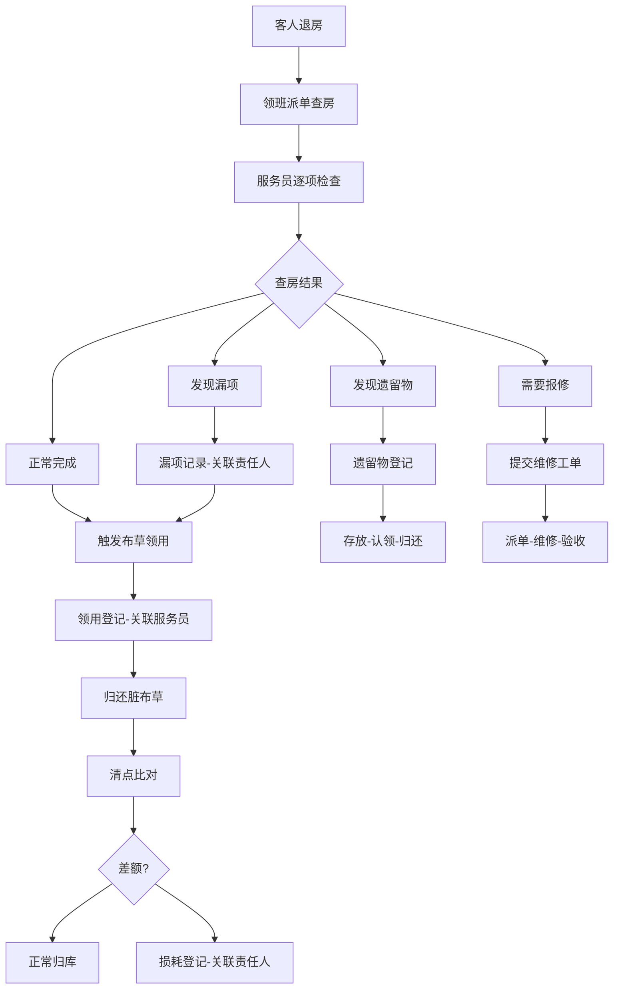

## 1. 产品概述

酒店客房部全流程管理系统，以**责任人**和**时间线**为核心组织维度，整合房态板、布草记录、维修单三大信息流，解决查房漏项、布草亏损、客人遗留物扯不清三大痛点，实现客房运营闭环管理。

- 目标用户：酒店客房部主管、楼层领班、客房服务员、布草房管理员
- 核心价值：责任可追溯、时间线可复盘、信息不遗漏、数据不孤岛

## 2. 核心功能

### 2.1 用户角色

| 角色 | 进入方式 | 核心权限 |
|------|----------|----------|
| 客房部主管 | 管理员分配账号 | 全局看板、审批、数据统计、人员管理 |
| 楼层领班 | 管理员分配账号 | 楼层房态监控、查房派单、布草审核、维修跟踪 |
| 客房服务员 | 管理员分配账号 | 接收任务、查房记录、布草领用、遗留物上报 |
| 布草房管理员 | 管理员分配账号 | 布草出入库、盘点、损耗登记 |

### 2.2 功能模块

1. **工作台总览**：实时房态看板、今日待办、预警提醒、责任概览
2. **房态管理**：房间状态流转、查房派单、查房记录、时间线追溯
3. **布草管理**：领用登记、归还记录、损耗登记、盘点对账、责任人关联
4. **维修管理**：报修提交、工单派发、进度跟踪、完成确认
5. **遗留物管理**：发现登记、存放记录、认领处理、责任追溯
6. **数据统计**：布草损耗分析、查房漏项统计、维修响应时效、人员绩效

### 2.3 页面详情

| 页面名称 | 模块名称 | 功能描述 |
|----------|----------|----------|
| 工作台总览 | 房态看板 | 按楼层展示房间状态色块（空房/住客/打扫/维修/查房），点击进入详情 |
| 工作台总览 | 今日待办 | 按责任人分组展示待处理任务（查房/领用/报修/遗留物） |
| 工作台总览 | 预警提醒 | 布草缺口预警、超时未查房预警、维修超期预警 |
| 房态管理 | 房间详情 | 房间完整时间线（入住→查房→打扫→领用→归还→退房），每步绑定责任人 |
| 房态管理 | 查房记录 | 查房项逐条勾选、漏项标记、照片上传、自动关联责任人 |
| 房态管理 | 查房派单 | 按楼层/区域批量派单，跟踪完成率 |
| 布草管理 | 领用登记 | 按房间/楼层领用，自动关联服务员，记录品类数量 |
| 布草管理 | 归还记录 | 脏布草归还登记，与领用数量自动比对，差额自动标记 |
| 布草管理 | 损耗登记 | 损耗类型分类（磨损/污渍/丢失），关联责任人与房间号 |
| 布草管理 | 盘点对账 | 按楼层/品类盘点，自动生成盈亏报表 |
| 维修管理 | 报修提交 | 选择房间+故障类型+紧急程度，上传照片 |
| 维修管理 | 工单详情 | 工单状态流转，维修前后照片对比，耗时统计 |
| 遗留物管理 | 登记记录 | 物品描述+照片+发现房间+发现人+时间，自动生成编号 |
| 遗留物管理 | 认领处理 | 认领记录、归还确认、超期处理，全程责任链 |
| 数据统计 | 布草损耗分析 | 按时间段/楼层/品类统计损耗率，责任热力图 |
| 数据统计 | 查房漏项统计 | 按人员/楼层统计漏项率，高频漏项排行 |
| 数据统计 | 维修响应时效 | 报修到完工的平均响应时间，超期工单排行 |

## 3. 核心流程

### 3.1 查房全流程（责任人+时间线闭环）

客人退房 → 领班派单查房 → 服务员逐项检查 → 记录查房结果（漏项标记/遗留物发现/报修需求）→ 领班复核确认 → 触发布草领用/维修/遗留物子流程 → 全程绑定责任人，时间线完整可追溯

### 3.2 布草领用到损耗闭环

查房完成 → 服务员按房间领用干净布草 → 更换脏布草 → 脏布草归还布草房 → 布草房清点比对（领用vs归还）→ 差额自动生成损耗记录 → 损耗关联责任人 → 定期盘点对账确认

### 3.3 遗留物处理闭环

查房发现遗留物 → 服务员登记（物品/照片/房间/时间）→ 领班确认 → 存放至前台/指定地点 → 客人认领 → 认领签字确认 → 全程责任链完整

## 4. 用户界面设计

### 4.1 设计风格

- **主色调**：深靛蓝 (#1e3a5f) + 暖琥珀色 (#d4940a) 作为强调色，传达专业与高效
- **辅助色**：浅灰底 (#f5f6fa)，白卡片 (#ffffff)，状态色（绿-空房、蓝-住客、橙-打扫、红-维修、紫-查房）
- **按钮风格**：圆角微阴影，主操作用琥珀色填充，次操作用描边
- **字体**：标题用 Noto Serif SC（衬线体传达信赖感），正文用 Noto Sans SC
- **布局风格**：左侧导航栏 + 右侧内容区，卡片式布局，桌面优先
- **图标**：Lucide 图标库，线性风格，与整体简洁调性一致
- **动效**：房态色块状态变化时平滑过渡，数据卡片入场 stagger 动画，表格行 hover 柔和阴影

### 4.2 页面设计概览

| 页面名称 | 模块名称 | UI 元素 |
|----------|----------|---------|
| 工作台总览 | 房态看板 | 楼层标签页 + 网格色块（每格代表一个房间），hover 显示房号和状态，点击弹抽屉 |
| 工作台总览 | 今日待办 | 按责任人分组的任务卡片，每卡片含任务类型图标+房间号+截止时间+状态标签 |
| 工作台总览 | 预警提醒 | 顶部横幅滚动预警条，红/橙/黄三级，含数量角标 |
| 房态管理 | 房间详情 | 右侧抽屉，顶部房间信息，中部垂直时间线（每节点含时间+操作人+状态），底部操作按钮 |
| 房态管理 | 查房记录 | 勾选式清单，漏项用红色标记，底部签名确认区 |
| 布草管理 | 领用登记 | 表单卡片（房间选择+品类表格+数量输入），底部领用人+领用时间自动填充 |
| 布草管理 | 盘点对账 | 左右分栏（左：当前库存表，右：系统应存表），底部差额高亮 |
| 数据统计 | 布草损耗分析 | 柱状图+趋势折线图，下方责任热力图（人员×月份矩阵） |

### 4.3 响应式设计

- 桌面优先（1440px 基准），适配 1280px / 1024px 两个断点
- 房态看板在小屏时从网格切换为列表视图
- 表格在小屏时隐藏次要列，支持横向滚动
- 移动端（未来）预留触控优化：大按钮、滑动手势

### 4.4 动效细节

- 房态色块：状态变化时 300ms ease 过渡
- 卡片入场：从下方 20px 淡入，stagger 50ms
- 抽屉打开：从右侧滑入 250ms ease-out
- 数字统计：加载后从 0 递增动画 800ms
- 表格行 hover：左侧出现琥珀色竖条 + 微阴影
