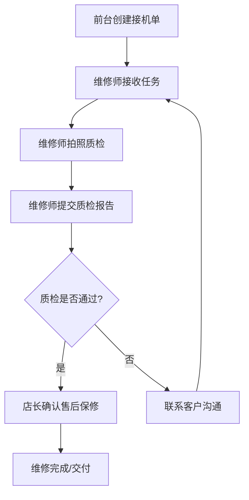

## 1. Product Overview
手机维修店取机质检与售后保修系统，解决接机单、备件柜和质检照片之间的交接问题，明确取机质检和售后保修的责任划分，避免后续纠纷。
- 核心目的：实现维修流程数字化，记录每一步操作和责任人，确保可追溯
- 目标用户：前台接待员、维修技师、店长

## 2. Core Features

### 2.1 User Roles
| Role | Registration Method | Core Permissions |
|------|---------------------|------------------|
| 前台接待 | 账号密码登录 | 创建接机单、提交取机质检、查看维修进度 |
| 维修技师 | 账号密码登录 | 接收维修任务、上传质检照片、完成维修、申请备件 |
| 店长 | 账号密码登录 | 确认售后保修、审核维修工单、查看统计报表、数据重置 |

### 2.2 Feature Module
1. **接机单管理**: 创建接机单、查看接机列表、搜索筛选
2. **取机质检**: 质检拍照、问题描述、配件检查、提交质检
3. **售后保修**: 保修确认、责任划分、保修期限设置
4. **备件管理**: 备件库存查看、领用记录、库存预警
5. **工单列表**: 全量工单查看、状态筛选、历史记录
6. **数据重置**: 测试数据重置功能

### 2.3 Page Details
| Page Name | Module Name | Feature description |
|-----------|-------------|---------------------|
| 首页仪表盘 | 工单概览 | 待处理工单统计、今日任务、快捷入口 |
| 接机单管理 | 接机单列表 | 创建接机单、搜索筛选、查看详情 |
| 取机质检 | 质检表单 | 拍照上传、问题描述、配件检查、提交 |
| 售后保修 | 保修确认 | 保修信息填写、责任确认、审批操作 |
| 备件管理 | 备件库存 | 库存列表、领用记录、预警提示 |
| 工单详情 | 工单详情页 | 完整工单信息、历史操作记录、备注 |

## 3. Core Process

## 4. User Interface Design

### 4.1 Design Style
- 主色调：深蓝色(#1e40af)，代表专业与信任
- 辅助色：橙色(#f97316)，用于强调和操作按钮
- 按钮样式：圆角矩形，hover状态有阴影和颜色变化
- 字体：Inter，14-16px正文，16-18px标题
- 布局：卡片式布局，清晰的信息层级

### 4.2 Page Design Overview
| Page Name | Module Name | UI Elements |
|-----------|-------------|-------------|
| 首页仪表盘 | 统计卡片 | 数字展示、状态标签、进度条 |
| 接机单管理 | 列表页 | 搜索框、筛选器、表格、操作按钮 |
| 取机质检 | 表单页 | 图片上传区域、多选框、文本输入、提交按钮 |
| 售后保修 | 审批页 | 保修信息表单、责任划分选项、确认按钮 |
| 工单详情 | 详情页 | 时间线、备注列表、操作日志 |

### 4.3 Responsiveness
- 桌面端优先设计
- 移动端自适应布局
- 触摸友好的按钮尺寸(最小44px)

### 4.4 Data Requirements
- 至少5条带历史备注的样例工单数据
- 包含完整的状态流转记录
- 每条工单包含多张质检照片