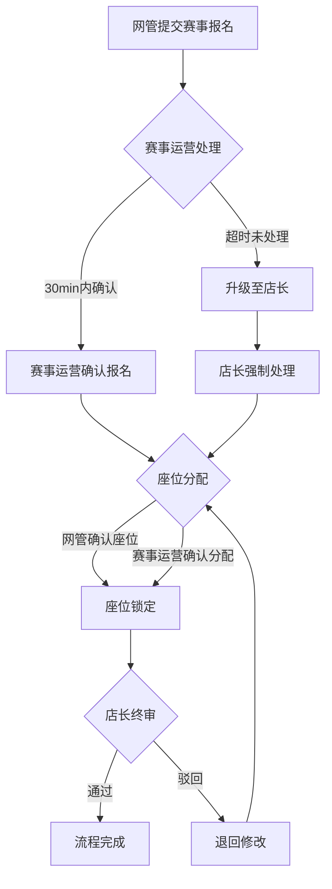
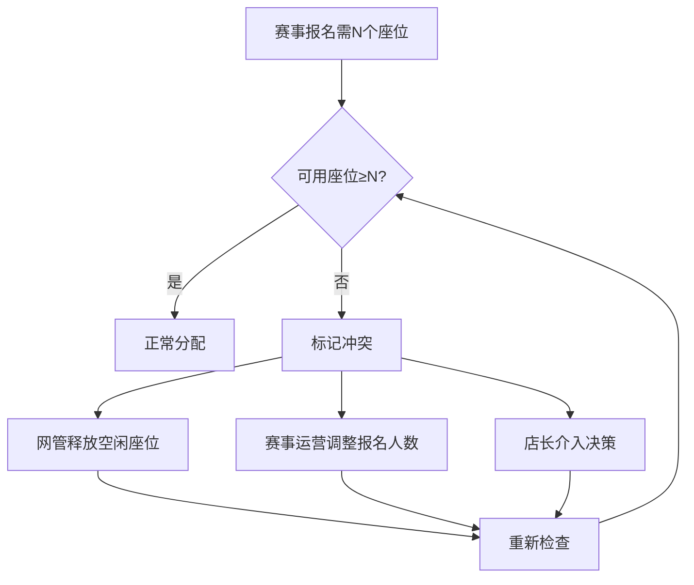

## 1. 产品概述

网咖电竞馆赛事报名与座位分配管理系统——解决赛事运营中"谁报的名、谁占的座、出了问题谁负责"的灰色地带。系统强制记录每一步交接的时间、操作人和备注，让赛事报名到座位分配的全链路有据可查，杜绝口头确认和甩锅推诿。

- 目标用户：网管、赛事运营、店长三类角色
- 核心价值：用系统留痕替代口头交接，用时效倒计时替代"催了没"，用责任锁定替代"不是我的锅"

## 2. 核心功能

### 2.1 用户角色

| 角色 | 进入方式 | 核心权限 |
|------|----------|----------|
| 网管 | 登录选择 | 查看座位状态、提交赛事报名、处理座位释放、上报设备问题 |
| 赛事运营 | 登录选择 | 确认赛事报名、确认座位分配、催办未处理事项、添加备注 |
| 店长 | 登录选择 | 审批超时事项、数据重置、查看全量交接记录、最终确认 |

### 2.2 功能模块

1. **现场态势仪表盘**：实时展示待处理数、超时预警、冲突座位，制造压力感
2. **赛事报名管理**：报名提交→处理→确认全流程，带时效倒计时和责任标记
3. **座位分配管理**：可视座位图+分配确认+冲突标记，与赛事报名强关联
4. **详情与处理页**：从详情进入，完成当前角色操作后自动流转到下一环节
5. **交接记录与备注**：每个操作留痕，支持历史备注回看
6. **数据重置**：店长权限，一键清空重置（需二次确认）

### 2.3 页面详情

| 页面名称 | 模块名称 | 功能说明 |
|----------|----------|----------|
| 现场态势仪表盘 | 压力指标卡 | 显示待处理数、超时数、冲突数，红黄绿三级预警 |
| 现场态势仪表盘 | 最近动态流 | 时间线展示最近操作和交接记录 |
| 现场态势仪表盘 | 紧急事项列表 | 超时未处理事项快速入口 |
| 赛事报名列表 | 报名卡片列表 | 按状态分组展示，支持筛选和搜索 |
| 赛事报名列表 | 时效倒计时 | 每条报名显示剩余处理时间，超时变红 |
| 赛事报名详情 | 报名信息 | 赛事名称、队伍、人数、设备要求、附件占位 |
| 赛事报名详情 | 处理流程 | 当前环节高亮，可执行操作，操作后自动流转 |
| 赛事报名详情 | 交接与备注 | 历史交接记录、备注添加、责任标记 |
| 座位分配管理 | 可视座位图 | 网咖座位网格图，颜色标记状态 |
| 座位分配管理 | 分配确认 | 关联赛事报名，确认/释放座位 |
| 座位分配详情 | 分配信息 | 关联报名、座位号、操作人、时间线 |
| 数据管理 | 数据重置 | 店长权限，二次确认后重置 |
| 数据管理 | 附件管理 | 附件占位符展示 |

## 3. 核心流程

赛事报名提交后进入处理流程：网管提交→赛事运营确认→座位分配→店长终审（如超时）。关键环节超时自动升级，每步操作强制留痕。

座位冲突处理流程：

## 4. 用户界面设计

### 4.1 设计风格

- 主色调：深灰底色（#0F1419）+ 荧光绿强调色（#00FF88）——电竞氛围
- 辅助色：警报红（#FF3B30）、警告黄（#FFCC00）、成功绿（#34C759）
- 按钮风格：微圆角+荧光边框，主操作按钮发光效果
- 字体：标题用 Rajdhani（电竞感），正文用 Noto Sans SC
- 布局风格：左侧导航+右侧内容区，卡片式模块，暗色主题
- 状态标记：脉冲动画表示实时变化，红色闪烁表示紧急

### 4.2 页面设计概览

| 页面名称 | 模块名称 | UI元素 |
|----------|----------|--------|
| 现场态势仪表盘 | 压力指标卡 | 大号数字+脉冲动画，红黄绿渐变背景 |
| 现场态势仪表盘 | 最近动态流 | 时间线+操作人头像+操作描述 |
| 赛事报名列表 | 报名卡片 | 左侧状态色条+右侧倒计时+底部操作人 |
| 赛事报名详情 | 处理流程 | 步骤条+当前步骤高亮+操作按钮发光 |
| 赛事报名详情 | 交接记录 | 卡片式备注+责任标签+时间戳 |
| 座位分配管理 | 座位图 | 网格布局+状态色块+hover详情 |
| 数据管理 | 重置按钮 | 红色警告+二次确认弹窗 |

### 4.3 响应式设计

桌面优先设计，关键操作区域固定在视口内，座位图支持缩放。移动端仅做基本可用适配。

## 5. 关键业务规则

### 5.1 责任与时效

- 赛事报名提交后30分钟内必须由赛事运营确认，超时自动升级至店长
- 座位分配确认后15分钟内必须由对应角色处理，超时标红
- 店长终审需在1小时内完成，超时系统自动标记异常
- 每个环节操作必须填写备注（可简短，但不能为空）

### 5.2 交接留痕

- 每次状态变更记录：操作人、操作时间、操作类型、备注
- 不可删除历史记录，只能追加
- 备注支持标记类型：正常、紧急、争议、补充说明

### 5.3 附件占位

- 赛事报名支持附件占位（文件名+占位状态），实际上传为后续扩展
- 占位附件显示为虚线框+图标

### 5.4 数据重置

- 仅店长可操作
- 二次确认弹窗需输入确认文本
- 重置后保留操作日志，可追溯重置行为
