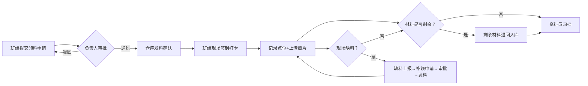

## 1. 产品概述
**弱电施工队-线缆领用与现场打卡系统**——解决弱电施工现场线缆用量难以追溯、领料与实际使用脱节的痛点问题，记录从仓库领出到现场使用到剩余退回的全流程，实现线缆领用数量与现场照片的一一对应。
- 目标用户：项目负责人、施工班组、资料员、仓库管理员
- 核心价值：材料流转全链路留痕，线缆用量可追溯，竣工资料一键整理

## 2. 核心功能

### 2.1 用户角色
| 角色 | 登录方式 | 核心权限 |
|------|----------|----------|
| 项目负责人 | 账号密码 | 审批领料申请、查看全量记录、发起补领 |
| 施工班组 | 账号密码 | 提交领料申请、现场签到打卡、记录点位、上传照片、退回剩余材料 |
| 资料员 | 账号密码 | 查看历史记录、导出竣工资料、整理归档 |
| 仓库管理员 | 账号密码 | 确认发料、入库登记、接收退回材料 |

### 2.2 功能模块
1. **仪表盘首页**：项目概览、待办事项、关键数据卡片
2. **领料管理**：领料申请、负责人审批、仓库发料、记录超领/错领
3. **现场打卡**：施工签到、点位记录、现场照片上传、缺料上报
4. **补领与退回**：补领申请、剩余材料退回、出入库台账
5. **历史记录**：全链路记录查询、领用-点位对应关系、数据筛选导出

### 2.3 页面详情
| 页面名称 | 模块名称 | 功能描述 |
|----------|----------|----------|
| 仪表盘 | 项目概览卡片 | 显示在建项目数、在线班组、本月领用总量、待审批数 |
| 仪表盘 | 待办事项列表 | 待审批领料、待确认缺料、待退回材料 |
| 仪表盘 | 最近动态时间线 | 最新发料/打卡/退回记录 |
| 领料管理 | 领料申请表单 | 选择项目/班组/线缆型号/数量、添加备注、标记超领/错领 |
| 领料管理 | 审批列表 | 审批状态标签、一键通过/驳回、查看详情 |
| 领料管理 | 发料确认 | 仓库扫码确认、出库时间、领用人签字 |
| 现场打卡 | 签到面板 | 选择项目、班组到场时间、GPS定位（模拟）、签到人 |
| 现场打卡 | 点位记录 | 点位编号、线缆型号、使用米数、接线图照片、备注说明 |
| 现场打卡 | 缺料上报 | 缺料型号、缺料数量、现场照片、紧急程度 |
| 补领与退回 | 补领申请 | 关联缺料记录、补领数量、审批流程 |
| 补领与退回 | 材料退回 | 退回型号、剩余米数、照片凭证、入库确认 |
| 历史记录 | 全链路时间轴 | 领料→审批→发料→打卡→点位→退回，串联展示 |
| 历史记录 | 领用-点位对照表 | 每卷线缆编号与使用点位的对应关系、照片可点击查看 |
| 历史记录 | 筛选导出 | 按项目/时间/班组/线缆型号筛选、导出Excel/PDF |

## 3. 核心流程

### 3.1 正常领料施工流程
施工班组提交领料申请 → 项目负责人审批 → 仓库管理员发料 → 班组到场签到打卡 → 记录点位使用情况（附照片） → 剩余材料退回 → 资料员整理归档

### 3.2 Mermaid 流程图

### 3.3 样例场景说明
| 样例 | 触发条件 | 数据表现 |
|------|----------|----------|
| 超领 | 班组申请数量 > 设计用量的10% | 系统自动标红"超领"，需负责人额外备注 |
| 错领 | 领料后发现型号错误，班组发起错领登记 | 关联原领料单，生成"错领"标签，仓库调换 |
| 现场缺料 | 施工中发现材料不足，班组上报 | 生成缺料单，高亮显示，触发补领流程 |
| 补领 | 关联缺料单再次领料 | 补领单标注"补领"，与原领料单关联 |

## 4. 用户界面设计

### 4.1 设计风格
- **主色**：工业蓝 `#1E40AF`（代表专业、可靠、工程感）
- **辅色**：警示橙 `#EA580C`（用于缺料/超领提醒）、成功绿 `#16A34A`（审批通过）
- **中性色**：深锌灰 `#18181B` 文本，锌灰 `#F4F4F5` 卡片背景
- **按钮风格**：硬朗直角转微圆角（4px），工业工装风格，悬浮上浮 + 阴影
- **字体**：标题使用思源宋体（稳重工程感），正文使用思源黑体（清晰易读），数字等宽字体
- **布局风格**：左侧固定导航栏 + 顶部面包屑 + 主内容卡片栅格，工程台账式布局
- **图标风格**：Lucide 线性图标，粗细一致，搭配小型状态徽章

### 4.2 页面设计概览
| 页面名称 | 模块名称 | UI 元素设计 |
|----------|----------|-------------|
| 仪表盘 | 项目概览卡片 | 4 卡片网格，图标+大数字+趋势小箭头，左侧色条区分（蓝/橙/绿/紫） |
| 仪表盘 | 待办事项列表 | 列表项带状态徽章，悬停高亮，右上角红点未读数 |
| 仪表盘 | 最近动态时间线 | 左侧竖线时间轴，节点圆点按状态着色，卡片式内容 |
| 领料管理 | 领料申请表单 | 分组 Fieldset：项目信息/线缆明细/备注，动态添加线缆行 |
| 领料管理 | 审批列表 | 表格 + 行内操作，超领行全幅橙底白字，错领斜体+删除线 |
| 现场打卡 | 签到面板 | 大按钮签到，模拟地图定位点，打卡成功绿色波纹动画 |
| 现场打卡 | 点位记录 | 卡片列表，每张卡片：点位编号+线缆米数+缩略图可放大 |
| 历史记录 | 全链路时间轴 | 大号竖向时间轴，图标节点，领料→审批→发料→打卡→退回 |
| 历史记录 | 领用-点位对照表 | 表格可展开行，展开后显示照片网格 |

### 4.3 响应式
- 桌面优先（1440px+），适配 1280px / 1024px
- 平板（768px）：导航收窄为图标模式
- 手机：底部 Tab 切换导航，表单全宽堆叠，表格横向滚动

### 4.4 动效设计
- 页面切换：淡入 + 轻微上浮（12px 位移，240ms）
- 状态变更：徽章颜色渐变过渡
- 打卡成功：按钮中心扩散绿色圆形波纹
- 超领/缺料告警：轻微黄色呼吸灯闪烁
- 表格行悬停：背景色浅灰渐变 + 左侧蓝色指示条滑入
