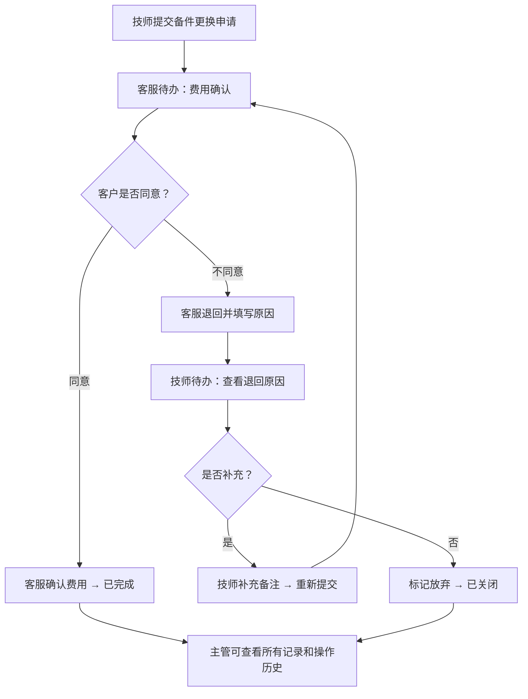

## 1. 产品概述

电梯维保行业中，备件更换与费用确认是最容易产生责任扯皮的环节。本工具聚焦于此核心痛点，将备件更换申请、费用确认、退回原因、补充备注统一到同一条记录中，明确维保技师、客服、项目主管三方角色的待办与责任边界，减少口头沟通带来的信息丢失和责任推诿。

- **目标用户**：电梯维保公司内部的维保技师、客服人员、项目主管
- **核心价值**：把"说不清"的责任提前标出来，让每一笔备件更换都有据可查、有人负责、有迹可循

## 2. 核心功能

### 2.1 用户角色

| 角色 | 核心权限与关注点 |
|------|------------------|
| 维保技师 | 提交备件更换申请、填写更换原因和现场情况、查看退回原因、补充备注 |
| 客服 | 费用确认、联系客户、记录客户反馈、退回不通过的申请 |
| 项目主管 | 全局查看、审批异常费用、查看操作历史、导出数据 |

### 2.2 功能模块

1. **工作台首页**：按角色显示待办统计、今日处理列表、责任风险预警
2. **备件更换处理**：密集数据表格展示所有更换记录，支持筛选、状态切换、快速查看详情
3. **费用确认回看**：按时间维度回看费用确认历史，支持按金额、客户、状态筛选
4. **操作历史**：全量操作日志，记录每条记录的所有变更节点、操作人、操作时间
5. **背景资料**：维保计划、故障电话记录、年检资料作为上下文参考

### 2.3 页面详情

| 页面名称 | 模块名称 | 功能描述 |
|----------|----------|----------|
| 工作台 | 角色切换 | 一键切换技师/客服/主管视角，待办数据联动刷新 |
| 工作台 | 待办统计卡片 | 显示我待办、我已办、风险预警三个维度的数量统计 |
| 工作台 | 责任风险列表 | 高亮显示超过24小时未处理、费用超过阈值、被退回超过2次的记录 |
| 工作台 | 快捷操作入口 | 新建更换申请、批量确认费用、导出报表 |
| 备件更换处理 | 密集数据表格 | 多列高密度展示：编号、电梯编号、备件名称、数量、申请金额、申请时间、状态、当前责任人、操作 |
| 备件更换处理 | 记录详情抽屉 | 同屏展示：备件信息、费用信息、更换原因、费用确认记录、退回原因、补充备注、操作时间线 |
| 备件更换处理 | 申请/确认表单 | 技师填写备件更换信息，客服填写费用确认意见，均支持上传占位凭证 |
| 备件更换处理 | 状态流转 | 待提交→待确认→已确认→已完成 / 待确认→已退回→待重新提交 |
| 费用确认回看 | 筛选区域 | 按日期范围、客户、电梯、金额区间、确认结果筛选 |
| 费用确认回看 | 确认明细表格 | 展示每笔费用的确认过程：申请人、确认人、确认时间、客户反馈、最终金额 |
| 费用确认回看 | 统计摘要 | 合计申请金额、确认金额、差异金额、退回笔数 |
| 操作历史 | 操作日志表格 | 操作时间、操作人、操作类型、记录编号、变更内容摘要 |
| 操作历史 | 变更详情 | 点击查看字段变更前后对比 |
| 背景资料 | 维保计划 | 表格展示近期维保计划，可关联查看对应更换记录 |
| 背景资料 | 故障电话 | 客户来电记录，可标记关联到备件更换记录 |
| 背景资料 | 年检资料 | 电梯年检档案，占位上传入口 |

## 3. 核心流程

维保技师在现场发现需要更换备件时，提交备件更换申请（填写备件信息、更换原因、上传现场照片占位）。客服收到待办后，与客户确认费用并记录确认结果。若客户不同意，客服退回申请并填写退回原因，技师收到退回待办后可补充信息重新提交或放弃。所有操作全程留痕，项目主管可随时查看全局状态和历史记录。

## 4. 用户界面设计

### 4.1 设计风格

本工具定位为办公室日常使用的业务工具，采用**工业/实用主义**设计风格，信息密度优先于视觉装饰。

- **主色调**：深蓝色 #1e3a5f 作为主导航和状态主色，搭配深灰 #2d3748 文字
- **强调色**：橙色 #dd6b20 用于"责任待办"和"风险预警"的高亮警示，绿色 #2f855a 表示已完成，红色 #c53030 表示已退回
- **中性色**：#f7fafc 背景、#edf2f7 表格隔行、#e2e8f0 边框线
- **按钮风格**：直角方按钮，无阴影，2px边框，点击态有明显的背景色反转
- **字体**：中文使用思源黑体（Source Han Sans）等宽数字表格对齐，英文使用 JetBrains Mono 显示编号和金额
- **布局风格**：顶部导航栏 + 左侧角色/功能切换 + 右侧主内容区，全部为矩形卡片堆叠，无圆角或轻微圆角（2px）
- **图标风格**：使用简洁线性图标，避免彩色装饰性图标，重点信息用色块而非图标表达

### 4.2 页面设计概述

| 页面名称 | 模块名称 | UI 元素 |
|----------|----------|----------|
| 工作台 | 待办统计 | 三列等宽数字卡片，大号粗体数字 + 小字标签，风险卡片用橙色边框和浅橙底色 |
| 工作台 | 责任风险列表 | 表格形式，每行左侧有橙色竖条标记，显示超时时长 |
| 备件更换处理 | 密集表格 | 12号字、行高20px、列宽紧凑，状态列使用色块标签（非圆角胶囊），鼠标悬停行高亮 |
| 备件更换处理 | 详情抽屉 | 从右侧滑出，50%屏宽，内部分三段：基本信息、费用/责任流转区、操作时间线 |
| 备件更换处理 | 表单 | 标签左对齐、输入框全宽、必填项红星标记、底部操作按钮左对齐 |
| 费用确认回看 | 筛选区 | 一行排开多个筛选项，紧凑布局，无多余间距 |
| 费用确认回看 | 统计摘要 | 四列数据展示：申请总额/确认总额/差异/退回率，数字右对齐 |
| 操作历史 | 日志表格 | 时间列固定左对齐，变更内容列显示"字段：旧值 → 新值"格式 |
| 背景资料 | 三栏Tab | 维保计划/故障电话/年检资料用Tab切换，内容均为表格 |

### 4.3 响应式

桌面端优先设计，最低支持 1280px 宽度。表格区域支持横向滚动，窄屏下左侧导航可折叠为图标模式。不做移动端适配，本工具为办公室桌面场景专用。
