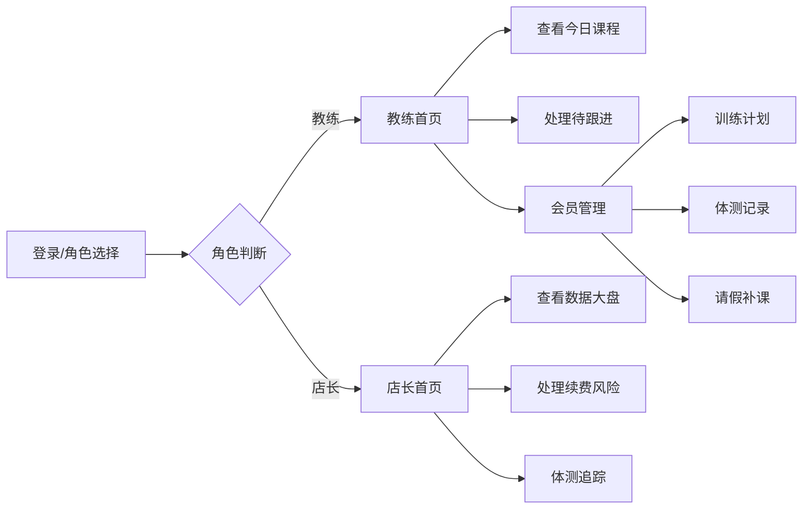

# 私教工作室管理系统 PRD

## 1. 产品概述

私教工作室一站式管理平台，解决训练计划分散、体测数据割裂、课程管理混乱的痛点，帮助教练和店长高效管理会员、追踪训练效果、识别续费风险。

- 核心目标：整合会员、课程、体测、请假等数据，实现一站式管理
- 目标用户：私教工作室教练、店长、管理者
- 市场价值：提升工作室运营效率，降低会员流失率，增加续费率

## 2. 核心功能

### 2.1 用户角色

| 角色 | 登录方式 | 核心权限 |
|------|----------|----------|
| 教练 | 账号登录 | 查看今日课程、管理训练计划、记录体测、处理请假、跟进待办 |
| 店长 | 账号登录 | 查看数据大盘、会员活跃度、续费风险预警、体测追踪、全店管理 |

### 2.2 功能模块

1. **教练端首页**: 今日课程列表、待跟进会员、快速操作入口
2. **店长端首页**: 活跃度看板、续费风险、长期未体测、核心数据指标
3. **会员列表**: 会员档案、搜索筛选、会员详情
4. **训练计划**: 训练计划管理、周视图、动作安排
5. **体测记录**: 体测数据对比、趋势图表、照片记录
6. **上课消耗**: 课程记录、消课统计、课包余额
7. **请假补课**: 请假申请、补课安排、历史记录

### 2.3 页面详情

| 页面名称 | 模块名称 | 功能描述 |
|----------|----------|----------|
| 教练端首页 | 今日课程 | 显示当日所有课程，支持签到、查看详情、快速消课 |
| 教练端首页 | 待跟进会员 | 显示需要关注的会员（长期没来、减脂停滞、课包将尽），支持快速备注 |
| 店长端首页 | 数据概览 | 核心指标卡片：今日到店率、本周消课、新增会员、续费率 |
| 店长端首页 | 续费风险 | 风险等级列表：高/中/低，支持直接联系、标记状态 |
| 店长端首页 | 长期未体测 | 超过2个月未体测的会员列表 |
| 会员列表 | 会员卡片 | 会员基本信息、课包余额、最近上课时间、状态标签 |
| 训练计划 | 周计划视图 | 按周展示训练安排，支持拖拽调整 |
| 体测记录 | 数据对比 | 前后两次体测数据对比，可视化图表 |
| 上课消耗 | 消课记录 | 历史消课列表、课包使用进度 |
| 请假补课 | 申请列表 | 待审批、已通过、补课安排 |

## 3. 核心流程

## 4. 用户界面设计

### 4.1 设计风格

- **主色调**: 深海军蓝 (#1e3a5f) - 专业、可信
- **辅助色**: 活力橙 (#ff6b35) - 能量、行动、警示
- **强调色**: 薄荷绿 (#4ecdc4) - 完成、健康
- **警示色**: 珊瑚红 (#ff6b6b) - 风险、重要
- **中性色**: 深灰 (#2d3748)、中灰 (#718096)、浅灰 (#edf2f7)

- **按钮风格**: 圆角 8px，悬停时有轻微上移动画和阴影加深
- **字体**: 中文系统字体 (PingFang SC, Microsoft YaHei)，数字使用 Roboto Mono
- **布局风格**: 卡片式布局，清晰的信息层级，左侧导航 + 主内容区
- **图标风格**: 线性图标，统一 24px 尺寸，配色与功能含义匹配

### 4.2 页面设计概览

| 页面名称 | 模块名称 | UI 元素 |
|----------|----------|----------|
| 教练端首页 | 今日课程 | 时间轴布局、状态标签（待上课/进行中/已完成）、快捷操作按钮 |
| 教练端首页 | 待跟进会员 | 卡片列表、风险等级色标、快速操作弹窗 |
| 店长端首页 | 数据概览 | 大数字指标卡片、趋势箭头、周同比百分比 |
| 店长端首页 | 续费风险 | 表格 + 风险徽章、一键操作列 |
| 会员列表 | 会员卡片 | 头像、姓名、状态标签、关键数据摘要 |
| 训练计划 | 周视图 | 时间网格、可拖拽卡片、动作标签 |
| 体测记录 | 数据对比 | 雷达图、趋势折线图、前后对比卡片 |

### 4.3 响应式设计

- 桌面端优先设计（1440px）
- 平板适配（768px - 1024px）：导航折叠为图标模式
- 移动端适配（< 768px）：底部标签栏导航、垂直堆叠布局

### 4.4 动画与交互

- 页面切换：淡入 + 轻微上移动画
- 卡片悬停：轻微上浮、阴影加深
- 按钮点击：缩放反馈
- 数据加载：骨架屏占位
- 状态变化：颜色过渡动画
