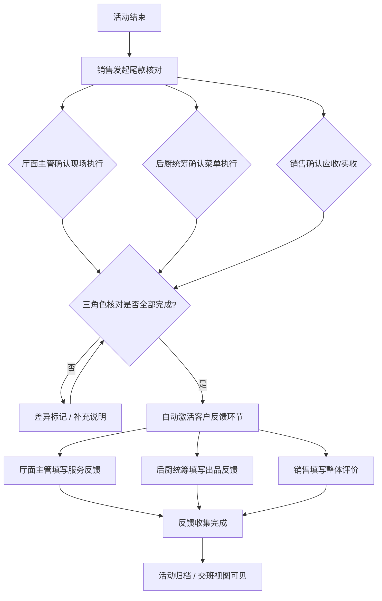

## 1. 产品概述

酒店宴会部尾款核对与客户反馈系统——解决宴会活动结束后尾款结算与客户反馈之间责任不清、时效失控的交班工具。通过将尾款核对与客户反馈编排为同一条工作流，核对完成即自动激活反馈环节，消除"谁负责催、谁负责收"的灰色地带。

- 目标用户：酒店宴会部的宴会销售、厅面主管、后厨统筹三类岗位
- 核心价值：责任可追溯、时效可量化、交班可衔接

## 2. 核心功能

### 2.1 用户角色

| 角色 | 登录方式 | 核心权限 |
|------|----------|----------|
| 宴会销售 | 角色选择+姓名 | 创建/编辑活动订单、发起尾款核对、查看全量反馈、导出报表 |
| 厅面主管 | 角色选择+姓名 | 确认现场执行完成、填写服务反馈、接收待办提醒 |
| 后厨统筹 | 角色选择+姓名 | 确认菜单执行完成、填写出品反馈、接收待办提醒 |

> **说明**：当前采用角色选择+姓名的轻量身份方案，非真实账号体系。多角色同账号切换时需重新选择角色。

### 2.2 功能模块

1. **角色工作台**：按角色展示待办事项、快捷入口、当日交班摘要
2. **尾款核对**：活动尾款逐项核对、批量确认、差异标记、自动流转至反馈环节
3. **客户反馈**：核对完成后自动激活、按角色分工填写、时效追踪与超时升级
4. **详情时间线**：单场活动的全生命周期事件流，含尾款与反馈的所有节点
5. **交班视图**：按班次汇总未完结事项、自动标注责任人与剩余时效

### 2.3 页面详情

| 页面名称 | 模块名称 | 功能说明 |
|----------|----------|----------|
| 登录页 | 角色选择 | 三角色卡片式入口，选角色+输入姓名后进入对应工作台 |
| 宴会销售工作台 | 待办概览 | 尾款待核对数、反馈待收集数、超时预警 |
| 宴会销售工作台 | 快捷操作 | 发起核对、批量处理、查看交班 |
| 厅面主管工作台 | 服务待办 | 待确认执行的活动列表、待填写的服务反馈 |
| 厅面主管工作台 | 交班摘要 | 当班期间已完成/未完成事项 |
| 后厨统筹工作台 | 出品待办 | 待确认菜单执行的活动列表、待填写的出品反馈 |
| 后厨统筹工作台 | 交班摘要 | 当班期间已完成/未完成事项 |
| 尾款核对列表 | 筛选与搜索 | 按状态/日期/客户筛选，支持批量选中 |
| 尾款核对列表 | 批量操作 | 批量确认核对、批量标记差异 |
| 尾款核对详情 | 核对表单 | 应收/实收逐项比对、差异说明、附件上传 |
| 尾款核对详情 | 自动流转 | 核对完成按钮 → 触发反馈环节激活 |
| 客户反馈列表 | 反馈回看 | 历史反馈检索、按评分/关键词筛选 |
| 客户反馈填写 | 分工表单 | 服务反馈（厅面）、出品反馈（后厨）、整体评价（销售） |
| 客户反馈填写 | 时效显示 | 剩余填写时间倒计时、超时自动标红 |
| 活动详情时间线 | 时间线 | 活动创建→执行确认→尾款核对→反馈收集全节点 |
| 交班视图 | 班次汇总 | 未完结事项列表、责任人、剩余时效、一键生成交班报告 |

## 3. 核心流程

宴会活动结束后，销售发起尾款核对，三角色各自确认本领域内容。全部核对项通过后，系统自动激活客户反馈环节，各角色按分工填写反馈，无需额外消息通知。整个过程在时间线中留痕，交班时一目了然。

## 4. 用户界面设计

### 4.1 设计风格

- 主色调：深靛蓝(#1e293b)搭配琥珀金(#d97706)强调色，传递专业与品质感
- 辅助色：石板灰(zinc)系作为中性背景，翡翠绿(#059669)标记完成状态，珊瑚红(#dc2626)标记超时/异常
- 按钮风格：圆角(8px)、轻微阴影、hover时微抬升效果
- 字体：标题用 Noto Serif SC 衬线体（酒店典雅感），正文用 Noto Sans SC
- 布局：左侧固定导航栏(240px)+右侧内容区，卡片式内容组织
- 图标：lucide-vue-next 图标库
- 动效：页面切换淡入、卡片hover微抬升、倒计时数字跳动、状态变更脉冲动画

### 4.2 页面设计概览

| 页面名称 | 模块名称 | UI 元素 |
|----------|----------|----------|
| 登录页 | 角色选择卡片 | 三列等宽卡片，每张卡片含角色图标+名称+职责简介，选中态金色边框 |
| 工作台 | 待办概览 | 顶部三列统计卡片（待处理/进行中/已完成），数字动态更新 |
| 工作台 | 快捷操作 | 右侧浮动操作栏，主要操作用琥珀金按钮 |
| 尾款核对列表 | 筛选栏 | 顶部横向标签页(全部/待核对/核对中/已完成)+搜索框 |
| 尾款核对列表 | 活动卡片 | 左侧活动名称+日期，右侧状态标签+操作按钮，支持勾选批量 |
| 尾款核对详情 | 核对表单 | 分组卡片(应收项/实收项/差异项)，每行含金额输入+差异标注 |
| 客户反馈填写 | 分工标签页 | 三个标签页(服务/出品/整体)，当前角色只可编辑自己的标签页 |
| 活动详情时间线 | 垂直时间线 | 左侧时间节点+右侧事件卡片，不同类型节点用不同颜色圆点 |
| 交班视图 | 汇总表格 | 表格行含：事项名称+责任人+剩余时效+状态标签 |

### 4.3 响应式设计

- 桌面优先设计，最小宽度1280px完整体验
- 平板(768-1280px)隐藏左侧导航栏，改为顶部汉堡菜单
- 手机(< 768px)仅保留工作台核心待办列表，详情页可滚动查看

### 4.4 轻量化说明

| 功能 | 当前实现 | 局限 |
|------|----------|------|
| 账号体系 | 角色选择+姓名 | 无真实认证、无权限隔离、同一浏览器可切换任意角色 |
| 第三方通知 | 无 | 未接入短信/邮件/企业微信，仅依赖页面内倒计时和状态标识 |
| 附件上传 | 本地文件选择+Base64存储 | 无云存储、文件大小受限、不适合大量图片 |
