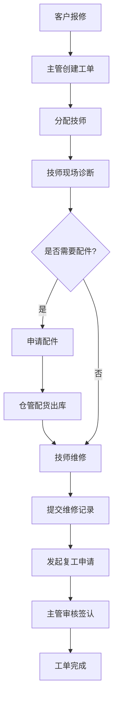
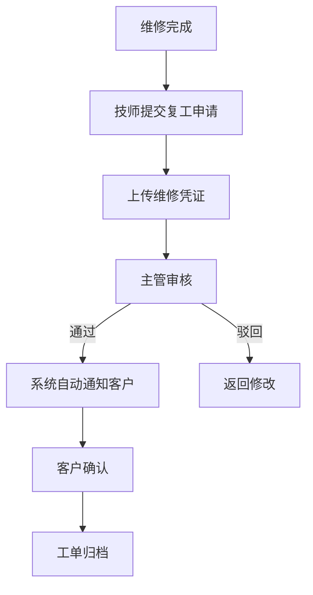

## 1. Product Overview
叉车维保商停机处置与复工签认系统是一款面向叉车维修保养业务的内部管理系统，旨在替代传统Excel表格和纸质记录，解决保养漏做、配件错发、客户现场停机等痛点问题。系统采用维保主管、现场技师、仓管接力协作模式，实现工单从停机处置到复工签认的全流程数字化管理。

## 2. Core Features

### 2.1 User Roles
| Role | Core Permissions |
|------|------------------|
| 维保主管 | 创建工单、分配任务、审批签认、查看报表 |
| 现场技师 | 接收任务、填写故障报告、申请配件、提交维修记录、发起复工申请 |
| 仓管 | 查看配件需求、配货出库、确认发货、库存管理 |

### 2.2 Feature Module
1. **工单管理**: 停机工单创建、状态流转、批量操作
2. **配件管理**: 配件库存查询、配货出库、申请审批
3. **签认管理**: 维修确认、复工签认、历史回看
4. **设备管理**: 客户设备档案、保养计划、预警提醒

### 2.3 Page Details
| Page Name | Module Name | Feature description |
|-----------|-------------|---------------------|
| 工作台 | 工单看板 | 按状态分组的工单卡片、拖拽流转、批量操作 |
| 工单详情 | 工单信息 | 设备信息、故障描述、配件清单、维修记录 |
| 配件管理 | 库存管理 | 库存列表、配货出库、库存预警 |
| 签认中心 | 签认回看 | 复工签认记录、签认历史查询、统计报表 |
| 设备档案 | 设备管理 | 客户设备列表、保养计划、保养记录 |

## 3. Core Process

### 3.1 停机处置流程

### 3.2 签认流程

## 4. User Interface Design

### 4.1 Design Style
- **Primary Color**: #2563eb (蓝色系，体现专业可靠)
- **Secondary Color**: #f59e0b (橙色系，用于强调和警示)
- **Status Colors**: 
  - 待处理: #fef3c7 (黄色)
  - 处理中: #dbeafe (蓝色)
  - 等待配件: #fce7f3 (粉色)
  - 已完成: #dcfce7 (绿色)
  - 异常: #fee2e2 (红色)
- **Button Style**: 圆角矩形、简洁现代
- **Font**: 思源黑体 (中文)、Inter (英文)
- **Layout**: 左侧导航、右侧内容区域、卡片式布局
- **Icon Style**: Lucide React 线性图标

### 4.2 Page Design Overview

| Page Name | Module Name | UI Elements |
|-----------|-------------|-------------|
| 工作台 | 工单看板 | 状态标签、工单卡片、拖拽区域、批量操作按钮 |
| 工单详情 | 工单信息 | 设备信息卡片、故障描述文本、配件清单表格、操作按钮组 |
| 配件管理 | 库存管理 | 搜索筛选栏、库存表格、出库按钮、预警标识 |
| 签认中心 | 签认回看 | 时间线组件、签认记录列表、统计图表 |
| 设备档案 | 设备管理 | 设备卡片网格、保养计划进度条、预警提醒标识 |

### 4.3 Responsiveness
- Desktop-first 设计
- 支持平板端自适应布局
- 关键操作按钮保持可点击尺寸

### 4.4 Key UI Components
- **工单卡片**: 显示设备编号、客户名称、故障类型、优先级标签、状态标识
- **时间线**: 展示工单流转历史和签认记录
- **批量操作面板**: 支持多选工单进行批量分配、批量关闭等操作
- **签认表单**: 包含维修内容、更换配件、工时记录、附件上传

## 5. Business Requirements

### 5.1 解决的核心问题
| 问题 | 解决方案 |
|------|----------|
| 保养漏做 | 保养计划自动提醒、逾期预警 |
| 配件错发 | 配件二维码扫码验证、出库确认 |
| 客户现场停机 | 工单状态实时同步、预计完成时间告知 |
| 信息反复确认 | 统一数据中台、一键查看设备历史 |

### 5.2 权限控制
| 角色 | 工单管理 | 配件管理 | 签认管理 | 设备管理 |
|------|----------|----------|----------|----------|
| 维保主管 | 全部权限 | 查询/审批 | 全部权限 | 全部权限 |
| 现场技师 | 创建/更新 | 申请/查询 | 发起申请 | 查询 |
| 仓管 | 查询 | 全部权限 | 查询 | 查询 |

### 5.3 附件管理
- 支持上传维修现场照片
- 支持上传配件出库单
- 支持上传签认凭证
- 文件格式限制: jpg, png, pdf

### 5.4 通知机制
- 工单分配通知（系统消息）
- 配件申请通知（系统消息）
- 复工申请通知（系统消息+邮件）
- 工单完成通知（系统消息+短信）

### 5.5 外部系统简化
- 简化与客户设备表的对接：通过设备编号关联
- 简化与保养计划的同步：定期批量导入
- 简化与配件库存的集成：本地库存管理，定期对账