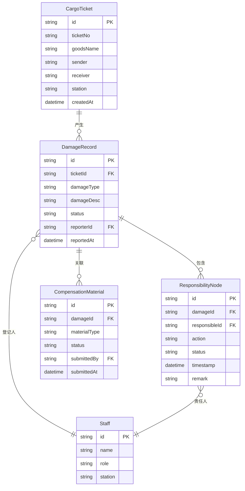

## 1. 架构设计
纯前端原型，数据存储在内存中（mock 数据），无后端服务。

```mermaid
graph TD
    "Svelte 前端" --> "状态管理(Svelte Store)"
    "状态管理(Svelte Store)" --> "Mock 数据层"
    "Svelte 前端" --> "Svelte Router"
    "Svelte 前端" --> "Tailwind CSS"
```

## 2. 技术说明
- 前端：Svelte 5 + SvelteKit + Tailwind CSS 4 + Vite
- 初始化工具：Vite（svelte-kit create）
- 后端：无（纯前端原型）
- 数据库：无（Mock 数据内嵌于 Store）

## 3. 路由定义
| 路由 | 用途 |
|------|------|
| / | 工作台首页，待办/异常/已完成概览 |
| /damage | 货损登记列表与新建 |
| /damage/new | 新建货损登记 |
| /compensation | 赔付材料管理 |
| /timeline/:id | 责任链时间线详情 |

## 4. API 定义
无后端 API，所有数据操作通过 Svelte Store 完成。

## 5. 服务端架构
不适用

## 6. 数据模型

### 6.1 数据模型定义


### 6.2 数据定义语言
使用 TypeScript 接口定义，内嵌于 `src/lib/types.ts`
