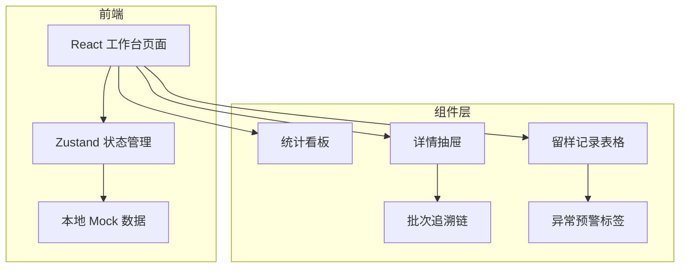
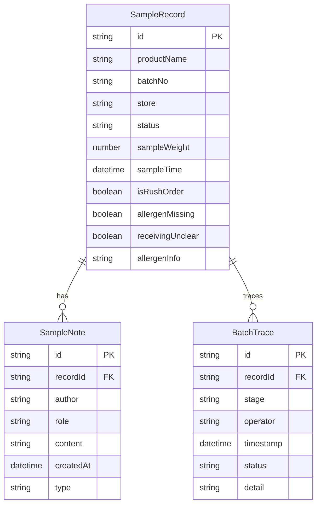

## 1. 架构设计

## 2. 技术说明

- 前端：React@18 + TypeScript + Tailwind CSS@3 + Vite
- 状态管理：Zustand
- 路由：react-router-dom@6
- 图标：lucide-react
- 数据：本地 Mock 数据（含历史备注样例）
- 后端：无（纯前端演示，数据存储在 Zustand store）

## 3. 路由定义

| 路由 | 用途 |
|------|------|
| / | 工作台主页（留样记录列表+统计看板） |

## 4. 数据模型

### 4.1 数据模型定义

### 4.2 数据定义

**SampleRecord（留样记录）**
- id: 唯一编号，格式 LY-YYYYMMDD-XXX
- productName: 产品名称
- batchNo: 生产批次号
- store: 门店名称
- status: pending | sampling | completed | abnormal
- sampleWeight: 留样克数
- sampleTime: 留样时间
- isRushOrder: 是否临时加单
- allergenMissing: 过敏原标识是否漏写
- receivingUnclear: 门店收货是否不清
- allergenInfo: 过敏原信息

**SampleNote（历史备注）**
- id: 唯一编号
- recordId: 关联留样记录ID
- author: 操作人
- role: 角色
- content: 备注内容
- createdAt: 创建时间
- type: system | manual | exception

**BatchTrace（批次追溯节点）**
- id: 唯一编号
- recordId: 关联留样记录ID
- stage: procurement | production | sampling | dispatch | store_receiving
- operator: 操作人
- timestamp: 操作时间
- status: normal | warning | error
- detail: 详情描述
