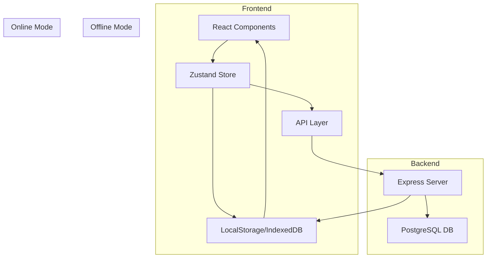
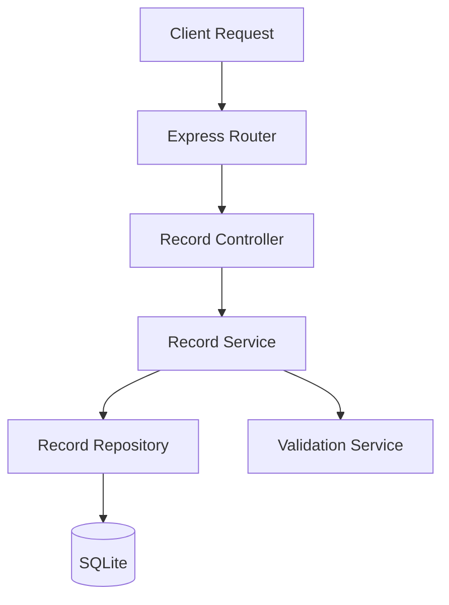
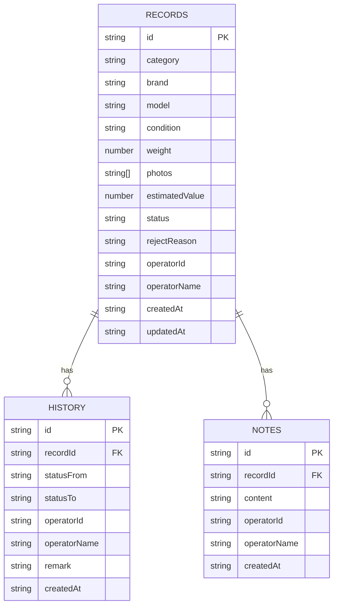

## 1. Architecture Design



## 2. Technology Description

- **Frontend**: React@18 + TypeScript + Vite
- **UI Framework**: TailwindCSS@3
- **State Management**: Zustand
- **Routing**: React Router DOM
- **Icons**: Lucide React
- **Offline Storage**: IndexedDB (localForage) + LocalStorage
- **Backend**: Express@4 + TypeScript
- **Database**: SQLite (轻量本地数据库)
- **Initialization Tool**: vite-init

## 3. Route Definitions

| Route | Purpose | Component |
|-------|---------|-----------|
| `/` | 待办首页 | TodoListPage |
| `/register` | 当品登记 | RegisterPage |
| `/review/:id` | 估价复核 | ReviewPage |
| `/detail/:id` | 记录详情 | DetailPage |
| `/login` | 角色选择（模拟登录） | LoginPage |

## 4. API Definitions

### 4.1 记录相关接口

#### GET /api/records
获取记录列表

**请求参数**:
```typescript
interface GetRecordsParams {
  status?: RecordStatus;
  role?: UserRole;
  keyword?: string;
  startDate?: string;
  endDate?: string;
  page?: number;
  limit?: number;
}
```

**响应**:
```typescript
interface GetRecordsResponse {
  data: RecordItem[];
  total: number;
  page: number;
  limit: number;
}
```

#### GET /api/records/:id
获取单条记录详情

**响应**:
```typescript
interface RecordDetail extends RecordItem {
  history: HistoryItem[];
  notes: NoteItem[];
}
```

#### POST /api/records
创建新记录

**请求体**:
```typescript
interface CreateRecordRequest {
  category: string;
  brand: string;
  model: string;
  condition: string;
  weight: number;
  photos: string[];
  remark: string;
  operatorId: string;
  operatorName: string;
}
```

**响应**:
```typescript
interface CreateRecordResponse {
  id: string;
  status: RecordStatus;
  createdAt: string;
}
```

#### PUT /api/records/:id
更新记录

**请求体**:
```typescript
interface UpdateRecordRequest {
  status?: RecordStatus;
  estimatedValue?: number;
  rejectReason?: string;
  remark?: string;
  operatorId: string;
  operatorName: string;
}
```

## 5. Server Architecture Diagram



## 6. Data Model

### 6.1 Data Model Definition



### 6.2 Data Definition Language

```sql
CREATE TABLE IF NOT EXISTS records (
    id TEXT PRIMARY KEY,
    category TEXT NOT NULL,
    brand TEXT,
    model TEXT,
    condition TEXT,
    weight REAL,
    photos TEXT,
    estimated_value REAL,
    status TEXT NOT NULL DEFAULT 'pending',
    reject_reason TEXT,
    remark TEXT,
    operator_id TEXT NOT NULL,
    operator_name TEXT NOT NULL,
    created_at TEXT NOT NULL,
    updated_at TEXT NOT NULL
);

CREATE TABLE IF NOT EXISTS history (
    id TEXT PRIMARY KEY,
    record_id TEXT NOT NULL,
    status_from TEXT,
    status_to TEXT NOT NULL,
    operator_id TEXT NOT NULL,
    operator_name TEXT NOT NULL,
    remark TEXT,
    created_at TEXT NOT NULL,
    FOREIGN KEY (record_id) REFERENCES records(id)
);

CREATE TABLE IF NOT EXISTS notes (
    id TEXT PRIMARY KEY,
    record_id TEXT NOT NULL,
    content TEXT NOT NULL,
    operator_id TEXT NOT NULL,
    operator_name TEXT NOT NULL,
    created_at TEXT NOT NULL,
    FOREIGN KEY (record_id) REFERENCES records(id)
);

CREATE INDEX idx_records_status ON records(status);
CREATE INDEX idx_records_operator ON records(operator_id);
CREATE INDEX idx_history_record ON history(record_id);
CREATE INDEX idx_notes_record ON notes(record_id);
```

### 6.3 TypeScript类型定义

```typescript
export type UserRole = 'counter' | 'warehouse' | 'finance';

export type RecordStatus = 
  | 'pending' 
  | 'reviewing' 
  | 'approved' 
  | 'rejected' 
  | 'closed' 
  | 'recheck';

export interface RecordItem {
  id: string;
  category: string;
  brand: string;
  model: string;
  condition: string;
  weight: number;
  photos: string[];
  estimatedValue: number | null;
  status: RecordStatus;
  rejectReason: string | null;
  remark: string;
  operatorId: string;
  operatorName: string;
  createdAt: string;
  updatedAt: string;
}

export interface HistoryItem {
  id: string;
  recordId: string;
  statusFrom: RecordStatus | null;
  statusTo: RecordStatus;
  operatorId: string;
  operatorName: string;
  remark: string;
  createdAt: string;
}

export interface NoteItem {
  id: string;
  recordId: string;
  content: string;
  operatorId: string;
  operatorName: string;
  createdAt: string;
}

export interface RoleConfig {
  role: UserRole;
  name: string;
  permissions: {
    view: RecordStatus[];
    edit: RecordStatus[];
    actions: ('review' | 'approve' | 'reject' | 'close' | 'recheck')[];
  };
}
```

### 6.4 角色权限配置

| Role | View Status | Edit Status | Actions |
|------|-------------|-------------|---------|
| counter | pending, rejected | pending, rejected | create, update |
| warehouse | pending, reviewing | pending, reviewing | review, approve, reject |
| finance | approved, recheck, closed | approved, recheck | close, recheck |

## 7. 离线存储方案

### 7.1 存储策略

- **IndexedDB**: 存储完整记录数据（records, history, notes）
- **LocalStorage**: 存储用户角色、当前状态、同步标记

### 7.2 同步机制

1. 断网时：所有操作写入本地IndexedDB
2. 联网后：自动检测本地变更，同步到服务端
3. 冲突处理：以服务端最新数据为准，本地变更标记为待处理

### 7.3 状态持久化

- 页面刷新时从IndexedDB恢复状态
- 登录状态保存在LocalStorage
- 表单草稿自动保存

## 8. 样例数据

```typescript
export const sampleRecords: RecordItem[] = [
  {
    id: 'REC001',
    category: '黄金饰品',
    brand: '周大福',
    model: '千足金项链',
    condition: '95新',
    weight: 15.5,
    photos: ['/images/gold1.jpg'],
    estimatedValue: null,
    status: 'pending',
    rejectReason: null,
    remark: '客户称是结婚时购买，保存完好',
    operatorId: 'OP001',
    operatorName: '张三',
    createdAt: '2024-01-15 09:30:00',
    updatedAt: '2024-01-15 09:30:00'
  },
  {
    id: 'REC002',
    category: '名表',
    brand: '劳力士',
    model: 'Datejust',
    condition: '9成新',
    weight: 120,
    photos: ['/images/watch1.jpg', '/images/watch2.jpg'],
    estimatedValue: 85000,
    status: 'reviewing',
    rejectReason: null,
    remark: '机芯编号已核实，走时准确',
    operatorId: 'OP002',
    operatorName: '李四',
    createdAt: '2024-01-14 14:20:00',
    updatedAt: '2024-01-14 15:00:00'
  },
  {
    id: 'REC003',
    category: '电子产品',
    brand: 'Apple',
    model: 'iPhone 14 Pro',
    condition: '85新',
    weight: 0.2,
    photos: ['/images/phone1.jpg'],
    estimatedValue: null,
    status: 'rejected',
    rejectReason: '缺少充电器和包装盒',
    remark: '屏幕有轻微划痕，功能正常',
    operatorId: 'OP003',
    operatorName: '王五',
    createdAt: '2024-01-13 10:15:00',
    updatedAt: '2024-01-13 11:30:00'
  },
  {
    id: 'REC004',
    category: '玉器',
    brand: '',
    model: '翡翠手镯',
    condition: '全新',
    weight: 58,
    photos: ['/images/jade1.jpg'],
    estimatedValue: 35000,
    status: 'closed',
    rejectReason: null,
    remark: 'A货翡翠，水头充足',
    operatorId: 'OP004',
    operatorName: '赵六',
    createdAt: '2024-01-10 16:45:00',
    updatedAt: '2024-01-11 09:00:00'
  },
  {
    id: 'REC005',
    category: '奢侈品包',
    brand: 'LV',
    model: 'Neverfull',
    condition: '9成新',
    weight: 0.8,
    photos: ['/images/bag1.jpg', '/images/bag2.jpg', '/images/bag3.jpg'],
    estimatedValue: 12000,
    status: 'recheck',
    rejectReason: null,
    remark: '五金有磨损，需要重新评估',
    operatorId: 'OP005',
    operatorName: '钱七',
    createdAt: '2024-01-12 09:00:00',
    updatedAt: '2024-01-12 17:00:00'
  }
];
```
