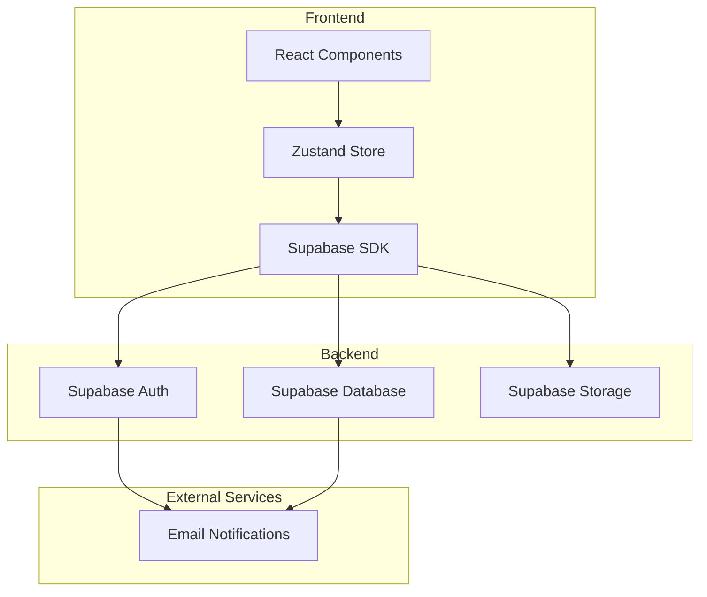
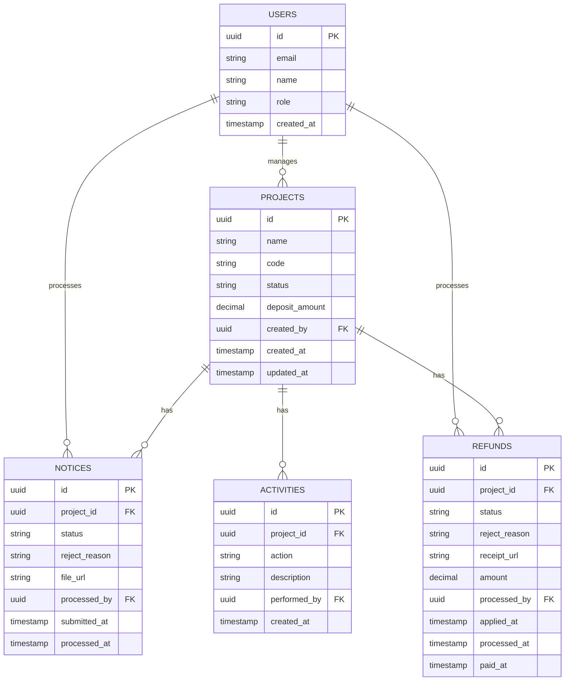

## 1. Architecture Design


## 2. Technology Description
- Frontend: React@18 + TypeScript + TailwindCSS@3
- Build Tool: Vite@6
- State Management: Zustand
- Icons: Lucide React
- Backend: Supabase (Auth, Database, Storage)
- Routing: React Router DOM

## 3. Route Definitions
| Route | Purpose | Component |
|-------|---------|-----------|
| / | Dashboard - 仪表盘首页 | Dashboard |
| /projects | ProjectList - 项目列表页 | ProjectList |
| /projects/:id | ProjectDetail - 项目详情页 | ProjectDetail |
| /projects/:id/notice | NoticeProcess - 中标通知处理 | NoticeProcess |
| /projects/:id/refund | DepositRefund - 保证金退还 | DepositRefund |
| /settings | Settings - 系统设置 | Settings |
| /login | Login - 登录页 | Login |

## 4. API Definitions

### 4.1 项目相关
| Method | Endpoint | Description |
|--------|----------|-------------|
| GET | /api/projects | 获取项目列表 |
| GET | /api/projects/:id | 获取项目详情 |
| POST | /api/projects | 创建项目 |
| PUT | /api/projects/:id | 更新项目 |
| DELETE | /api/projects/:id | 删除项目 |

### 4.2 中标通知相关
| Method | Endpoint | Description |
|--------|----------|-------------|
| POST | /api/projects/:id/notice | 提交中标通知 |
| PUT | /api/projects/:id/notice | 更新中标通知 |
| POST | /api/projects/:id/notice/approve | 审核通过 |
| POST | /api/projects/:id/notice/reject | 驳回并填写理由 |

### 4.3 保证金退还相关
| Method | Endpoint | Description |
|--------|----------|-------------|
| POST | /api/projects/:id/refund | 发起退款申请 |
| PUT | /api/projects/:id/refund | 更新退款信息 |
| POST | /api/projects/:id/refund/approve | 财务审核通过 |
| POST | /api/projects/:id/refund/reject | 财务驳回 |
| POST | /api/projects/:id/refund/pay | 执行打款 |

## 5. Data Model

### 5.1 Data Model Diagram


### 5.2 Data Definition Language

```sql
-- Projects table
CREATE TABLE projects (
    id UUID PRIMARY KEY DEFAULT uuid_generate_v4(),
    name VARCHAR(255) NOT NULL,
    code VARCHAR(50) UNIQUE NOT NULL,
    status VARCHAR(20) DEFAULT 'draft',
    deposit_amount DECIMAL(15,2) DEFAULT 0,
    created_by UUID REFERENCES users(id),
    created_at TIMESTAMP DEFAULT NOW(),
    updated_at TIMESTAMP DEFAULT NOW()
);

-- Notices table
CREATE TABLE notices (
    id UUID PRIMARY KEY DEFAULT uuid_generate_v4(),
    project_id UUID REFERENCES projects(id) NOT NULL,
    status VARCHAR(20) DEFAULT 'pending',
    reject_reason TEXT,
    file_url VARCHAR(500),
    processed_by UUID REFERENCES users(id),
    submitted_at TIMESTAMP,
    processed_at TIMESTAMP
);

-- Refunds table
CREATE TABLE refunds (
    id UUID PRIMARY KEY DEFAULT uuid_generate_v4(),
    project_id UUID REFERENCES projects(id) NOT NULL,
    status VARCHAR(20) DEFAULT 'pending',
    reject_reason TEXT,
    receipt_url VARCHAR(500),
    amount DECIMAL(15,2),
    processed_by UUID REFERENCES users(id),
    applied_at TIMESTAMP,
    processed_at TIMESTAMP,
    paid_at TIMESTAMP
);

-- Activities table
CREATE TABLE activities (
    id UUID PRIMARY KEY DEFAULT uuid_generate_v4(),
    project_id UUID REFERENCES projects(id) NOT NULL,
    action VARCHAR(50) NOT NULL,
    description TEXT,
    performed_by UUID REFERENCES users(id),
    created_at TIMESTAMP DEFAULT NOW()
);

-- Users table
CREATE TABLE users (
    id UUID PRIMARY KEY DEFAULT uuid_generate_v4(),
    email VARCHAR(255) UNIQUE NOT NULL,
    name VARCHAR(100) NOT NULL,
    role VARCHAR(20) DEFAULT 'project_manager',
    created_at TIMESTAMP DEFAULT NOW()
);

-- Indexes
CREATE INDEX idx_projects_status ON projects(status);
CREATE INDEX idx_notices_project_id ON notices(project_id);
CREATE INDEX idx_refunds_project_id ON refunds(project_id);
CREATE INDEX idx_activities_project_id ON activities(project_id);
```

## 6. Frontend State Management

### 6.1 Store Structure
```typescript
interface ProjectStore {
  projects: Project[];
  currentProject: Project | null;
  loading: boolean;
  error: string | null;
  
  fetchProjects: () => Promise<void>;
  fetchProjectById: (id: string) => Promise<void>;
  createProject: (data: ProjectCreateData) => Promise<void>;
  updateProject: (id: string, data: ProjectUpdateData) => Promise<void>;
  deleteProject: (id: string) => Promise<void>;
  
  submitNotice: (projectId: string, data: NoticeData) => Promise<void>;
  approveNotice: (projectId: string) => Promise<void>;
  rejectNotice: (projectId: string, reason: string) => Promise<void>;
  
  applyRefund: (projectId: string, data: RefundData) => Promise<void>;
  approveRefund: (projectId: string) => Promise<void>;
  rejectRefund: (projectId: string, reason: string) => Promise<void>;
  processPayment: (projectId: string) => Promise<void>;
}
```

## 7. Component Structure

```
src/
├── components/
│   ├── layout/
│   │   ├── Sidebar.tsx
│   │   ├── Header.tsx
│   │   └── Layout.tsx
│   ├── dashboard/
│   │   ├── TodoCard.tsx
│   │   ├── StatusChart.tsx
│   │   └── StatsCard.tsx
│   ├── project/
│   │   ├── ProjectTable.tsx
│   │   ├── ProjectForm.tsx
│   │   └── Timeline.tsx
│   ├── notice/
│   │   ├── NoticeForm.tsx
│   │   └── NoticeReview.tsx
│   └── refund/
│       ├── RefundForm.tsx
│       └── RefundReview.tsx
├── pages/
│   ├── Dashboard.tsx
│   ├── ProjectList.tsx
│   ├── ProjectDetail.tsx
│   ├── NoticeProcess.tsx
│   ├── DepositRefund.tsx
│   ├── Settings.tsx
│   └── Login.tsx
├── stores/
│   └── projectStore.ts
├── types/
│   └── index.ts
├── utils/
│   └── supabase.ts
└── App.tsx
```
