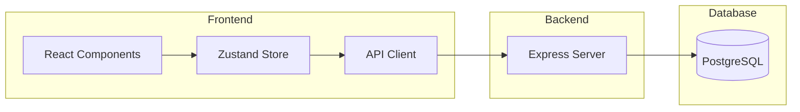
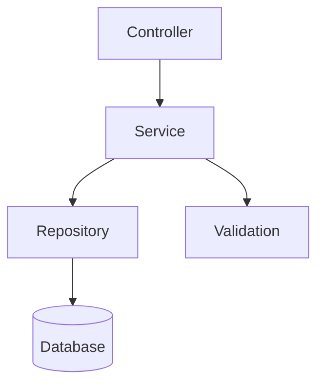
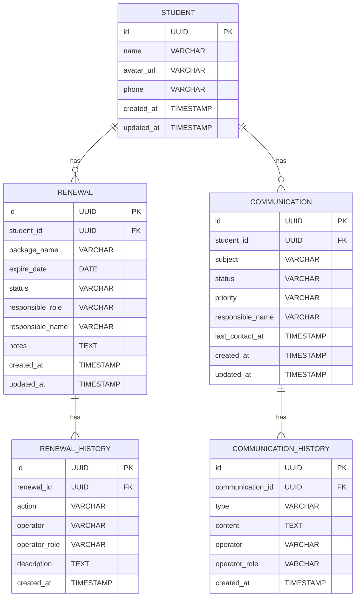

## 1. Architecture Design


## 2. Technology Description
- Frontend: React@18 + TypeScript + TailwindCSS@3 + Vite
- State Management: Zustand
- Routing: React Router DOM
- Icons: Lucide React
- Backend: Express@4 + TypeScript
- Database: PostgreSQL
- ORM: Prisma

## 3. Route Definitions
| Route | Purpose |
|-------|---------|
| / | 首页仪表盘 |
| /renewals | 课包续费列表页 |
| /renewals/:id | 课包续费详情页 |
| /communications | 家长沟通列表页 |
| /communications/:id | 家长沟通详情页 |

## 4. API Definitions

### 4.1 课包续费 API

#### GET /api/renewals
获取续费任务列表

**Request:**
```typescript
interface RenewalFilter {
  status?: 'pending' | 'processing' | 'completed' | 'risk';
  startDate?: string;
  endDate?: string;
  studentName?: string;
}
```

**Response:**
```typescript
interface Renewal {
  id: string;
  studentId: string;
  studentName: string;
  studentAvatar: string;
  packageName: string;
  expireDate: string;
  status: 'pending' | 'processing' | 'completed' | 'risk';
  responsibleRole: 'teaching' | 'consultant' | 'admin';
  responsibleName: string;
  createdAt: string;
  updatedAt: string;
}
```

#### GET /api/renewals/:id
获取续费任务详情

**Response:**
```typescript
interface RenewalDetail extends Renewal {
  history: RenewalHistory[];
  notes: string;
}

interface RenewalHistory {
  id: string;
  action: string;
  operator: string;
  operatorRole: string;
  timestamp: string;
  description: string;
}
```

#### PUT /api/renewals/:id/status
更新续费状态

**Request:**
```typescript
interface UpdateStatusRequest {
  status: 'pending' | 'processing' | 'completed' | 'risk';
  note?: string;
}
```

### 4.2 家长沟通 API

#### GET /api/communications
获取沟通任务列表

**Request:**
```typescript
interface CommunicationFilter {
  status?: 'pending' | 'ongoing' | 'completed';
  priority?: 'high' | 'medium' | 'low';
  studentName?: string;
}
```

**Response:**
```typescript
interface Communication {
  id: string;
  studentId: string;
  studentName: string;
  studentAvatar: string;
  subject: string;
  status: 'pending' | 'ongoing' | 'completed';
  priority: 'high' | 'medium' | 'low';
  responsibleName: string;
  lastContactAt?: string;
  createdAt: string;
  updatedAt: string;
}
```

#### GET /api/communications/:id
获取沟通详情

**Response:**
```typescript
interface CommunicationDetail extends Communication {
  history: CommunicationHistory[];
}

interface CommunicationHistory {
  id: string;
  type: 'call' | 'message' | 'meeting';
  content: string;
  operator: string;
  operatorRole: string;
  timestamp: string;
}
```

#### POST /api/communications/:id/history
添加沟通记录

**Request:**
```typescript
interface AddHistoryRequest {
  type: 'call' | 'message' | 'meeting';
  content: string;
}
```

## 5. Server Architecture Diagram


## 6. Data Model

### 6.1 Data Model Definition


### 6.2 Data Definition Language

```sql
CREATE TABLE students (
    id UUID PRIMARY KEY DEFAULT gen_random_uuid(),
    name VARCHAR(100) NOT NULL,
    avatar_url VARCHAR(255),
    phone VARCHAR(20),
    created_at TIMESTAMP DEFAULT CURRENT_TIMESTAMP,
    updated_at TIMESTAMP DEFAULT CURRENT_TIMESTAMP
);

CREATE TABLE renewals (
    id UUID PRIMARY KEY DEFAULT gen_random_uuid(),
    student_id UUID REFERENCES students(id),
    package_name VARCHAR(100) NOT NULL,
    expire_date DATE NOT NULL,
    status VARCHAR(20) DEFAULT 'pending',
    responsible_role VARCHAR(20),
    responsible_name VARCHAR(100),
    notes TEXT,
    created_at TIMESTAMP DEFAULT CURRENT_TIMESTAMP,
    updated_at TIMESTAMP DEFAULT CURRENT_TIMESTAMP
);

CREATE TABLE renewal_history (
    id UUID PRIMARY KEY DEFAULT gen_random_uuid(),
    renewal_id UUID REFERENCES renewals(id),
    action VARCHAR(50) NOT NULL,
    operator VARCHAR(100) NOT NULL,
    operator_role VARCHAR(20) NOT NULL,
    description TEXT,
    created_at TIMESTAMP DEFAULT CURRENT_TIMESTAMP
);

CREATE TABLE communications (
    id UUID PRIMARY KEY DEFAULT gen_random_uuid(),
    student_id UUID REFERENCES students(id),
    subject VARCHAR(200) NOT NULL,
    status VARCHAR(20) DEFAULT 'pending',
    priority VARCHAR(20) DEFAULT 'medium',
    responsible_name VARCHAR(100),
    last_contact_at TIMESTAMP,
    created_at TIMESTAMP DEFAULT CURRENT_TIMESTAMP,
    updated_at TIMESTAMP DEFAULT CURRENT_TIMESTAMP
);

CREATE TABLE communication_history (
    id UUID PRIMARY KEY DEFAULT gen_random_uuid(),
    communication_id UUID REFERENCES communications(id),
    type VARCHAR(20) NOT NULL,
    content TEXT NOT NULL,
    operator VARCHAR(100) NOT NULL,
    operator_role VARCHAR(20) NOT NULL,
    created_at TIMESTAMP DEFAULT CURRENT_TIMESTAMP
);

-- 索引
CREATE INDEX idx_renewals_student_id ON renewals(student_id);
CREATE INDEX idx_renewals_status ON renewals(status);
CREATE INDEX idx_renewals_expire_date ON renewals(expire_date);
CREATE INDEX idx_communications_student_id ON communications(student_id);
CREATE INDEX idx_communications_status ON communications(status);
CREATE INDEX idx_communications_priority ON communications(priority);
```
