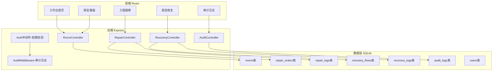
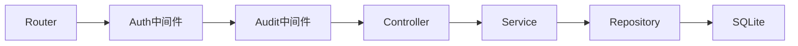
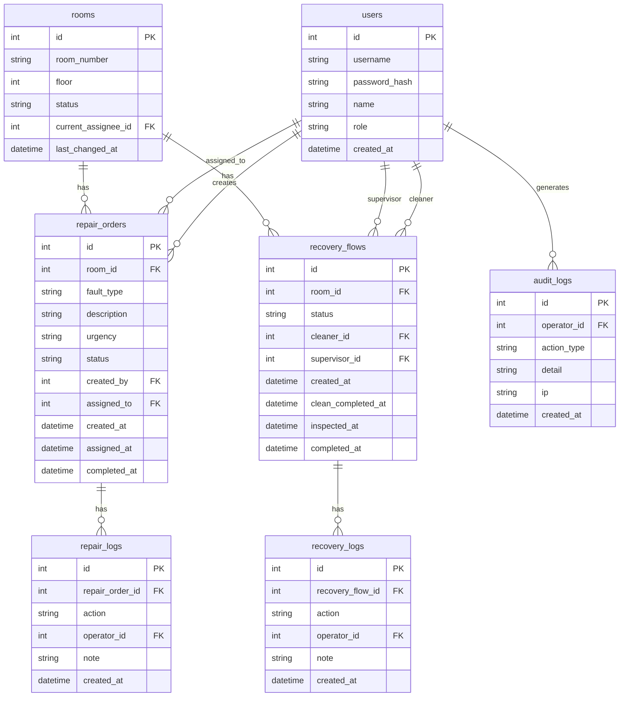

## 1. 架构设计



## 2. 技术说明

- 前端：React@18 + TailwindCSS@3 + Vite + Zustand
- 初始化工具：vite-init
- 后端：Express@4 + TypeScript（ESM）
- 数据库：SQLite（better-sqlite3）
- 认证：JWT Token
- 项目模板：react-express-ts

## 3. 路由定义

| 路由 | 用途 |
|------|------|
| / | 工作台首页，展示优先级看板 |
| /rooms | 房态看板，全部房间状态总览 |
| /rooms/:id | 房间详情页，含历史记录 |
| /repairs | 工程报修列表 |
| /repairs/new | 创建报修单 |
| /repairs/:id | 报修详情页，含处理历史 |
| /recovery | 房态恢复列表 |
| /recovery/:id | 恢复详情页，含审批历史 |
| /audit | 审计日志页面（仅主管） |
| /login | 登录页 |

## 4. API定义

### 4.1 认证接口

```
POST /api/auth/login
Request: { username: string, password: string }
Response: { token: string, user: { id, name, role } }
```

### 4.2 房间接口

```
GET /api/rooms?floor=&status=
Response: [{ id, room_number, floor, status, current_assignee, last_changed_at, last_changed_by }]

GET /api/rooms/:id
Response: { id, room_number, floor, status, current_assignee, history: [...] }
```

### 4.3 工程报修接口

```
GET /api/repairs?status=&assignee_id=
Response: [{ id, room_id, room_number, fault_type, description, urgency, status, created_by, created_at, assigned_to, assigned_at, completed_at }]

POST /api/repairs
Request: { room_id, fault_type, description, urgency }
Permission: cleaner, supervisor
Response: { id, ... }

PATCH /api/repairs/:id/accept
Request: { note: string }
Permission: engineer
Response: { id, status: "in_progress", ... }

PATCH /api/repairs/:id/complete
Request: { note: string }
Permission: engineer
Response: { id, status: "completed", ... }

GET /api/repairs/:id/logs
Response: [{ action, operator_id, operator_name, note, created_at }]
```

### 4.4 房态恢复接口

```
GET /api/recovery?status=
Response: [{ id, room_id, room_number, status, cleaner_id, cleaner_name, supervisor_id, supervisor_name, created_at, completed_at }]

POST /api/recovery
Request: { room_id }
Permission: cleaner
Response: { id, status: "pending_clean", ... }

PATCH /api/recovery/:id/clean-complete
Request: { note: string }
Permission: cleaner
Response: { id, status: "pending_inspect", ... }

PATCH /api/recovery/:id/approve
Request: { note: string }
Permission: supervisor
Response: { id, status: "recovered", ... }

PATCH /api/recovery/:id/reject
Request: { note: string }
Permission: supervisor
Response: { id, status: "pending_clean", ... }

GET /api/recovery/:id/logs
Response: [{ action, operator_id, operator_name, note, created_at }]
```

### 4.5 审计日志接口

```
GET /api/audit?operator_id=&action_type=&from=&to=
Permission: supervisor
Response: [{ id, operator_id, operator_name, action_type, detail, ip, created_at }]
```

### 4.6 工作台接口

```
GET /api/dashboard
Response: {
  pending_repairs: number,
  urgent_repairs: [{ id, room_number, fault_type, created_at }],
  blocked_rooms: [{ room_id, room_number, stuck_at, stuck_duration_hours }],
  recent_activities: [{ operator_name, action_type, detail, created_at }]
}
```

## 5. 服务端架构图



## 6. 数据模型

### 6.1 数据模型定义



### 6.2 数据定义语言

```sql
CREATE TABLE users (
  id INTEGER PRIMARY KEY AUTOINCREMENT,
  username TEXT NOT NULL UNIQUE,
  password_hash TEXT NOT NULL,
  name TEXT NOT NULL,
  role TEXT NOT NULL CHECK(role IN ('supervisor','cleaner','engineer')),
  created_at TEXT NOT NULL DEFAULT (datetime('now'))
);

CREATE TABLE rooms (
  id INTEGER PRIMARY KEY AUTOINCREMENT,
  room_number TEXT NOT NULL UNIQUE,
  floor INTEGER NOT NULL,
  status TEXT NOT NULL DEFAULT 'vacant' CHECK(status IN ('vacant','occupied','cleaning','repair','pending_inspect')),
  current_assignee_id INTEGER,
  last_changed_at TEXT NOT NULL DEFAULT (datetime('now')),
  FOREIGN KEY (current_assignee_id) REFERENCES users(id)
);

CREATE TABLE repair_orders (
  id INTEGER PRIMARY KEY AUTOINCREMENT,
  room_id INTEGER NOT NULL,
  fault_type TEXT NOT NULL,
  description TEXT,
  urgency TEXT NOT NULL DEFAULT 'normal' CHECK(urgency IN ('low','normal','high','urgent')),
  status TEXT NOT NULL DEFAULT 'pending' CHECK(status IN ('pending','in_progress','completed','cancelled')),
  created_by INTEGER NOT NULL,
  assigned_to INTEGER,
  created_at TEXT NOT NULL DEFAULT (datetime('now')),
  assigned_at TEXT,
  completed_at TEXT,
  FOREIGN KEY (room_id) REFERENCES rooms(id),
  FOREIGN KEY (created_by) REFERENCES users(id),
  FOREIGN KEY (assigned_to) REFERENCES users(id)
);

CREATE TABLE repair_logs (
  id INTEGER PRIMARY KEY AUTOINCREMENT,
  repair_order_id INTEGER NOT NULL,
  action TEXT NOT NULL,
  operator_id INTEGER NOT NULL,
  note TEXT,
  created_at TEXT NOT NULL DEFAULT (datetime('now')),
  FOREIGN KEY (repair_order_id) REFERENCES repair_orders(id),
  FOREIGN KEY (operator_id) REFERENCES users(id)
);

CREATE TABLE recovery_flows (
  id INTEGER PRIMARY KEY AUTOINCREMENT,
  room_id INTEGER NOT NULL,
  status TEXT NOT NULL DEFAULT 'pending_clean' CHECK(status IN ('pending_clean','pending_inspect','recovered')),
  cleaner_id INTEGER,
  supervisor_id INTEGER,
  created_at TEXT NOT NULL DEFAULT (datetime('now')),
  clean_completed_at TEXT,
  inspected_at TEXT,
  completed_at TEXT,
  FOREIGN KEY (room_id) REFERENCES rooms(id),
  FOREIGN KEY (cleaner_id) REFERENCES users(id),
  FOREIGN KEY (supervisor_id) REFERENCES users(id)
);

CREATE TABLE recovery_logs (
  id INTEGER PRIMARY KEY AUTOINCREMENT,
  recovery_flow_id INTEGER NOT NULL,
  action TEXT NOT NULL,
  operator_id INTEGER NOT NULL,
  note TEXT,
  created_at TEXT NOT NULL DEFAULT (datetime('now')),
  FOREIGN KEY (recovery_flow_id) REFERENCES recovery_flows(id),
  FOREIGN KEY (operator_id) REFERENCES users(id)
);

CREATE TABLE audit_logs (
  id INTEGER PRIMARY KEY AUTOINCREMENT,
  operator_id INTEGER NOT NULL,
  action_type TEXT NOT NULL,
  detail TEXT,
  ip TEXT,
  created_at TEXT NOT NULL DEFAULT (datetime('now')),
  FOREIGN KEY (operator_id) REFERENCES users(id)
);

-- 初始数据
INSERT INTO users (username, password_hash, name, role) VALUES
  ('zhangwg', '$2b$10$dummyhash1', '张主管', 'supervisor'),
  ('libaoj', '$2b$10$dummyhash2', '李保洁', 'cleaner'),
  ('wanggc', '$2b$10$dummyhash3', '王工程', 'engineer');

INSERT INTO rooms (room_number, floor, status) VALUES
  ('301', 3, 'vacant'), ('302', 3, 'occupied'), ('303', 3, 'cleaning'),
  ('304', 3, 'repair'), ('305', 3, 'pending_inspect'),
  ('401', 4, 'vacant'), ('402', 4, 'occupied'), ('403', 4, 'vacant'),
  ('404', 4, 'cleaning'), ('405', 4, 'vacant'),
  ('501', 5, 'occupied'), ('502', 5, 'vacant'), ('503', 5, 'repair'),
  ('504', 5, 'vacant'), ('505', 5, 'vacant');
```
