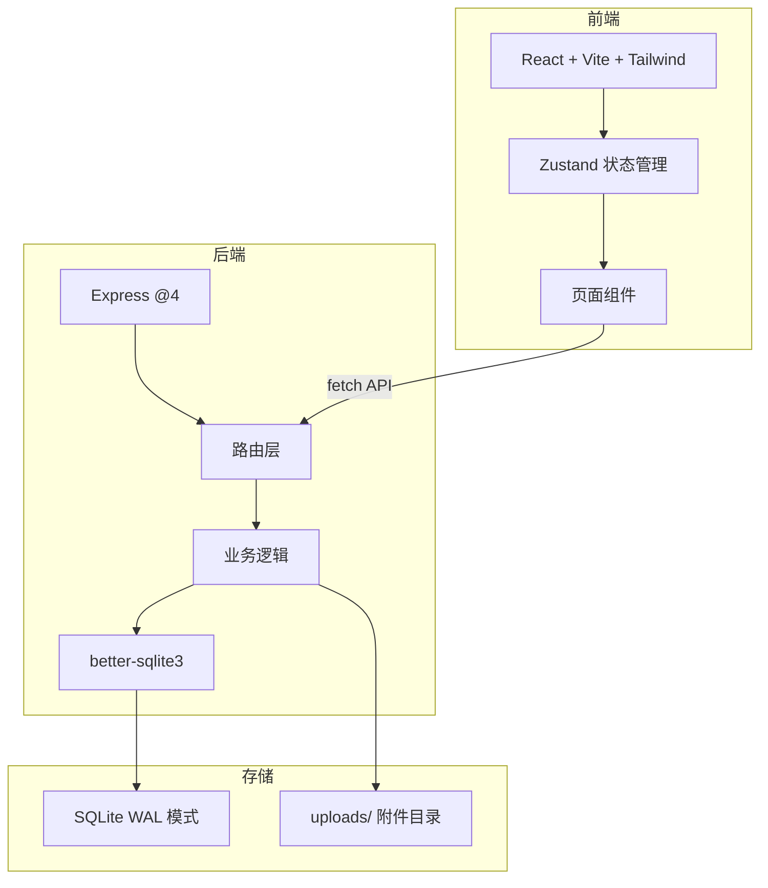
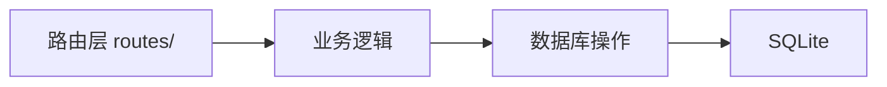
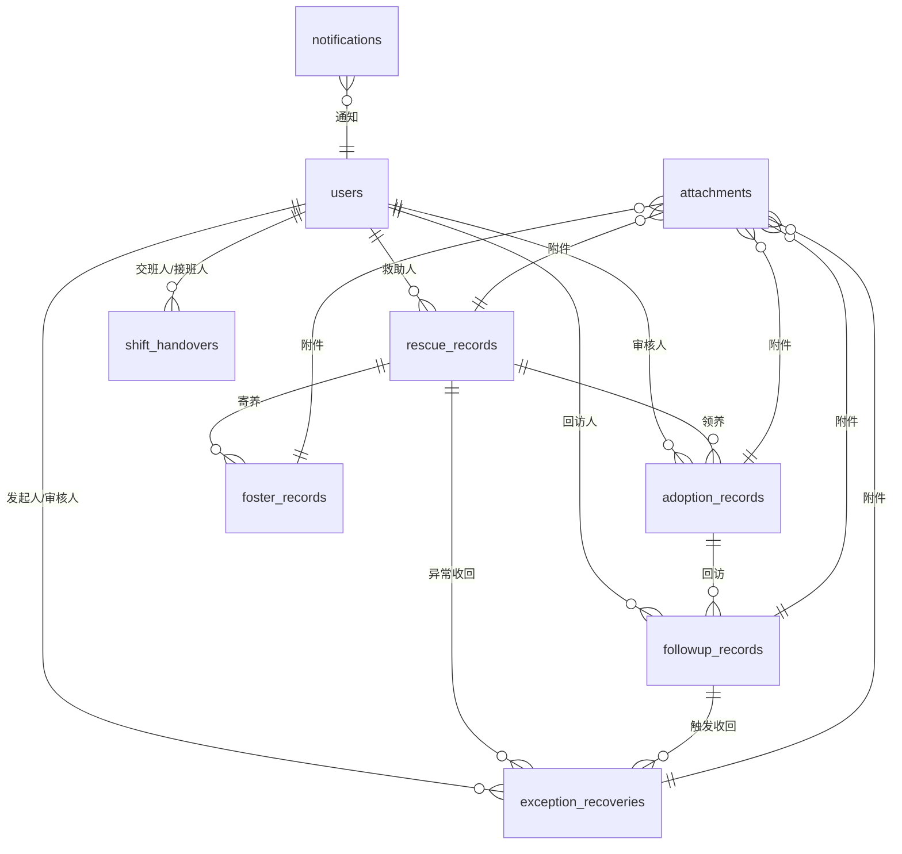

## 1. 架构设计

## 2. 技术说明

- 前端：React 18 + Tailwind CSS 3 + Vite 6 + Zustand
- 后端：Express 4 + better-sqlite3（已有）
- 数据库：SQLite WAL 模式（已有 schema）
- 附件：multer 上传到 server/uploads/，数据库存路径（占位实现）
- 通知：站内通知表，前端定时轮询

## 3. 路由定义

| 路由 | 用途 |
|------|------|
| / | 登录页 |
| /dashboard | 角色仪表盘 |
| /rescues | 救助档案列表 |
| /rescues/:id | 救助档案详情 |
| /followups | 回访记录列表 |
| /followups/new | 新建回访 |
| /followups/:id | 回访详情/处理 |
| /exceptions | 异常收回列表 |
| /exceptions/new | 发起异常收回 |
| /exceptions/:id | 异常收回详情/处理 |
| /handovers | 交班中心 |
| /handovers/new | 创建交班 |
| /handovers/:id | 交班详情/确认 |

## 4. API 定义

### 4.1 认证

| 方法 | 路径 | 说明 |
|------|------|------|
| POST | /api/auth/login | 登录 |
| GET | /api/auth/users | 用户列表 |
| GET | /api/auth/users/:role | 按角色查用户 |

### 4.2 救助档案

| 方法 | 路径 | 说明 |
|------|------|------|
| GET | /api/rescues | 救助记录列表（支持分页、筛选） |
| GET | /api/rescues/:id | 救助记录详情（含关联寄养、领养） |
| POST | /api/rescues | 新建救助记录 |
| PUT | /api/rescues/:id | 更新救助记录 |

### 4.3 寄养记录

| 方法 | 路径 | 说明 |
|------|------|------|
| GET | /api/fosters | 寄养记录列表 |
| POST | /api/fosters | 新建寄养记录 |
| PUT | /api/fosters/:id | 更新寄养记录 |

### 4.4 领养记录

| 方法 | 路径 | 说明 |
|------|------|------|
| GET | /api/adoptions | 领养记录列表 |
| POST | /api/adoptions | 新建领养记录 |
| PUT | /api/adoptions/:id | 更新领养记录 |

### 4.5 回访记录

| 方法 | 路径 | 说明 |
|------|------|------|
| GET | /api/followups | 回访列表（支持状态、领养ID筛选） |
| GET | /api/followups/:id | 回访详情 |
| POST | /api/followups | 新建回访 |
| PUT | /api/followups/:id | 处理回访（状态流转） |
| PUT | /api/followups/batch | 批量更新回访状态 |

### 4.6 异常收回

| 方法 | 路径 | 说明 |
|------|------|------|
| GET | /api/exceptions | 异常收回列表（支持状态筛选） |
| GET | /api/exceptions/:id | 异常收回详情（含关联回访链路） |
| POST | /api/exceptions | 发起异常收回 |
| PUT | /api/exceptions/:id | 更新异常收回状态 |

### 4.7 交班

| 方法 | 路径 | 说明 |
|------|------|------|
| GET | /api/handovers | 交班列表 |
| GET | /api/handovers/:id | 交班详情 |
| POST | /api/handovers | 创建交班（自动汇总待办） |
| PUT | /api/handovers/:id/confirm | 确认交班 |

### 4.8 附件

| 方法 | 路径 | 说明 |
|------|------|------|
| POST | /api/attachments/upload | 上传附件 |
| GET | /api/attachments/:entityType/:entityId | 获取实体附件列表 |
| DELETE | /api/attachments/:id | 删除附件 |

### 4.9 通知

| 方法 | 路径 | 说明 |
|------|------|------|
| GET | /api/notifications | 当前用户通知列表 |
| PUT | /api/notifications/:id/read | 标记已读 |
| PUT | /api/notifications/read-all | 全部已读 |

## 5. 服务端架构图

## 6. 数据模型

### 6.1 ER 图

### 6.2 数据库 DDL

已有 schema（见 server/scripts/init-db.js），无需修改表结构。

种子数据需包含：
- 4 个角色各 2 名用户
- 8 条救助记录（覆盖不同状态）
- 5 条寄养记录
- 6 条领养记录
- 10 条回访记录（覆盖待处理/已完成/异常-需跟进/已转异常收回）
- 4 条异常收回记录（覆盖已发起/审核中/执行收回/已收回）
- 3 条交班记录
- 若干附件与通知占位数据

## 7. 关键实现约束

1. 前端 Vite 开发服务器代理 /api 到 Express 后端（端口 3001）
2. 后端为 CommonJS 格式（与现有代码一致）
3. 前端状态管理使用 Zustand，登录信息存 localStorage
4. 附件上传占位：multer 存本地文件，接口可用但文件为测试占位
5. 通知为轮询模式，30 秒一次
6. 异常收回回看：通过 followup_id 和 adoption_id 追溯完整链路
