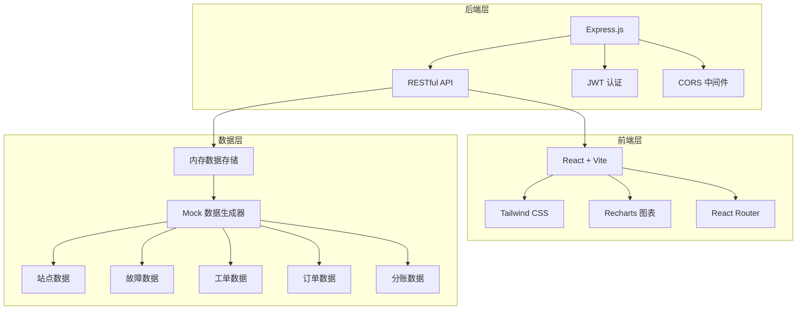
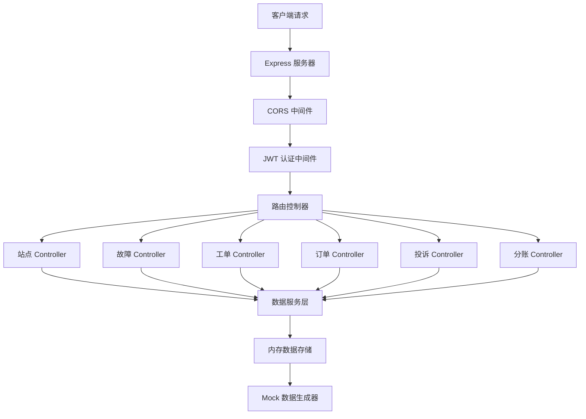
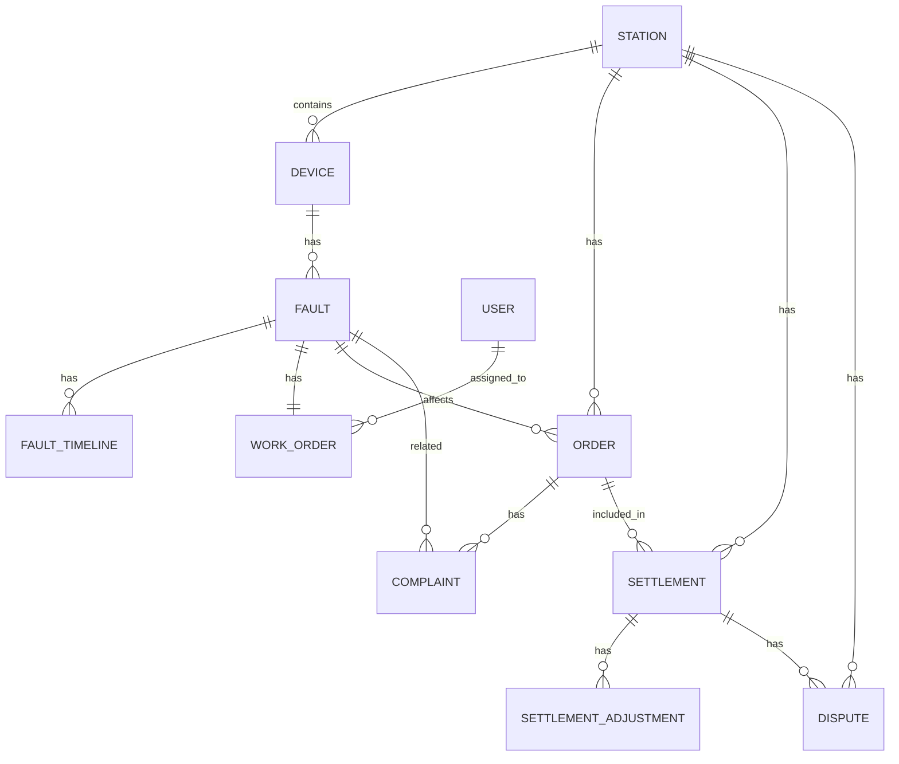

# 充电桩运营后台系统 技术架构文档

## 1. 架构设计



## 2. 技术选型

- **前端**: React@18 + TailwindCSS@3 + Vite@5 + React Router@6 + Recharts@2
- **后端**: Express@4 + CORS + JWT认证
- **数据**: 内存存储 + Mock数据（便于演示，无需数据库）
- **构建工具**: Vite（前端）、Node.js（后端）

## 3. 路由定义

### 前端路由

| 路由路径 | 页面名称 | 权限要求 |
|---------|---------|----------|
| /login | 登录页 | 公开 |
| /dashboard | 首页仪表盘 | 所有角色 |
| /stations | 站点列表 | 运营、客服 |
| /stations/:id | 站点详情 | 运营、客服 |
| /faults | 故障列表 | 运营、客服、维修商 |
| /faults/:id | 故障详情 | 运营、客服、维修商 |
| /workorders | 工单列表 | 所有角色 |
| /workorders/:id | 工单详情 | 所有角色 |
| /orders | 订单列表 | 运营、客服、财务 |
| /orders/:id | 订单详情 | 运营、客服、财务 |
| /complaints | 投诉列表 | 客服 |
| /complaints/:id | 投诉详情 | 客服 |
| /settlements | 分账概览 | 财务 |
| /settlements/adjustments | 分账调整 | 财务 |
| /settlements/disputes | 对账异议 | 财务 |

### 后端 API 路由

| 方法 | 路径 | 说明 |
|-----|------|------|
| POST | /api/auth/login | 用户登录 |
| GET | /api/auth/me | 获取当前用户信息 |
| GET | /api/stations | 获取站点列表 |
| GET | /api/stations/:id | 获取站点详情 |
| GET | /api/stations/:id/devices | 获取站点设备列表 |
| GET | /api/faults | 获取故障列表 |
| GET | /api/faults/:id | 获取故障详情 |
| GET | /api/faults/:id/timeline | 获取故障时间线 |
| GET | /api/faults/:id/orders | 获取受影响订单 |
| GET | /api/workorders | 获取工单列表 |
| GET | /api/workorders/:id | 获取工单详情 |
| PUT | /api/workorders/:id/status | 更新工单状态 |
| GET | /api/orders | 获取订单列表 |
| GET | /api/orders/:id | 获取订单详情 |
| POST | /api/orders/:id/refund | 申请退款 |
| GET | /api/complaints | 获取投诉列表 |
| GET | /api/complaints/:id | 获取投诉详情 |
| PUT | /api/complaints/:id | 处理投诉 |
| GET | /api/settlements/overview | 分账概览 |
| GET | /api/settlements/details | 分账明细 |
| GET | /api/settlements/adjustments | 分账调整记录 |
| GET | /api/settlements/disputes | 对账异议列表 |
| PUT | /api/settlements/disputes/:id | 处理对账异议 |
| GET | /api/stats/dashboard | 仪表盘统计数据 |

## 4. API 数据类型定义

```typescript
// 用户
interface User {
  id: string;
  username: string;
  name: string;
  role: 'admin' | 'service' | 'maintenance' | 'finance';
  avatar?: string;
}

// 站点
interface Station {
  id: string;
  name: string;
  address: string;
  lat: number;
  lng: number;
  deviceCount: number;
  onlineCount: number;
  status: 'normal' | 'warning' | 'offline';
  partnerName: string;
  splitRatio: number;
  createdAt: string;
}

// 设备
interface Device {
  id: string;
  stationId: string;
  name: string;
  model: string;
  power: number;
  status: 'online' | 'offline' | 'maintenance';
  lastOnline: string;
}

// 故障
interface Fault {
  id: string;
  stationId: string;
  deviceId: string;
  deviceName: string;
  stationName: string;
  type: 'offline' | 'interrupt' | 'hardware' | 'network';
  severity: 'low' | 'medium' | 'high' | 'critical';
  status: 'pending' | 'processing' | 'resolved' | 'closed';
  description: string;
  detectedAt: string;
  resolvedAt?: string;
}

// 故障时间线
interface FaultTimeline {
  id: string;
  faultId: string;
  type: 'detected' | 'assigned' | 'arrived' | 'repaired' | 'verified' | 'closed';
  title: string;
  description: string;
  createdAt: string;
  operator?: string;
}

// 工单
interface WorkOrder {
  id: string;
  faultId: string;
  stationId: string;
  stationName: string;
  deviceName: string;
  maintenanceId: string;
  maintenanceName: string;
  status: 'pending' | 'accepted' | 'arrived' | 'processing' | 'completed' | 'timeout';
  priority: 'normal' | 'urgent';
  assignedAt: string;
  estimatedArrival?: string;
  arrivedAt?: string;
  completedAt?: string;
  expectedDuration: number;
  actualDuration?: number;
}

// 订单
interface Order {
  id: string;
  stationId: string;
  stationName: string;
  deviceId: string;
  deviceName: string;
  userId: string;
  userName: string;
  startTime: string;
  endTime?: string;
  duration?: number;
  energy: number;
  amount: number;
  status: 'charging' | 'completed' | 'interrupted' | 'refunded';
  faultId?: string;
  refundAmount?: number;
  refundReason?: string;
}

// 投诉
interface Complaint {
  id: string;
  orderId?: string;
  faultId?: string;
  stationId: string;
  userName: string;
  userPhone: string;
  type: 'device' | 'interrupt' | 'charge' | 'other';
  status: 'pending' | 'processing' | 'resolved' | 'closed';
  description: string;
  createdAt: string;
  handler?: string;
  handleNotes?: string;
  handledAt?: string;
}

// 分账
interface Settlement {
  id: string;
  date: string;
  stationId: string;
  stationName: string;
  totalAmount: number;
  platformShare: number;
  partnerShare: number;
  refundDeduction: number;
  finalPartnerShare: number;
  status: 'pending' | 'confirmed' | 'disputed' | 'completed';
}

// 分账调整
interface SettlementAdjustment {
  id: string;
  settlementId: string;
  stationId: string;
  type: 'refund' | 'compensation' | 'dispute';
  amount: number;
  reason: string;
  operator: string;
  createdAt: string;
}

// 对账异议
interface Dispute {
  id: string;
  settlementId: string;
  stationId: string;
  stationName: string;
  partnerName: string;
  disputedAmount: number;
  reason: string;
  status: 'pending' | 'reviewing' | 'resolved' | 'rejected';
  createdAt: string;
  handler?: string;
  resolution?: string;
  resolvedAt?: string;
}
```

## 5. 服务器架构



## 6. 数据模型

### 6.1 ER 图



### 6.2 Mock 数据要点

**演示数据必须包含：**
1. **离线桩**：至少3个站点存在离线设备，设备状态标记为offline
2. **充电中断**：至少5个订单状态为interrupted，关联到具体故障
3. **维修超时**：至少2个工单状态为timeout，显示超时时长
4. **场地方对账异议**：至少3条dispute记录，状态包括pending和resolved
5. **退款记录**：部分订单已退款，退款金额在分账中体现扣减
