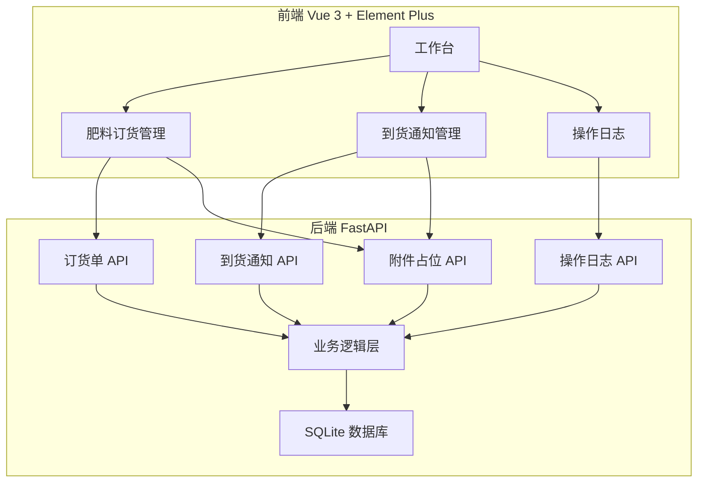
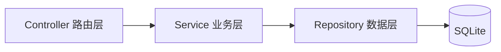
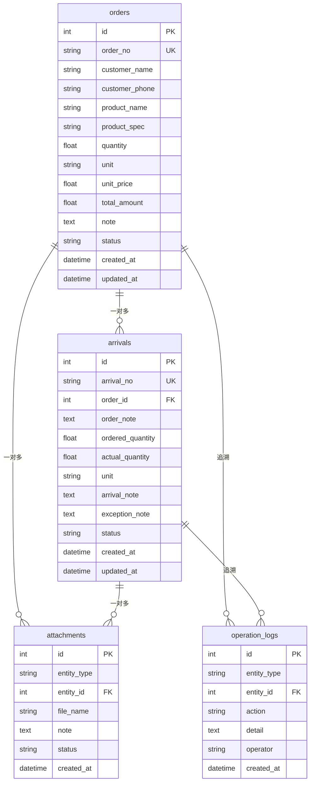

## 1. 架构设计



## 2. 技术说明

- 前端：Vue 3 + Vite + Element Plus + Vue Router + Pinia
- 初始化工具：Vite
- 后端：FastAPI + Uvicorn
- 数据库：SQLite（单文件，零配置）
- 跨域：FastAPI CORSMiddleware 允许前端 localhost 访问

## 3. 路由定义

| 路由 | 用途 |
|------|------|
| / | 工作台首页，展示统计和快捷入口 |
| /orders | 肥料订货单列表 |
| /orders/new | 新建订货单 |
| /orders/:id | 订货单详情 |
| /arrivals | 到货通知列表 |
| /arrivals/new?orderId=:id | 从订货单创建到货通知 |
| /arrivals/:id | 到货通知详情 |
| /logs | 操作日志列表 |

## 4. API 定义

### 4.1 肥料订货单

```
GET    /api/orders              # 列表，支持 ?status=&customer=&date_from=&date_to=
POST   /api/orders              # 创建
GET    /api/orders/:id          # 详情
PUT    /api/orders/:id          # 编辑
PATCH  /api/orders/:id/status   # 状态流转 { status: "confirmed"|"shipped"|"arrived" }
```

### 4.2 到货通知

```
GET    /api/arrivals            # 列表，支持 ?status=&order_id=&date_from=&date_to=
POST   /api/arrivals            # 创建，{ order_id, arrival_note, actual_quantity, exception_note? }
GET    /api/arrivals/:id        # 详情（含关联订货单信息）
PATCH  /api/arrivals/:id/confirm # 到货确认 { actual_quantity, exception_note? }
```

### 4.3 操作日志

```
GET    /api/logs                # 列表，支持 ?entity_type=&entity_id=&action=&date_from=&date_to=
```

### 4.4 附件占位

```
POST   /api/attachments         # 创建占位 { entity_type, entity_id, file_name, note }
DELETE /api/attachments/:id     # 删除占位
PATCH  /api/attachments/:id     # 更新占位状态 { status: "placeholder"|"uploaded" }
```

### 4.5 数据导出

```
GET    /api/export/orders       # 导出订货单 CSV
GET    /api/export/arrivals     # 导出到货通知 CSV
```

### 4.6 TypeScript 类型定义

```typescript
interface Order {
  id: number
  order_no: string
  customer_name: string
  customer_phone: string
  product_name: string
  product_spec: string
  quantity: number
  unit: string
  unit_price: number
  total_amount: number
  note: string
  status: "pending" | "confirmed" | "shipped" | "arrived"
  created_at: string
  updated_at: string
  attachments: Attachment[]
}

interface Arrival {
  id: number
  arrival_no: string
  order_id: number
  order_no: string
  order_note: string
  product_name: string
  product_spec: string
  ordered_quantity: number
  actual_quantity: number | null
  unit: string
  arrival_note: string
  exception_note: string
  status: "pending" | "confirmed" | "exception"
  created_at: string
  updated_at: string
  attachments: Attachment[]
}

interface Attachment {
  id: number
  entity_type: "order" | "arrival"
  entity_id: number
  file_name: string
  note: string
  status: "placeholder" | "uploaded"
  created_at: string
}

interface OperationLog {
  id: number
  entity_type: "order" | "arrival" | "attachment"
  entity_id: number
  action: "create" | "update" | "status_change" | "confirm" | "delete" | "attach"
  detail: string
  operator: string
  created_at: string
}
```

## 5. 服务架构图



- Controller：FastAPI Router，参数校验，HTTP 响应
- Service：业务逻辑，备注继承，状态流转校验，操作日志写入
- Repository：SQL 执行，数据映射

## 6. 数据模型

### 6.1 实体关系图



### 6.2 数据定义语言

```sql
CREATE TABLE orders (
    id INTEGER PRIMARY KEY AUTOINCREMENT,
    order_no TEXT NOT NULL UNIQUE,
    customer_name TEXT NOT NULL,
    customer_phone TEXT NOT NULL DEFAULT '',
    product_name TEXT NOT NULL,
    product_spec TEXT NOT NULL DEFAULT '',
    quantity REAL NOT NULL DEFAULT 0,
    unit TEXT NOT NULL DEFAULT 'kg',
    unit_price REAL NOT NULL DEFAULT 0,
    total_amount REAL NOT NULL DEFAULT 0,
    note TEXT NOT NULL DEFAULT '',
    status TEXT NOT NULL DEFAULT 'pending' CHECK(status IN ('pending','confirmed','shipped','arrived')),
    created_at TIMESTAMP NOT NULL DEFAULT CURRENT_TIMESTAMP,
    updated_at TIMESTAMP NOT NULL DEFAULT CURRENT_TIMESTAMP
);

CREATE TABLE arrivals (
    id INTEGER PRIMARY KEY AUTOINCREMENT,
    arrival_no TEXT NOT NULL UNIQUE,
    order_id INTEGER NOT NULL REFERENCES orders(id),
    order_note TEXT NOT NULL DEFAULT '',
    ordered_quantity REAL NOT NULL DEFAULT 0,
    actual_quantity REAL,
    unit TEXT NOT NULL DEFAULT 'kg',
    arrival_note TEXT NOT NULL DEFAULT '',
    exception_note TEXT NOT NULL DEFAULT '',
    status TEXT NOT NULL DEFAULT 'pending' CHECK(status IN ('pending','confirmed','exception')),
    created_at TIMESTAMP NOT NULL DEFAULT CURRENT_TIMESTAMP,
    updated_at TIMESTAMP NOT NULL DEFAULT CURRENT_TIMESTAMP
);

CREATE TABLE attachments (
    id INTEGER PRIMARY KEY AUTOINCREMENT,
    entity_type TEXT NOT NULL CHECK(entity_type IN ('order','arrival')),
    entity_id INTEGER NOT NULL,
    file_name TEXT NOT NULL,
    note TEXT NOT NULL DEFAULT '',
    status TEXT NOT NULL DEFAULT 'placeholder' CHECK(status IN ('placeholder','uploaded')),
    created_at TIMESTAMP NOT NULL DEFAULT CURRENT_TIMESTAMP
);

CREATE TABLE operation_logs (
    id INTEGER PRIMARY KEY AUTOINCREMENT,
    entity_type TEXT NOT NULL CHECK(entity_type IN ('order','arrival','attachment')),
    entity_id INTEGER NOT NULL,
    action TEXT NOT NULL CHECK(action IN ('create','update','status_change','confirm','delete','attach')),
    detail TEXT NOT NULL DEFAULT '',
    operator TEXT NOT NULL DEFAULT '店员',
    created_at TIMESTAMP NOT NULL DEFAULT CURRENT_TIMESTAMP
);

CREATE INDEX idx_orders_status ON orders(status);
CREATE INDEX idx_orders_created ON orders(created_at DESC);
CREATE INDEX idx_arrivals_order ON arrivals(order_id);
CREATE INDEX idx_arrivals_status ON arrivals(status);
CREATE INDEX idx_arrivals_created ON arrivals(created_at DESC);
CREATE INDEX idx_attachments_entity ON attachments(entity_type, entity_id);
CREATE INDEX idx_logs_entity ON operation_logs(entity_type, entity_id);
CREATE INDEX idx_logs_created ON operation_logs(created_at DESC);
```
