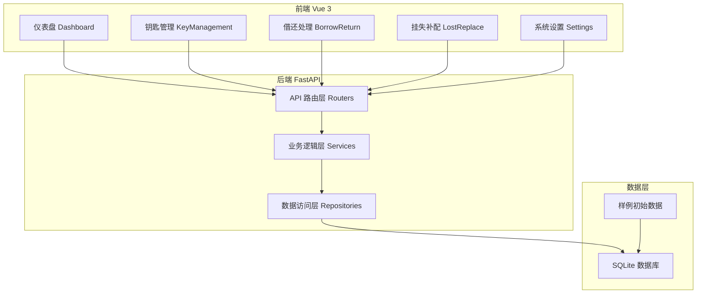
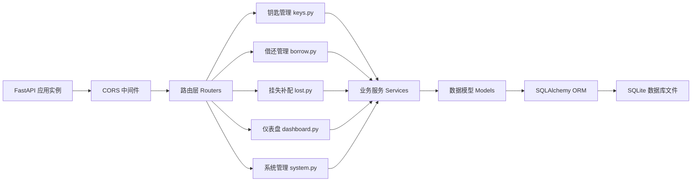
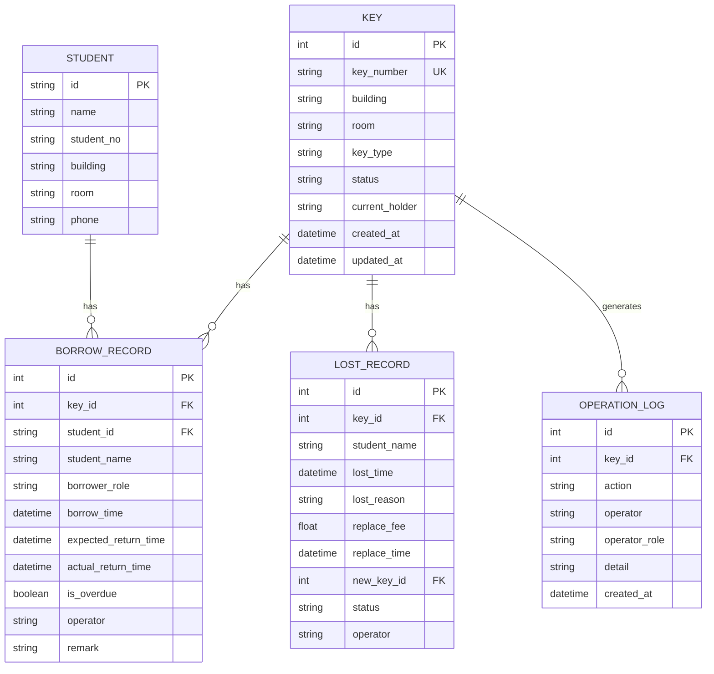

## 1. 架构设计



## 2. 技术描述

- **前端**：Vue 3 + Vite + Vue Router + Pinia + Axios + Element Plus
- **后端**：FastAPI + SQLAlchemy + SQLite + Pydantic
- **数据库**：SQLite（文件型，无需额外部署）
- **初始化工具**：Vite 初始化前端项目，pip 管理后端依赖

## 3. 路由定义

### 前端路由

| 路由路径 | 页面名称 | 说明 |
|----------|----------|------|
| /login | 登录页 | 简化登录，选择角色即可 |
| /dashboard | 仪表盘 | 待处理、风险项、最近变更 |
| /keys | 钥匙列表 | 筛选列表、快速操作 |
| /keys/:id | 钥匙详情 | 状态流转、历史记录 |
| /borrow | 借还处理 | 借用登记、归还确认 |
| /lost | 挂失补配 | 挂失登记、补配处理、历史回看 |
| /settings | 系统设置 | 数据重置 |

### 后端 API 路由

| 方法 | 路径 | 说明 |
|------|------|------|
| GET | /api/keys | 获取钥匙列表（支持筛选） |
| GET | /api/keys/{id} | 获取钥匙详情 |
| POST | /api/keys | 新增钥匙 |
| PUT | /api/keys/{id} | 更新钥匙信息 |
| DELETE | /api/keys/{id} | 删除钥匙 |
| POST | /api/borrow | 钥匙借用登记 |
| POST | /api/return | 钥匙归还确认 |
| POST | /api/lost | 钥匙挂失登记 |
| POST | /api/replace | 钥匙补配完成 |
| GET | /api/records | 获取操作记录 |
| GET | /api/students | 获取学生列表 |
| GET | /api/dashboard/stats | 获取仪表盘统计数据 |
| GET | /api/dashboard/risks | 获取风险项列表 |
| POST | /api/system/reset | 重置所有数据 |

## 4. API 定义

### 数据类型定义

```python
# 钥匙状态枚举
class KeyStatus(str, Enum):
    AVAILABLE = "available"    # 在库
    BORROWED = "borrowed"      # 已借出
    LOST = "lost"              # 已挂失
    REPLACING = "replacing"    # 补配中
    OBSOLETE = "obsolete"      # 已作废
    OVERDUE = "overdue"        # 逾期

# 钥匙模型
class Key(BaseModel):
    id: int
    key_number: str          # 钥匙编号
    building: str            # 楼栋
    room: str                # 房间号
    key_type: str            # 类型：room/public
    status: KeyStatus
    current_holder: Optional[str]  # 当前持有人
    created_at: datetime
    updated_at: datetime

# 借还记录
class BorrowRecord(BaseModel):
    id: int
    key_id: int
    student_id: Optional[str]
    student_name: str
    borrower_role: str       # student/maintenance/other
    borrow_time: datetime
    expected_return_time: datetime
    actual_return_time: Optional[datetime]
    is_overdue: bool
    operator: str
    remark: Optional[str]

# 挂失补配记录
class LostRecord(BaseModel):
    id: int
    key_id: int
    student_name: str
    lost_time: datetime
    lost_reason: str
    replace_fee: Optional[float]
    replace_time: Optional[datetime]
    new_key_id: Optional[int]
    status: str              # lost/replaced/resolved
    operator: str

# 操作日志
class OperationLog(BaseModel):
    id: int
    key_id: Optional[int]
    action: str
    operator: str
    operator_role: str
    detail: str
    created_at: datetime
```

## 5. 服务器架构图



## 6. 数据模型

### 6.1 ER 图



### 6.2 初始样例数据

- 学生数据：30 名学生，分布在 3 栋楼 10 个房间
- 钥匙数据：每房间 2 把钥匙 + 公共区域钥匙共 30 把
- 借还记录：15 条记录，其中 3 条逾期
- 挂失记录：5 条记录，其中 2 条已补配
- 操作日志：最近 20 条变更记录
