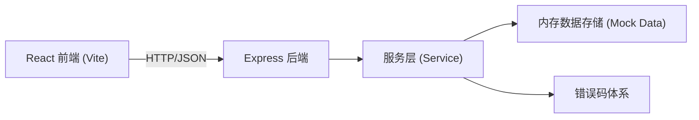
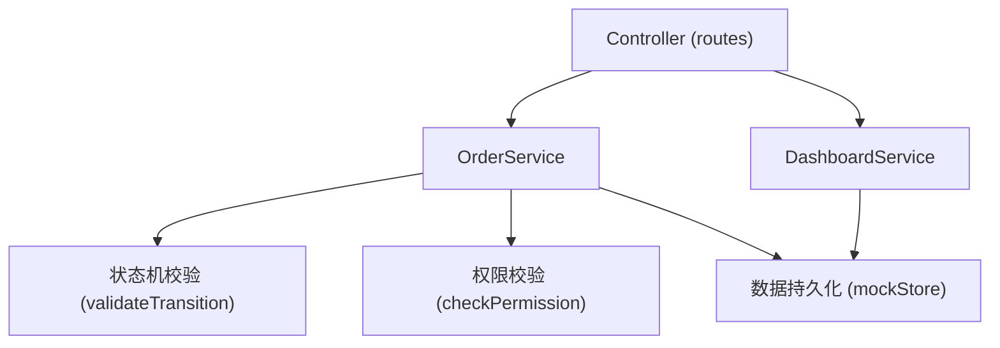
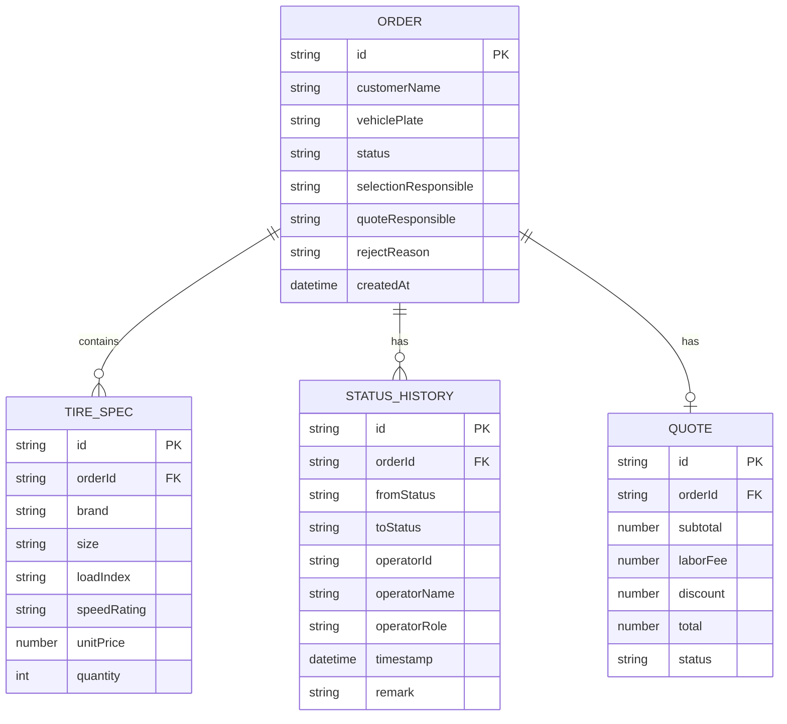

## 1. 架构设计



## 2. 技术描述
- 前端：React@18 + TypeScript + react-router-dom + tailwindcss@3 + zustand + lucide-react
- 构建工具：Vite
- 后端：Express@4 + TypeScript
- 数据存储：内存 Mock 数据（含初始样例工单、待办、异常、已完成数据）
- 图标：lucide-react

## 3. 路由定义
| 路由 | 用途 |
|-------|---------|
| /login | 角色登录页 |
| /dashboard | 工作台首页（按角色展示不同入口和数据） |
| /orders | 工单列表页 |
| /orders/:id | 工单详情页（含选型、报价、状态流转） |
| /orders/:id/selection | 轮胎选型处理页 |
| /orders/:id/quote | 报价确认页 |

## 4. API 定义

### 4.1 通用响应结构
```typescript
interface ApiResponse<T> {
  code: number;
  message: string;
  data: T | null;
}
```

### 4.2 错误码
| 错误码 | 含义 |
|--------|------|
| 0 | 成功 |
| 40001 | 工单不存在 |
| 40002 | 状态流转非法（如未选型直接报价） |
| 40003 | 无操作权限（角色不匹配） |
| 40004 | 参数缺失或格式错误 |
| 40005 | 报价金额异常 |
| 40006 | 驳回原因不能为空 |
| 50001 | 服务端内部错误 |

### 4.3 核心接口
```typescript
// 获取当前角色工作台数据
GET /api/dashboard
Response: { pendingCount, exceptionCount, completedCount, pendingList, exceptionList, completedList }

// 获取工单列表
GET /api/orders?status=&role=
Response: Order[]

// 获取工单详情
GET /api/orders/:id
Response: Order

// 轮胎选型提交（技师权限）
POST /api/orders/:id/selection
Request: { tireSpecs: TireSpec[], basis: string[], operatorId: string }
Response: Order

// 报价确认回看（任意已登录角色）
GET /api/orders/:id/quote
Response: QuoteDetail

// 报价确认/驳回（店长权限）
POST /api/orders/:id/quote
Request: { action: 'confirm' | 'reject', rejectReason?: string, operatorId: string }
Response: Order

// 状态变更历史
GET /api/orders/:id/history
Response: StatusHistory[]
```

## 5. 服务层架构



## 6. 数据模型

### 6.1 ER 图


### 6.2 状态流转定义
```typescript
type OrderStatus = 
  | 'PENDING_SELECTION'   // 待选型
  | 'IN_SELECTION'        // 选型中
  | 'PENDING_QUOTE'       // 待报价
  | 'QUOTE_REJECTED'      // 报价驳回(回退选型)
  | 'QUOTE_CONFIRMED';    // 报价确认(完成)

const VALID_TRANSITIONS: Record<OrderStatus, OrderStatus[]> = {
  PENDING_SELECTION: ['IN_SELECTION'],
  IN_SELECTION: ['PENDING_QUOTE'],
  PENDING_QUOTE: ['QUOTE_CONFIRMED', 'QUOTE_REJECTED'],
  QUOTE_REJECTED: ['IN_SELECTION', 'PENDING_QUOTE'],
  QUOTE_CONFIRMED: [],
};
```

### 6.3 初始样例数据
- 3 条待办工单（分别在待选型、选型中、待报价状态各1条）
- 2 条异常工单（1条超时未选型、1条报价驳回待处理）
- 3 条已完成工单（已确认报价）
- 3 个用户账号：前台(reception)、技师(tech)、店长(manager)
