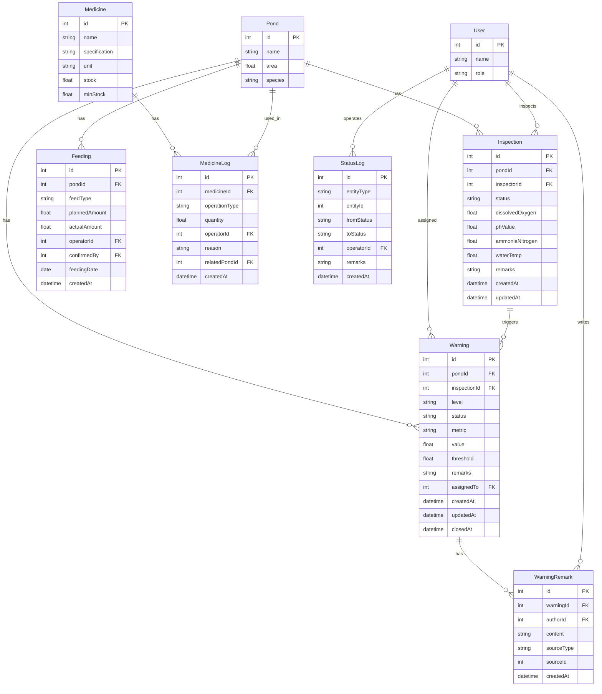

## 1. 架构设计

```mermaid
graph TB
    subgraph "前端层"
        "React 18 + Tailwind CSS + Zustand"
        "今日工作台"
        "塘口巡检页"
        "水质预警页"
        "投喂记录页"
        "药品台账页"
        "异常处理抽屉"
    end
    subgraph "后端层"
        "Express + Prisma ORM"
        "巡检 API"
        "预警 API"
        "投喂 API"
        "药品 API"
        "状态变更 API"
    end
    subgraph "数据层"
        "SQLite 数据库"
        "塘口表"
        "巡检记录表"
        "水质预警表"
        "投喂记录表"
        "药品台账表"
        "状态变更日志表"
    end
    "React 18 + Tailwind CSS + Zustand" --> "Express + Prisma ORM"
    "Express + Prisma ORM" --> "SQLite 数据库"
```

## 2. 技术说明

- **前端**：React@18 + Tailwind CSS@3 + Zustand + Vite
- **初始化工具**：vite-init (react-express-ts 模板)
- **后端**：Express@4 + Prisma ORM + TypeScript (ESM)
- **数据库**：SQLite（通过 Prisma 管理，文件存储）
- **状态管理**：Zustand（前端全局状态）
- **图标**：lucide-react

## 3. 路由定义

| 路由 | 用途 |
|------|------|
| / | 今日工作台 - 显示今日优先待办、预警速览、角色切换 |
| /inspection | 塘口巡检 - 巡检列表、处理面板、历史回看 |
| /warning | 水质预警 - 预警列表、详情回看、关联巡检备注 |
| /feeding | 投喂记录 - 投喂计划与实际记录 |
| /medicine | 药品台账 - 药品出入库与库存管理 |
| /settings | 设置 - 角色切换、数据重置 |

## 4. API 定义

### 4.1 塘口巡检 API

```typescript
// GET /api/inspections - 获取巡检列表（可按塘口、状态、日期筛选）
interface InspectionQuery {
  pondId?: number;
  status?: 'pending' | 'completed' | 'abnormal';
  date?: string;
}
interface Inspection {
  id: number;
  pondId: number;
  pondName: string;
  inspectorId: number;
  inspectorName: string;
  status: 'pending' | 'completed' | 'abnormal';
  dissolvedOxygen: number | null;
  phValue: number | null;
  ammoniaNitrogen: number | null;
  waterTemp: number | null;
  remarks: string;
  createdAt: string;
  updatedAt: string;
}

// POST /api/inspections - 创建巡检记录
interface CreateInspection {
  pondId: number;
  inspectorId: number;
  dissolvedOxygen?: number;
  phValue?: number;
  ammoniaNitrogen?: number;
  waterTemp?: number;
  remarks?: string;
}

// PUT /api/inspections/:id - 更新巡检记录（触发水质预警联动）
interface UpdateInspection {
  dissolvedOxygen?: number;
  phValue?: number;
  ammoniaNitrogen?: number;
  waterTemp?: number;
  remarks?: string;
  status?: 'pending' | 'completed' | 'abnormal';
}
```

### 4.2 水质预警 API

```typescript
// GET /api/warnings - 获取预警列表
interface WarningQuery {
  level?: 'info' | 'warning' | 'critical';
  status?: 'active' | 'processing' | 'closed';
  pondId?: number;
}
interface Warning {
  id: number;
  pondId: number;
  pondName: string;
  inspectionId: number | null;
  level: 'info' | 'warning' | 'critical';
  status: 'active' | 'processing' | 'closed';
  metric: string;
  value: number;
  threshold: number;
  remarks: string;
  assignedTo: number | null;
  assignedName: string | null;
  createdAt: string;
  updatedAt: string;
  closedAt: string | null;
}

// PUT /api/warnings/:id - 更新预警状态
interface UpdateWarning {
  status?: 'active' | 'processing' | 'closed';
  remarks?: string;
  assignedTo?: number;
}

// GET /api/warnings/:id/timeline - 获取预警状态变更时间线
interface WarningTimeline {
  id: number;
  warningId: number;
  fromStatus: string;
  toStatus: string;
  operatorId: number;
  operatorName: string;
  remarks: string;
  createdAt: string;
}
```

### 4.3 投喂记录 API

```typescript
// GET /api/feedings - 获取投喂记录
interface Feeding {
  id: number;
  pondId: number;
  pondName: string;
  feedType: string;
  plannedAmount: number;
  actualAmount: number | null;
  operatorId: number;
  operatorName: string;
  confirmedBy: number | null;
  confirmerName: string | null;
  feedingDate: string;
  createdAt: string;
}

// POST /api/feedings - 创建投喂记录
// PUT /api/feedings/:id/confirm - 仓管确认投喂
```

### 4.4 药品台账 API

```typescript
// GET /api/medicines - 获取药品列表
interface Medicine {
  id: number;
  name: string;
  specification: string;
  unit: string;
  stock: number;
  minStock: number;
}

// POST /api/medicines/:id/stock-in - 入库
// POST /api/medicines/:id/stock-out - 出库
interface StockOperation {
  quantity: number;
  operatorId: number;
  reason: string;
  relatedPondId?: number;
}
```

### 4.5 状态变更日志 API

```typescript
// GET /api/status-logs - 获取状态变更日志
interface StatusLog {
  id: number;
  entityType: 'inspection' | 'warning' | 'feeding' | 'medicine';
  entityId: number;
  fromStatus: string;
  toStatus: string;
  operatorId: number;
  operatorName: string;
  remarks: string;
  createdAt: string;
}
```

### 4.6 系统 API

```typescript
// POST /api/reset - 重置数据（场长权限）
// GET /api/dashboard - 今日工作台数据
interface DashboardData {
  pendingInspections: number;
  activeWarnings: number;
  todayFeedings: number;
  lowStockMedicines: number;
  priorityItems: PriorityItem[];
  recentWarnings: Warning[];
}
interface PriorityItem {
  type: 'inspection' | 'warning' | 'feeding';
  id: number;
  title: string;
  urgency: 'high' | 'medium' | 'low';
  pondName: string;
  createdAt: string;
}
```

## 5. 服务端架构图

```mermaid
graph LR
    "Router / Controller" --> "Service 层"
    "Service 层" --> "Prisma Repository"
    "Prisma Repository" --> "SQLite"
    "Service 层" --> "事件发布器"
    "事件发布器" --> "联动处理器"
    "联动处理器" --> "Prisma Repository"
```

## 6. 数据模型

### 6.1 数据模型定义



### 6.2 数据定义语言

```sql
CREATE TABLE User (
  id INTEGER PRIMARY KEY AUTOINCREMENT,
  name TEXT NOT NULL,
  role TEXT NOT NULL CHECK(role IN ('technician', 'warehouse', 'director'))
);

CREATE TABLE Pond (
  id INTEGER PRIMARY KEY AUTOINCREMENT,
  name TEXT NOT NULL,
  area REAL NOT NULL,
  species TEXT NOT NULL
);

CREATE TABLE Inspection (
  id INTEGER PRIMARY KEY AUTOINCREMENT,
  pondId INTEGER NOT NULL REFERENCES Pond(id),
  inspectorId INTEGER NOT NULL REFERENCES User(id),
  status TEXT NOT NULL DEFAULT 'pending' CHECK(status IN ('pending', 'completed', 'abnormal')),
  dissolvedOxygen REAL,
  phValue REAL,
  ammoniaNitrogen REAL,
  waterTemp REAL,
  remarks TEXT DEFAULT '',
  createdAt DATETIME NOT NULL DEFAULT CURRENT_TIMESTAMP,
  updatedAt DATETIME NOT NULL DEFAULT CURRENT_TIMESTAMP
);

CREATE TABLE Warning (
  id INTEGER PRIMARY KEY AUTOINCREMENT,
  pondId INTEGER NOT NULL REFERENCES Pond(id),
  inspectionId INTEGER REFERENCES Inspection(id),
  level TEXT NOT NULL CHECK(level IN ('info', 'warning', 'critical')),
  status TEXT NOT NULL DEFAULT 'active' CHECK(status IN ('active', 'processing', 'closed')),
  metric TEXT NOT NULL,
  value REAL NOT NULL,
  threshold REAL NOT NULL,
  remarks TEXT DEFAULT '',
  assignedTo INTEGER REFERENCES User(id),
  createdAt DATETIME NOT NULL DEFAULT CURRENT_TIMESTAMP,
  updatedAt DATETIME NOT NULL DEFAULT CURRENT_TIMESTAMP,
  closedAt DATETIME
);

CREATE TABLE WarningRemark (
  id INTEGER PRIMARY KEY AUTOINCREMENT,
  warningId INTEGER NOT NULL REFERENCES Warning(id),
  authorId INTEGER NOT NULL REFERENCES User(id),
  content TEXT NOT NULL,
  sourceType TEXT DEFAULT 'manual' CHECK(sourceType IN ('manual', 'inspection', 'system')),
  sourceId INTEGER,
  createdAt DATETIME NOT NULL DEFAULT CURRENT_TIMESTAMP
);

CREATE TABLE Feeding (
  id INTEGER PRIMARY KEY AUTOINCREMENT,
  pondId INTEGER NOT NULL REFERENCES Pond(id),
  feedType TEXT NOT NULL,
  plannedAmount REAL NOT NULL,
  actualAmount REAL,
  operatorId INTEGER NOT NULL REFERENCES User(id),
  confirmedBy INTEGER REFERENCES User(id),
  feedingDate DATE NOT NULL,
  createdAt DATETIME NOT NULL DEFAULT CURRENT_TIMESTAMP
);

CREATE TABLE Medicine (
  id INTEGER PRIMARY KEY AUTOINCREMENT,
  name TEXT NOT NULL,
  specification TEXT NOT NULL,
  unit TEXT NOT NULL,
  stock REAL NOT NULL DEFAULT 0,
  minStock REAL NOT NULL DEFAULT 0
);

CREATE TABLE MedicineLog (
  id INTEGER PRIMARY KEY AUTOINCREMENT,
  medicineId INTEGER NOT NULL REFERENCES Medicine(id),
  operationType TEXT NOT NULL CHECK(operationType IN ('in', 'out')),
  quantity REAL NOT NULL,
  operatorId INTEGER NOT NULL REFERENCES User(id),
  reason TEXT DEFAULT '',
  relatedPondId INTEGER REFERENCES Pond(id),
  createdAt DATETIME NOT NULL DEFAULT CURRENT_TIMESTAMP
);

CREATE TABLE StatusLog (
  id INTEGER PRIMARY KEY AUTOINCREMENT,
  entityType TEXT NOT NULL,
  entityId INTEGER NOT NULL,
  fromStatus TEXT NOT NULL,
  toStatus TEXT NOT NULL,
  operatorId INTEGER NOT NULL REFERENCES User(id),
  remarks TEXT DEFAULT '',
  createdAt DATETIME NOT NULL DEFAULT CURRENT_TIMESTAMP
);

CREATE INDEX idx_inspection_pond ON Inspection(pondId);
CREATE INDEX idx_inspection_status ON Inspection(status);
CREATE INDEX idx_warning_pond ON Warning(pondId);
CREATE INDEX idx_warning_status ON Warning(status);
CREATE INDEX idx_warning_inspection ON Warning(inspectionId);
CREATE INDEX idx_warning_remark_warning ON WarningRemark(warningId);
CREATE INDEX idx_feeding_pond ON Feeding(pondId);
CREATE INDEX idx_feeding_date ON Feeding(feedingDate);
CREATE INDEX idx_medicine_log_medicine ON MedicineLog(medicineId);
CREATE INDEX idx_status_log_entity ON StatusLog(entityType, entityId);
```
